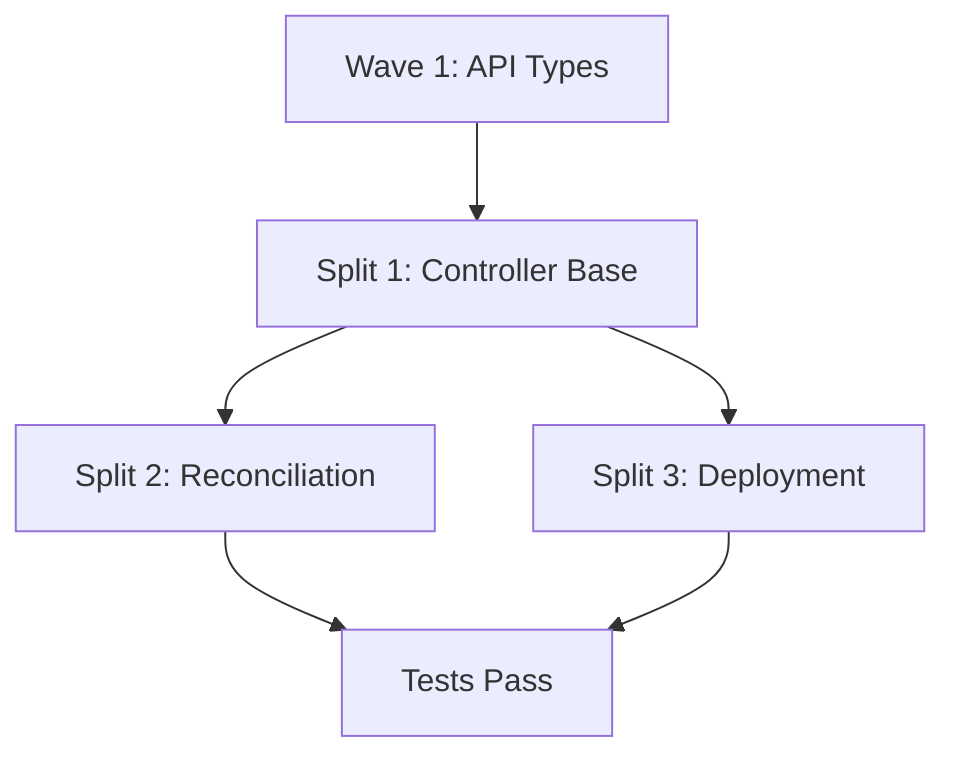

# Split Master Plan: Wave 2A - Controller Implementation

## Current State
- **Total Lines:** 1,190 lines (excluding generated code)
- **Test Lines:** 234 lines  
- **Files:** Currently contains only API types from Wave 1 (no controller yet)
- **Status:** NEEDS IMPLEMENTATION AND SPLIT

## Important Note
This branch currently only contains the API types from Wave 1. The actual controller implementation needs to be added according to the implementation spec. The split plan below assumes the controller will be implemented.

## Split Strategy

### Split 1: Controller Foundation & Structure (wave2a-01)
**Target Size:** ~400 lines  
**Branch:** `feature/tmc-syncer-02a-controller-base`
**Worktree:** `/workspaces/kcp-worktrees/phase2/wave2a-01-split-from-controller`

**Files to Create:**
- `pkg/reconciler/workload/synctarget/doc.go` (~20 lines)
- `pkg/reconciler/workload/synctarget/controller.go` (~250 lines)
  - Controller struct definition
  - NewController function
  - Workspace isolation setup
  - Informer and client initialization
- `pkg/reconciler/workload/synctarget/indexes.go` (~100 lines)
  - Index definitions for efficient lookups
- `cmd/syncer/main.go` updates (~30 lines)
  - Wire controller into syncer startup

**Total:** ~400 lines

**Rationale:** Establishes the controller foundation with proper KCP integration patterns.

### Split 2: Reconciliation Logic (wave2a-02)
**Target Size:** ~450 lines  
**Branch:** `feature/tmc-syncer-02a-reconcile`
**Worktree:** `/workspaces/kcp-worktrees/phase2/wave2a-02-split-from-controller`

**Files to Create:**
- `pkg/reconciler/workload/synctarget/reconcile.go` (~350 lines)
  - Main reconciliation loop
  - Status update logic
  - Condition management
  - Error handling
- `pkg/reconciler/workload/synctarget/status.go` (~100 lines)
  - Status helper functions
  - Condition utilities

**Total:** ~450 lines

**Rationale:** Core business logic for managing SyncTarget lifecycle.

### Split 3: Deployment & Integration (wave2a-03)
**Target Size:** ~340 lines + tests
**Branch:** `feature/tmc-syncer-02a-deployment`
**Worktree:** `/workspaces/kcp-worktrees/phase2/wave2a-03-split-from-controller`

**Files to Create:**
- `pkg/reconciler/workload/synctarget/deployment.go` (~200 lines)
  - Syncer deployment logic
  - Configuration generation
  - Physical cluster interaction
- `pkg/reconciler/workload/synctarget/finalizer.go` (~140 lines)
  - Cleanup logic
  - Finalizer management
- `pkg/reconciler/workload/synctarget/controller_test.go` (tests - not counted)
- `pkg/reconciler/workload/synctarget/reconcile_test.go` (tests - not counted)

**Total:** ~340 lines + tests

**Rationale:** Deployment logic and cleanup can be isolated from core reconciliation.

## Dependencies



- **Wave 1 API Types** must exist (already in branch)
- **Split 1** establishes controller structure
- **Split 2** and **Split 3** can proceed in parallel after Split 1

## Implementation Requirements

Since the controller doesn't exist yet, each split must:

1. **Copy API types from Wave 1** if not already present
2. **Implement assigned functionality** per implementation spec
3. **Ensure compilation** at each step
4. **Add appropriate tests**
5. **Follow KCP controller patterns**

## Execution Order

### Sequential Requirements:
1. **Verify API types** from Wave 1 are present
2. **Split 1** (Controller Base) - MUST be first
3. **Split 2** and **Split 3** can proceed in parallel

### Parallel Opportunities:
- After Split 1:
  - Agent A: Split 2 (Reconciliation)
  - Agent B: Split 3 (Deployment)

## Success Criteria

Each split must:
1. ✅ Stay under 800 lines
2. ✅ Implement complete functionality per spec
3. ✅ Be atomic and compilable
4. ✅ Include comprehensive tests
5. ✅ Follow KCP patterns exactly
6. ✅ Handle workspace isolation properly

## Risk Mitigation

1. **Missing Implementation**: Controller needs to be written from scratch
2. **API Dependencies**: Ensure Wave 1 types are available
3. **KCP Integration**: Follow existing controller patterns
4. **Testing**: Each split needs appropriate test coverage

## Verification Steps

```bash
# 1. Ensure API types are present
ls -la pkg/apis/workload/v1alpha1/

# 2. Build after implementation
make build

# 3. Run code generation
make codegen

# 4. Run tests
make test

# 5. Check line count
/workspaces/kcp-shared-tools/tmc-pr-line-counter.sh -c <branch-name>

# 6. Integration test with syncer
make test-e2e-shared
```

## Notes

- Controller must follow KCP's workspace-aware patterns
- Integration with existing ClusterRegistration API required
- Syncer deployment logic needs careful physical cluster handling
- Feature flag integration needed for gradual rollout