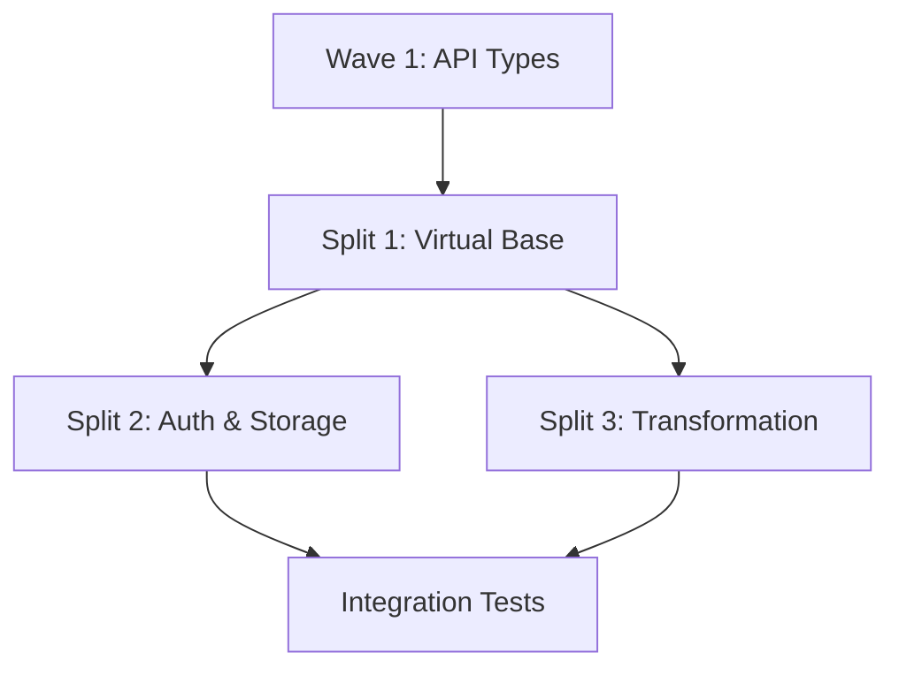

# Split Master Plan: Wave 2B - Virtual Workspace Implementation

## Current State
- **Total Lines:** 2,268 lines (excluding generated code)
- **Test Lines:** 504 lines
- **Files:** 8 virtual workspace files + API types from Wave 1
- **Status:** NEEDS SPLIT - Exceeds 800 line limit by 1,468 lines

## File Breakdown
```
pkg/virtual/syncer/transformation.go  - 229 lines
pkg/virtual/syncer/doc.go            - 29 lines
pkg/virtual/syncer/virtual_workspace.go - 201 lines
pkg/virtual/syncer/auth.go           - 185 lines
pkg/virtual/syncer/rest_storage.go   - 190 lines
pkg/virtual/syncer/discovery.go      - 197 lines
pkg/virtual/syncer/context.go        - 46 lines
pkg/virtual/syncer/virtual_workspace_test.go - ~270 lines
Plus API types from Wave 1         - 1,184 lines
```

## Split Strategy

### Split 1: Virtual Workspace Foundation (wave2b-01)
**Target Size:** ~475 lines  
**Branch:** `feature/tmc-syncer-02b-virtual-base`
**Worktree:** `/workspaces/kcp-worktrees/phase2/wave2b-01-split-from-virtual`

**Files to Include:**
- `pkg/virtual/syncer/doc.go` (29 lines)
- `pkg/virtual/syncer/context.go` (46 lines)
- `pkg/virtual/syncer/virtual_workspace.go` (201 lines)
- `pkg/virtual/syncer/discovery.go` (197 lines)

**Total:** 473 lines

**Rationale:** Core virtual workspace structure and discovery mechanism form the foundation. These components establish the virtual workspace pattern and API discovery.

### Split 2: Authentication & Storage (wave2b-02)
**Target Size:** ~375 lines  
**Branch:** `feature/tmc-syncer-02b-auth-storage`
**Worktree:** `/workspaces/kcp-worktrees/phase2/wave2b-02-split-from-virtual`

**Files to Include:**
- `pkg/virtual/syncer/auth.go` (185 lines)
- `pkg/virtual/syncer/rest_storage.go` (190 lines)

**Total:** 375 lines

**Rationale:** Authentication and REST storage are closely related - auth validates access while storage handles the REST API implementation.

### Split 3: Transformation & Tests (wave2b-03)
**Target Size:** ~499 lines  
**Branch:** `feature/tmc-syncer-02b-transform`
**Worktree:** `/workspaces/kcp-worktrees/phase2/wave2b-03-split-from-virtual`

**Files to Include:**
- `pkg/virtual/syncer/transformation.go` (229 lines)
- `pkg/virtual/syncer/virtual_workspace_test.go` (~270 lines)

**Total:** ~499 lines

**Rationale:** Transformation logic handles resource conversion between virtual and physical representations. Tests validate the entire virtual workspace implementation.

### Note on API Types
The API types from Wave 1 (1,184 lines) should already be in a separate PR. If they're included in this branch, they should be removed as they belong to Wave 1.

## Dependencies



- **Wave 1 API Types** must be available (separate PR)
- **Split 1** establishes virtual workspace foundation
- **Split 2** and **Split 3** can proceed in parallel after Split 1

## Execution Order

### Sequential Requirements:
1. **Split 1** (Virtual Base) - MUST be first, establishes foundation
2. **Split 2** and **Split 3** can proceed in parallel

### Parallel Opportunities:
- After Split 1 merges:
  - Agent A: Split 2 (Auth & Storage)
  - Agent B: Split 3 (Transformation)

## Critical Integration Points

### Split 1 → Split 2 Interface
- Virtual workspace registration
- Discovery provider interface
- Context propagation patterns

### Split 1 → Split 3 Interface
- Resource transformation hooks
- Virtual resource definitions
- Type conversion interfaces

## Success Criteria

Each split must:
1. ✅ Stay under 800 lines (strictly enforced)
2. ✅ Be independently compilable
3. ✅ Maintain virtual workspace isolation
4. ✅ Follow KCP virtual workspace patterns
5. ✅ Include appropriate test coverage
6. ✅ Handle multi-tenancy correctly

## Risk Mitigation

1. **Virtual Workspace Pattern**: Must follow KCP's established patterns exactly
2. **Security**: Authentication must be properly isolated per workspace
3. **Resource Transformation**: Must handle all edge cases in conversion
4. **Discovery**: Must integrate with KCP's discovery mechanism
5. **Testing**: Virtual workspaces are complex - need thorough testing

## Verification Steps

```bash
# For each split:

# 1. Verify compilation
make build

# 2. Run code generation if needed
make codegen

# 3. Run unit tests
make test

# 4. Check virtual workspace registration
kubectl ws virtual

# 5. Test authentication
kubectl --context admin get --raw /services/syncer/clusters/

# 6. Verify line count
/workspaces/kcp-shared-tools/tmc-pr-line-counter.sh -c <branch-name>

# 7. Integration test
make test-e2e-shared-minimal
```

## Implementation Notes

### Virtual Workspace Patterns
- Must register with APIExport/APIBinding system
- Proper workspace isolation is critical
- Authentication must use KCP's auth patterns
- Discovery must integrate with aggregated API server

### Security Considerations
- Each virtual workspace must be isolated
- Authentication tokens must be workspace-scoped
- No cross-workspace data leakage
- Proper RBAC integration

### Performance Considerations
- Virtual workspaces add overhead
- Caching strategy needed for transformation
- Efficient discovery mechanism required

## Parallelization Strategy

### Independent Development Paths
1. **Path 1**: Virtual Base → Auth & Storage
2. **Path 2**: Virtual Base → Transformation

### Coordination Points
- Both paths depend on Split 1 (Virtual Base)
- Final integration testing requires all splits
- Performance testing after all components integrated

## Notes

- Virtual workspaces are a complex KCP feature requiring careful implementation
- Each split must maintain the security boundary
- The transformation logic is critical for resource compatibility
- Discovery mechanism must be efficient to avoid performance issues
- Test coverage is essential given the complexity