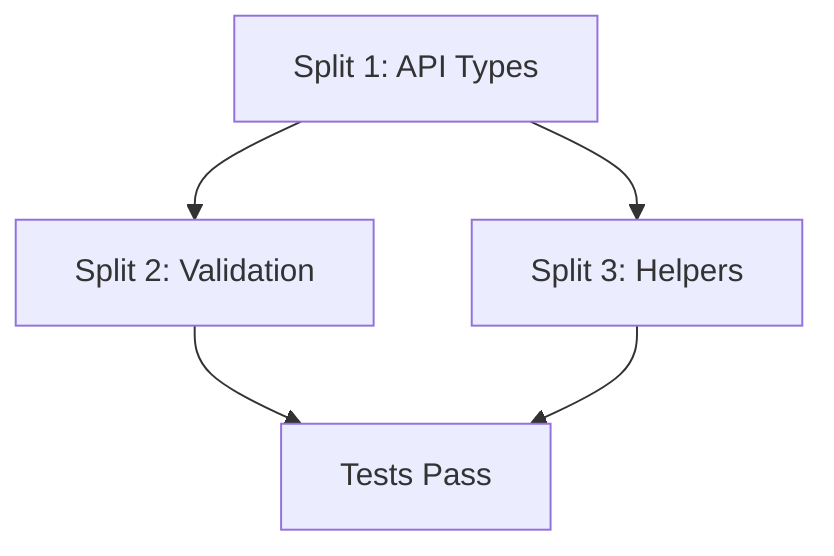

# Split Master Plan: Wave 1 - API Foundation

## Current State
- **Total Lines:** 1,184 lines (excluding generated code)
- **Test Lines:** 234 lines
- **Files:** 10 files (including generated)
- **Status:** NEEDS SPLIT - Exceeds 800 line limit by 384 lines

## Split Strategy

### Split 1: Core API Types & Registration (wave1-01)
**Target Size:** ~450 lines  
**Branch:** `feature/tmc-syncer-01a-api-types`
**Worktree:** `/workspaces/kcp-worktrees/phase2/wave1-01-split-from-api-foundation`

**Files to Include:**
- `pkg/apis/workload/group.go` (~15 lines)
- `pkg/apis/workload/v1alpha1/doc.go` (22 lines)
- `pkg/apis/workload/v1alpha1/register.go` (54 lines)
- `pkg/apis/workload/v1alpha1/synctarget_types.go` (333 lines)
- `pkg/apis/workload/v1alpha1/zz_generated.deepcopy.go` (generated - not counted)

**Total:** ~424 lines + generated deepcopy

**Rationale:** Core API types must be established first as they form the foundation for all other functionality.

### Split 2: API Validation & Defaults (wave1-02)
**Target Size:** ~389 lines  
**Branch:** `feature/tmc-syncer-01b-api-validation`
**Worktree:** `/workspaces/kcp-worktrees/phase2/wave1-02-split-from-api-foundation`

**Files to Include:**
- `pkg/apis/workload/v1alpha1/synctarget_validation.go` (276 lines)
- `pkg/apis/workload/v1alpha1/synctarget_defaults.go` (113 lines)

**Total:** 389 lines

**Rationale:** Validation and defaulting logic can be added after types are defined. These are cohesive units that work together.

### Split 3: API Helpers, Conversion & Tests (wave1-03)
**Target Size:** ~590 lines  
**Branch:** `feature/tmc-syncer-01c-api-helpers`
**Worktree:** `/workspaces/kcp-worktrees/phase2/wave1-03-split-from-api-foundation`

**Files to Include:**
- `pkg/apis/workload/v1alpha1/synctarget_helpers.go` (309 lines)
- `pkg/apis/workload/v1alpha1/synctarget_conversion.go` (48 lines)
- `pkg/apis/workload/v1alpha1/synctarget_types_test.go` (233 lines)

**Total:** 590 lines

**Rationale:** Helpers and conversion are utility functions that depend on types but are independent of validation. Tests validate the entire API surface.

## Dependencies



- **Split 1** must be merged first (establishes types)
- **Split 2** and **Split 3** can be done in parallel after Split 1
- All splits must maintain compilation and test success

## Execution Order

### Sequential Requirements:
1. **Split 1** (API Types) - MUST be first
2. **Split 2** and **Split 3** can proceed in parallel after Split 1

### Parallel Opportunities:
- After Split 1 is complete:
  - Agent A can work on Split 2 (Validation)
  - Agent B can work on Split 3 (Helpers)

## Success Criteria

Each split must:
1. ✅ Stay under 800 lines (excluding generated code)
2. ✅ Be atomic and compilable
3. ✅ Pass all tests
4. ✅ Include proper documentation
5. ✅ Follow KCP coding standards
6. ✅ Be independently reviewable

## Risk Mitigation

1. **Compilation Issues**: Each split includes minimal dependencies to ensure compilation
2. **Test Coverage**: Tests are included in Split 3 to validate all API functionality
3. **Generated Code**: Deepcopy generation must run after Split 1
4. **Import Cycles**: Careful package structure to avoid circular dependencies

## Verification Steps

Before creating PR for each split:
```bash
# 1. Verify compilation
make build

# 2. Run code generation
make codegen

# 3. Run tests
make test

# 4. Check line count
/workspaces/kcp-shared-tools/tmc-pr-line-counter.sh -c <branch-name>

# 5. Verify no uncommitted files
git status
```

## Notes

- Each split maintains the full package structure
- Generated code (deepcopy) is included but not counted in line limits
- CRD generation may be needed after API types are added
- All splits target merging to `main` independently