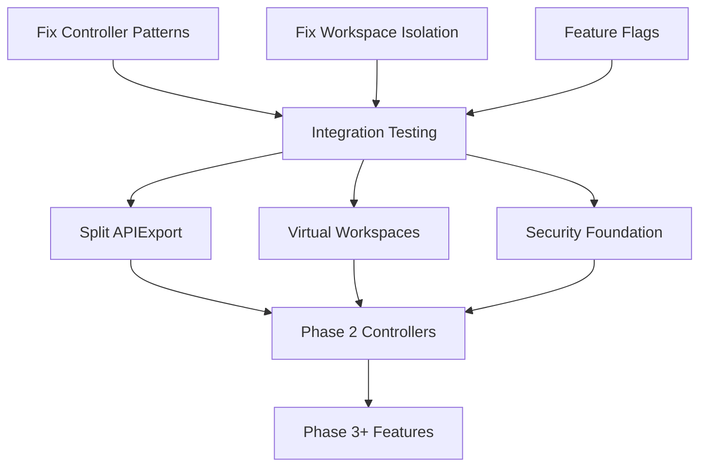

# TMC Reimplementation Plan 2 - Parallel Development Strategy

## Executive Summary

This document outlines a comprehensive parallel development strategy for addressing architectural issues identified in the TMC implementation while enabling multiple software engineering agents to work simultaneously using git worktrees. The plan prioritizes fixing critical architectural violations before proceeding with Phase 2+ work.

## Current State Assessment

### Completed Work Requiring Fixes
- **02a-core-apis** (401 lines) - Core TMC APIs ✅ (Needs workspace isolation review)
- **01a-01j branches** - Multiple API definition branches (various sizes) ⚠️
- **03-controller-foundation** (871 lines) - Has critical KCP pattern violations 🚨
- **02-apiexport-integration** (2,101 lines) - Needs splitting into smaller PRs 🚨

### Critical Issues from Architectural Review
1. **Controller Pattern Violations** - Existing controllers don't follow KCP patterns
2. **Workspace Isolation Gaps** - Security vulnerabilities in multi-tenant scenarios  
3. **Missing Virtual Workspace Support** - Required for proper TMC API serving
4. **Security Components in Wrong Phase** - RBAC/Auth should be Phase 1, not Phase 5
5. **Scalability Concerns** - Current design won't handle 1M workspaces

## Worktree Allocation Strategy

### Available Worktrees
```
/workspaces/kcp-worktrees/
├── main/                    # Clean main branch for reference
├── fix-controllers/         # Agent 1: Controller refactoring
├── fix-workspace-isolation/ # Agent 2: Workspace isolation fixes
├── split-apiexport/        # Agent 3: Split large APIExport PR
├── virtual-workspaces/     # Agent 4: Add virtual workspace support
├── security-foundation/    # Agent 5: Security/RBAC foundation
├── feature-flags/          # Agent 6: Feature flag implementation
├── testing-framework/      # Agent 7: Comprehensive testing
└── integration/           # Agent 8: Integration testing & coordination
```

### Agent Role Assignments

#### **Agent 1: Controller Refactoring Specialist**
- **Worktree**: `/workspaces/kcp-worktrees/fix-controllers/`
- **Priority**: CRITICAL
- **Tasks**:
  1. Refactor 03-controller-foundation to use KCP patterns
  2. Fix controller reconciliation loops
  3. Implement proper committer patterns
  4. Add typed workqueue interfaces
- **Branches to Create**:
  - `feature/tmc2-impl2/03a1-controller-patterns` (400 lines)
  - `feature/tmc2-impl2/03a2-reconciler-refactor` (350 lines)
  - `feature/tmc2-impl2/03a3-committer-integration` (300 lines)

#### **Agent 2: Workspace Isolation Engineer**
- **Worktree**: `/workspaces/kcp-worktrees/fix-workspace-isolation/`
- **Priority**: CRITICAL
- **Tasks**:
  1. Add workspace boundary validation to all controllers
  2. Fix LogicalCluster path resolution
  3. Implement proper cluster-aware client usage
  4. Add workspace isolation tests
- **Branches to Create**:
  - `feature/tmc2-impl2/02c-workspace-validation` (350 lines)
  - `feature/tmc2-impl2/02d-cluster-aware-clients` (400 lines)
  - `feature/tmc2-impl2/02e-isolation-tests` (300 lines)

#### **Agent 3: APIExport Decomposition Specialist**
- **Worktree**: `/workspaces/kcp-worktrees/split-apiexport/`
- **Priority**: HIGH
- **Tasks**:
  1. Split 02-apiexport-integration into smaller PRs
  2. Create incremental APIExport components
  3. Ensure each PR is atomic and testable
- **Branches to Create**:
  - `feature/tmc2-impl2/02a1-apiexport-core` (500 lines)
  - `feature/tmc2-impl2/02a2-apiexport-controller` (600 lines)
  - `feature/tmc2-impl2/02a3-apiexport-schemas` (500 lines)
  - `feature/tmc2-impl2/02a4-apiexport-integration` (500 lines)

#### **Agent 4: Virtual Workspace Architect**
- **Worktree**: `/workspaces/kcp-worktrees/virtual-workspaces/`
- **Priority**: HIGH
- **Tasks**:
  1. Implement TMC virtual workspace
  2. Add path prefix handling
  3. Create delegation chain
  4. Integrate with KCP virtual workspace system
- **Branches to Create**:
  - `feature/tmc2-impl2/01k-virtual-workspace` (600 lines)
  - `feature/tmc2-impl2/01l-vw-integration` (400 lines)

#### **Agent 5: Security Foundation Engineer**
- **Worktree**: `/workspaces/kcp-worktrees/security-foundation/`
- **Priority**: HIGH
- **Tasks**:
  1. Move security components to Phase 1
  2. Implement RBAC for TMC
  3. Add authentication/authorization
  4. Create security testing framework
- **Branches to Create**:
  - `feature/tmc2-impl2/01m-rbac-foundation` (500 lines)
  - `feature/tmc2-impl2/01n-auth-integration` (400 lines)
  - `feature/tmc2-impl2/01o-security-tests` (300 lines)

#### **Agent 6: Feature Flag Implementation**
- **Worktree**: `/workspaces/kcp-worktrees/feature-flags/`
- **Priority**: MEDIUM
- **Tasks**:
  1. Implement TMC master feature flag
  2. Add sub-feature flags for components
  3. Create flag configuration system
  4. Add flag testing
- **Branches to Create**:
  - `feature/tmc2-impl2/00a-feature-flags` (300 lines)
  - `feature/tmc2-impl2/00b-flag-integration` (250 lines)

#### **Agent 7: Testing Framework Specialist**
- **Worktree**: `/workspaces/kcp-worktrees/testing-framework/`
- **Priority**: MEDIUM
- **Tasks**:
  1. Create comprehensive unit test framework
  2. Add integration test harness
  3. Implement workspace isolation tests
  4. Add performance benchmarks
- **Branches to Create**:
  - `feature/tmc2-impl2/test-framework` (600 lines)
  - `feature/tmc2-impl2/test-benchmarks` (400 lines)

#### **Agent 8: Integration Coordinator**
- **Worktree**: `/workspaces/kcp-worktrees/integration/`
- **Priority**: ONGOING
- **Tasks**:
  1. Coordinate changes across worktrees
  2. Resolve merge conflicts
  3. Create integration tests
  4. Maintain PR plan documentation
- **Branches to Create**:
  - `feature/tmc2-impl2/integration-tests` (500 lines)

## Task Prioritization Matrix

### Phase 0: Critical Fixes (Week 1)
**Can be done in parallel - MUST complete before Phase 1**

| Task | Agent | Dependencies | Priority | Estimated Lines |
|------|-------|--------------|----------|-----------------|
| Fix controller patterns | Agent 1 | None | CRITICAL | 1,050 |
| Add workspace isolation | Agent 2 | None | CRITICAL | 1,050 |
| Implement feature flags | Agent 6 | None | HIGH | 550 |

### Phase 1: Foundation Corrections (Week 1-2)
**Can be done in parallel after Phase 0**

| Task | Agent | Dependencies | Priority | Estimated Lines |
|------|-------|--------------|----------|-----------------|
| Split APIExport PR | Agent 3 | Phase 0 | HIGH | 2,100 |
| Virtual workspace support | Agent 4 | Phase 0 | HIGH | 1,000 |
| Security foundation | Agent 5 | Phase 0 | HIGH | 1,200 |
| Testing framework | Agent 7 | Phase 0 | MEDIUM | 1,000 |

### Phase 2: Integration & Validation (Week 2)
**Sequential - requires Phase 1 completion**

| Task | Agent | Dependencies | Priority | Estimated Lines |
|------|-------|--------------|----------|-----------------|
| Integration testing | Agent 8 | Phase 1 | HIGH | 500 |
| Performance validation | Agent 7 | Phase 1 | MEDIUM | 400 |
| Security audit | Agent 5 | Phase 1 | HIGH | 300 |

### Phase 3: Resume Feature Development (Week 3+)
**Can proceed after Phase 2 validation**

- Resume Phase 2-5 work from original plan
- Apply corrected patterns to new development
- Maintain <700 lines per PR constraint

## Dependency Management

### Critical Path Dependencies


### Parallel Work Streams
1. **Stream 1**: Controller fixes (Agent 1) + Workspace isolation (Agent 2)
2. **Stream 2**: Feature flags (Agent 6) + Testing framework (Agent 7)
3. **Stream 3**: APIExport split (Agent 3) - can start after initial fixes
4. **Stream 4**: Virtual workspaces (Agent 4) + Security (Agent 5)

### Coordination Points
- **Daily Sync**: Integration agent coordinates status
- **Phase Gates**: All agents sync before phase transitions
- **Conflict Resolution**: Integration agent manages merge conflicts

## Quality Gates

### Per-Worktree Requirements

#### Code Quality Gates
- [ ] All tests pass (`make test`)
- [ ] Linting passes (`make lint`)
- [ ] Generated code updated (`make codegen`)
- [ ] No security vulnerabilities (`make security-scan`)
- [ ] Under 700 lines per PR (run `tmc-pr-line-counter.sh`)

#### Architectural Gates
- [ ] Follows KCP controller patterns
- [ ] Maintains workspace isolation
- [ ] Uses cluster-aware clients
- [ ] Implements proper error handling
- [ ] Includes comprehensive logging

#### Testing Gates
- [ ] Unit test coverage >80%
- [ ] Integration tests for new features
- [ ] Workspace isolation tests pass
- [ ] Performance benchmarks meet targets
- [ ] No regression in existing tests

### Integration Gates
- [ ] No merge conflicts with main
- [ ] All worktree changes compatible
- [ ] Integration tests pass
- [ ] Documentation updated
- [ ] PR description complete

## Coordination Protocol

### Communication Channels
1. **Primary**: Shared status file in each worktree
2. **Status Updates**: `/workspaces/kcp-shared-tools/status/`
3. **Conflict Resolution**: Integration agent coordinates
4. **PR Tracking**: Update TMC-REIMPL-PLAN2-PR-PLAN.md

### Daily Workflow
```bash
# Morning sync (each agent)
cd /workspaces/kcp-worktrees/<agent-worktree>/
git fetch origin
git rebase origin/main
echo "$(date): Status update" >> ../status/agent-<n>.md

# Work phase
# ... implement features ...

# Evening sync
git push origin feature/tmc2-impl2/<branch>
echo "$(date): Completed <task>" >> ../status/agent-<n>.md

# Integration agent reviews all status files
cd /workspaces/kcp-worktrees/integration/
./scripts/check-integration.sh
```

### Conflict Resolution Process
1. **Detection**: Integration agent monitors for conflicts
2. **Isolation**: Conflicting changes isolated to separate branches
3. **Resolution**: Agents collaborate on resolution branch
4. **Validation**: Integration tests confirm resolution
5. **Merge**: Clean merge to target branch

## Risk Mitigation

### Technical Risks

#### Risk: Merge Conflicts
- **Mitigation**: Daily rebasing, small atomic commits
- **Owner**: Integration agent
- **Fallback**: Create resolution branches

#### Risk: Pattern Violations Reintroduced
- **Mitigation**: Automated pattern checking in CI
- **Owner**: Agent 1 (Controller specialist)
- **Fallback**: Code review gates

#### Risk: Workspace Isolation Breaches
- **Mitigation**: Comprehensive isolation tests
- **Owner**: Agent 2 (Workspace specialist)
- **Fallback**: Security audit before merge

### Process Risks

#### Risk: Agent Coordination Failure
- **Mitigation**: Daily status updates, integration agent oversight
- **Owner**: Agent 8 (Integration coordinator)
- **Fallback**: Sequential development fallback

#### Risk: PR Size Violations
- **Mitigation**: Continuous line counting, early splitting
- **Owner**: Each agent for their PRs
- **Fallback**: Further decomposition

#### Risk: Timeline Slippage
- **Mitigation**: Phase gates, priority focus on critical fixes
- **Owner**: Integration coordinator
- **Fallback**: Reduce scope, focus on critical path

## Success Metrics

### Phase 0 Success Criteria
- ✅ All controllers use KCP patterns
- ✅ Workspace isolation validated
- ✅ Feature flags operational
- ✅ No failing tests

### Phase 1 Success Criteria
- ✅ APIExport split into <700 line PRs
- ✅ Virtual workspace implementation complete
- ✅ Security foundation in place
- ✅ Testing framework operational

### Phase 2 Success Criteria
- ✅ All integration tests pass
- ✅ Performance targets met
- ✅ Security audit passed
- ✅ Ready for Phase 3 development

### Overall Success Metrics
- **PR Size**: 100% compliance with <700 line limit
- **Test Coverage**: >80% for all new code
- **Pattern Compliance**: 100% KCP pattern adherence
- **Security**: Zero workspace isolation violations
- **Performance**: Handles 1000 workspaces in testing

## Timeline

### Week 1: Critical Fixes
- Days 1-2: Setup worktrees, begin Phase 0
- Days 3-4: Complete critical fixes
- Day 5: Integration testing of fixes

### Week 2: Foundation Corrections
- Days 6-7: Begin Phase 1 parallel work
- Days 8-9: Continue implementation
- Day 10: Phase 1 integration

### Week 3: Integration & Validation
- Days 11-12: Phase 2 integration work
- Day 13: Security audit
- Days 14-15: Performance validation

### Week 4+: Resume Feature Development
- Apply corrected patterns
- Continue with original Phase 2-5 plans
- Maintain quality gates

## Worktree Setup Instructions

### Initial Setup (One-time)
```bash
# Create worktrees directory
mkdir -p /workspaces/kcp-worktrees
cd /workspaces/kcp

# Setup each agent worktree
for agent in fix-controllers fix-workspace-isolation split-apiexport \
             virtual-workspaces security-foundation feature-flags \
             testing-framework integration; do
  git worktree add ../kcp-worktrees/$agent main
done

# Create shared status directory
mkdir -p /workspaces/kcp-shared-tools/status
```

### Per-Agent Setup
```bash
# Agent N setup (example for Agent 1)
cd /workspaces/kcp-worktrees/fix-controllers/
git checkout -b feature/tmc2-impl2/03a1-controller-patterns

# Configure agent identity
git config user.name "Agent 1 - Controller Specialist"
git config user.email "agent1@tmc-project.local"

# Create status file
echo "# Agent 1 Status Log" > /workspaces/kcp-shared-tools/status/agent-1.md
```

## Conclusion

This parallel development strategy enables 8 agents to work simultaneously on fixing critical architectural issues while maintaining code quality and preventing conflicts. The phased approach ensures critical fixes are completed before resuming feature development, with clear quality gates and coordination protocols to ensure success.

The strategy prioritizes:
1. **Fixing critical KCP pattern violations** (Phase 0)
2. **Implementing proper foundations** (Phase 1)
3. **Validating through integration** (Phase 2)
4. **Resuming feature development** with corrected patterns (Phase 3+)

By following this plan, the TMC implementation will be architecturally sound, scalable to 1M workspaces, and maintainable within the KCP ecosystem.