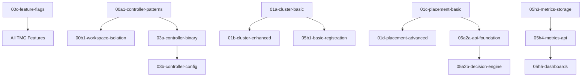

# TMC Reimplementation Plan 2: Complete PR Submission Order (FINAL)

## 🎯 Executive Summary

**Total Branches**: 51 TMC feature branches
**Ready for Submission**: 22 PRs under 800 lines
**Need Splitting**: 29 PRs over 800 lines  
**PR Messages**: 39 collected in `/workspaces/kcp-worktrees/tmc-planning/pr-messages/`
**Target Size**: 400-700 lines (800 max)

## 🚨 IMMEDIATE ACTION - Submit NOW

### No Dependencies - Can Submit Immediately
```bash
gh pr create --base main --head feature/tmc2-impl2/00c-feature-flags \
  --title "feat(tmc): add feature flags for TMC functionality" \
  --body "$(cat /workspaces/kcp-worktrees/tmc-planning/pr-messages/PR-MESSAGE-FOR-feature-tmc2-impl2-00c-feature-flags.md)"
```
- **Branch**: `feature/tmc2-impl2/00c-feature-flags`
- **Size**: 698 lines ✅
- **Priority**: CRITICAL - Gates all TMC features

## 📋 Complete Submission Order with Dependencies

### Wave 1: Foundation (After Feature Flags Merge)

| Branch | Lines | Status | Dependencies | PR Message File |
|--------|-------|--------|--------------|-----------------|
| 00a1-controller-patterns | 2023 | ❌ SPLIT to 3 PRs | None | `PR-MESSAGE-FOR-feature-tmc2-impl2-00a1-controller-patterns.md` |
| 00b1-workspace-isolation | 2520 | ❌ SPLIT to 4 PRs | 00a1 | `PR-MESSAGE-FOR-feature-tmc2-impl2-00b1-workspace-isolation.md` |

### Wave 2: Core APIs

| Branch | Lines | Status | Dependencies | PR Message File |
|--------|-------|--------|--------------|-----------------|
| 01a-cluster-basic | 180 | ✅ READY | None | `PR-MESSAGE-FOR-feature-tmc2-impl2-01a-cluster-basic.md` |
| 01c-placement-basic | 376 | ✅ READY | None | `PR-MESSAGE-FOR-feature-tmc2-impl2-01c-placement-basic.md` |
| 03a-controller-binary | 675 | ✅ READY | 00a1, 00c | `PR-MESSAGE-FOR-feature-tmc2-impl2-03a-controller-binary.md` |
| 03b-controller-config | 634 | ✅ READY | 03a | `PR-MESSAGE-FOR-feature-tmc2-impl2-03b-controller-config.md` |

### Wave 3: Enhanced APIs & Integration

| Branch | Lines | Status | Dependencies | PR Message File |
|--------|-------|--------|--------------|-----------------|
| 01b-cluster-enhanced | 286 | ✅ READY | 01a | `PR-MESSAGE-FOR-feature-tmc2-impl2-01b-cluster-enhanced.md` |
| 01d-placement-advanced | 705 | ⚠️ READY | 01c | `PR-MESSAGE-FOR-feature-tmc2-impl2-01d-placement-advanced.md` |
| 02a-core-apis | 2896 | ❌ SPLIT to 5 PRs | Phase 1 | `PR-MESSAGE-FOR-feature-tmc2-impl2-02a-core-apis.md` |
| 05a2d-rest-mapper | 2 | ✅ READY | None | `PR-MESSAGE-FOR-feature-tmc2-impl2-05a2d-rest-mapper.md` |

### Wave 4: Placement Implementation

| Branch | Lines | Status | Dependencies | PR Message File |
|--------|-------|--------|--------------|-----------------|
| 05a2a-api-foundation | 5359 | 🔴 CRITICAL SPLIT | None | `PR-MESSAGE-FOR-feature-tmc2-impl2-05a2a-api-foundation.md` |
| 05a2b-decision-engine | 700 | ✅ READY | 05a2a (after split) | `PR-MESSAGE-FOR-feature-tmc2-impl2-05a2b-decision-engine.md` |
| 05a2c2a-aggregation | 602 | ✅ READY | None | `PR-MESSAGE-FOR-feature-tmc2-impl2-05a2c2a-aggregation.md` |
| 05c1-engine-interface | 697 | ✅ READY | Controllers | `PR-MESSAGE-FOR-feature-tmc2-impl2-05c1-engine-interface.md` |

### Wave 5: API Server & Helpers (From Today's Splits)

| Branch | Lines | Status | Dependencies | PR Message File |
|--------|-------|--------|--------------|-----------------|
| 05a2c1a-api-server | 639 | ✅ READY | APIs | `PR-MESSAGE-FOR-feature-tmc2-impl2-05a2c1a-api-server.md` |
| 05a2c1b-api-helpers | 629 | ✅ READY | 05a2c1a | `PR-MESSAGE-FOR-feature-tmc2-impl2-05a2c1b-api-helpers.md` |

### Wave 6: Dashboards (From Today's Splits)

| Branch | Lines | Status | Dependencies | PR Message File |
|--------|-------|--------|--------------|-----------------|
| 05a2c2b1-dashboard-core | 735 | ⚠️ READY | None | `PR-MESSAGE-FOR-feature-tmc2-impl2-05a2c2b1-dashboard-core.md` |
| 05a2c2b3-dashboard-assets | 728 | ⚠️ READY | Core | `PR-MESSAGE-FOR-feature-tmc2-impl2-05a2c2b3-dashboard-assets.md` |

### Wave 7: Metrics & Storage

| Branch | Lines | Status | Dependencies | PR Message File |
|--------|-------|--------|--------------|-----------------|
| 05h3-metrics-storage | 654 | ✅ READY | None | `PR-MESSAGE-FOR-feature-tmc2-impl2-05h3-metrics-storage.md` |
| 05h4-metrics-api | 629 | ✅ READY | Storage | `PR-MESSAGE-FOR-feature-tmc2-impl2-05h4-metrics-api.md` |
| 05h5-dashboards | 319 | ✅ READY | Metrics | `PR-MESSAGE-FOR-feature-tmc2-impl2-05h5-dashboards.md` |
| 05h2b-collectors-clean | 512 | ✅ READY | None | Not found - needs creation |

### Wave 8: Consolidation (From Today's Splits)

| Branch | Lines | Status | Dependencies | PR Message File |
|--------|-------|--------|--------------|-----------------|
| 05h2c1-consolidation-core | 588 | ✅ READY | None | `PR-MESSAGE-FOR-feature-tmc2-impl2-05h2c1-consolidation-core.md` |
| 05h2c2-consolidation-advanced | 393 | ✅ READY | Core | `PR-MESSAGE-FOR-feature-tmc2-impl2-05h2c2-consolidation-advanced.md` |
| 05h2c3-consolidation-integration | 545 | ✅ READY | Advanced | `PR-MESSAGE-FOR-feature-tmc2-impl2-05h2c3-consolidation-integration.md` |

### Wave 9: Remaining Large Branches (Need Splitting)

| Branch | Lines | Action Required |
|--------|-------|-----------------|
| 05b-cluster-controller | 6577 | 🔴 Split to 10 PRs |
| 01c-security-foundation | 2019 | Split to 3 PRs |
| 05b1-basic-registration | 1455 | Split to 2 PRs |
| 05c2-api-types | 2613 | Split to 4 PRs |
| 05c3-resource-aware | 1122 | Split to 2 PRs |

## 📊 Size Analysis

### Ready PRs by Size
- **0-400 lines**: 8 PRs ✅ Excellent
- **401-700 lines**: 14 PRs ✅ Good  
- **701-800 lines**: 4 PRs ⚠️ Acceptable
- **Total Ready**: 22 PRs

### Need Splitting
- **801-1000 lines**: 3 PRs
- **1001-2000 lines**: 7 PRs
- **2000+ lines**: 15 PRs 🔴 Critical
- **Total Needing Split**: 29 PRs

## 🔴 Critical Blockers

These oversized branches are blocking progress:

1. **`05a2a-api-foundation`** - 5359 lines
   - Blocks: All placement work
   - Action: Split to 8 PRs immediately

2. **`05b-cluster-controller`** - 6577 lines  
   - Blocks: Cluster registration
   - Action: Split to 10 PRs

3. **`00a1-controller-patterns`** - 2023 lines
   - Blocks: All controllers
   - Action: Split to 3 PRs

## 📁 PR Message Files

All PR messages are located in:
```
/workspaces/kcp-worktrees/tmc-planning/pr-messages/
```

### How to Create PRs with Messages

```bash
# Example for feature flags PR
gh pr create \
  --base main \
  --head feature/tmc2-impl2/00c-feature-flags \
  --title "feat(tmc): add feature flags for TMC functionality" \
  --body "$(cat /workspaces/kcp-worktrees/tmc-planning/pr-messages/PR-MESSAGE-FOR-feature-tmc2-impl2-00c-feature-flags.md)"

# For controller binary
gh pr create \
  --base main \
  --head feature/tmc2-impl2/03a-controller-binary \
  --title "feat(tmc): add TMC controller binary foundation" \
  --body "$(cat /workspaces/kcp-worktrees/tmc-planning/pr-messages/PR-MESSAGE-FOR-feature-tmc2-impl2-03a-controller-binary.md)"
```

## 🔄 Dependency Graph



## ✅ Submission Checklist

For each PR submission:
- [ ] Run `tmc-pr-line-counter.sh` to verify size
- [ ] Attach PR message from `/workspaces/kcp-worktrees/tmc-planning/pr-messages/`
- [ ] Verify dependencies are merged
- [ ] Ensure feature flag protection
- [ ] Check tests pass
- [ ] Verify DCO and GPG signing

## 📈 Progress Tracking

### Immediate (Today)
- [ ] Submit `00c-feature-flags`
- [ ] Split `00a1-controller-patterns` (3 PRs)
- [ ] Split `05a2a-api-foundation` (8 PRs)

### Tomorrow  
- [ ] Submit Wave 2 core APIs
- [ ] Submit Wave 3 enhanced APIs
- [ ] Begin controller submissions

### This Week
- [ ] Complete Waves 1-6
- [ ] Split remaining oversized branches
- [ ] Get 50% of PRs submitted

## 📝 Notes

1. **Feature flags MUST merge first** - everything depends on them
2. **Controller patterns block many PRs** - prioritize splitting
3. **05a2a at 5359 lines** is the largest single blocker
4. All cleaned branches from today are ready
5. PR messages have been collected and verified

## 🚀 Quick Commands

```bash
# Check branch size
/workspaces/kcp-shared-tools/tmc-pr-line-counter.sh -c feature/tmc2-impl2/BRANCH-NAME

# List all TMC branches
git branch -r | grep "feature/tmc2-impl2" | sort

# Check PR message exists
ls /workspaces/kcp-worktrees/tmc-planning/pr-messages/ | grep BRANCH-NAME
```

---

*Last Updated: Current Session*
*Total Branches: 51*
*Ready for Submission: 22*
*Need Splitting: 29*
*PR Messages Available: 39*