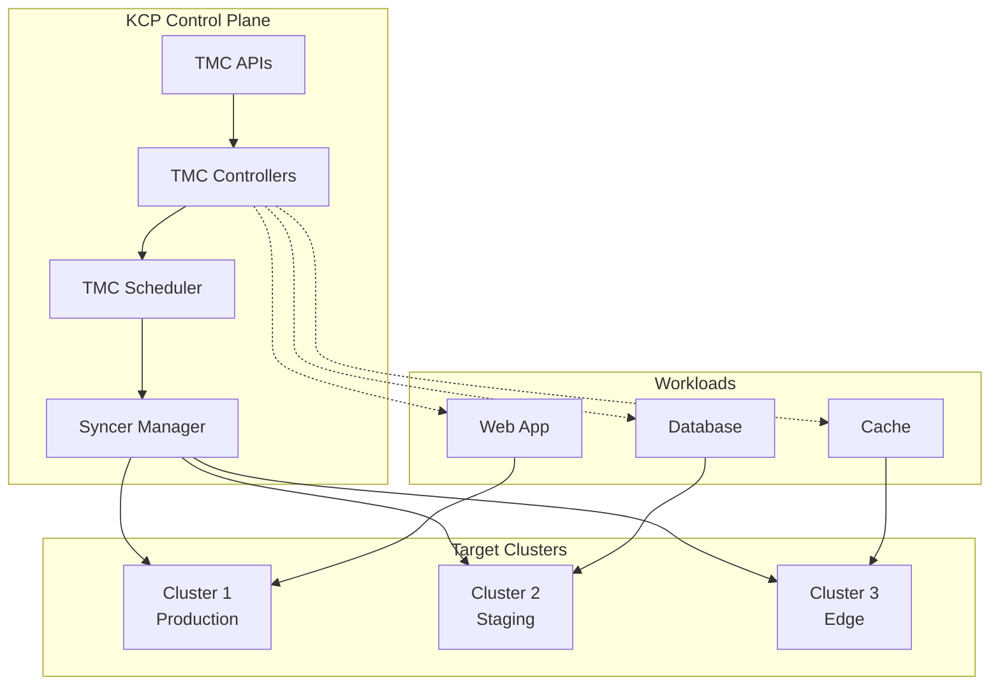

# TMC Overview and Architecture

## Introduction

Transparent Multi-Cluster (TMC) extends KCP's capabilities to provide seamless multi-cluster workload management. TMC abstracts away the complexity of multiple Kubernetes clusters, presenting them as a single logical compute surface where workloads can be scheduled intelligently.

## Core Concepts

### Cluster Registration

Physical Kubernetes clusters are registered with TMC through the `ClusterRegistration` API. This process:

- Establishes secure communication channels between KCP and target clusters
- Discovers cluster capabilities and resource capacity
- Sets up continuous health monitoring and status reporting
- Enables workload scheduling and lifecycle management

### Workload Placement

The `WorkloadPlacement` API defines how and where workloads should be deployed:

- **Placement Policies**: Rules governing workload distribution
- **Resource Requirements**: CPU, memory, and storage constraints  
- **Affinity Rules**: Co-location and anti-affinity preferences
- **Geographic Constraints**: Region and availability zone requirements

### Transparent Scheduling

TMC's scheduler automatically:

1. Analyzes workload requirements and placement policies
2. Evaluates available cluster resources and health
3. Selects optimal target clusters for deployment
4. Handles failover and rescheduling as needed

## Architecture Components

### TMC APIs

- **ClusterRegistration**: Manages cluster lifecycle and capabilities
- **WorkloadPlacement**: Defines placement policies and requirements
- **SyncTarget**: Internal representation of registered clusters
- **PlacementPolicy**: Cross-cutting placement rules and constraints

### TMC Controllers

- **Cluster Registration Controller**: Handles cluster onboarding and health
- **Workload Placement Controller**: Processes placement decisions
- **Syncer Manager**: Coordinates workload synchronization
- **Resource Monitor**: Tracks cluster capacity and utilization

### TMC Scheduler

The scheduler implements sophisticated algorithms for:

- **Resource-aware placement**: Considering CPU, memory, and storage
- **Policy enforcement**: Respecting placement constraints
- **Load balancing**: Even distribution across available capacity
- **Failure handling**: Automatic rescheduling on cluster issues

## Integration with KCP

TMC leverages KCP's foundational concepts:

### Logical Clusters

Each registered cluster maintains its own logical cluster context within KCP, providing:
- Isolated resource namespaces
- Independent RBAC and policy enforcement
- Separate API discovery and schema validation

### API Exports and Bindings

TMC APIs are exported and bound following KCP patterns:
- Cluster operators bind to TMC APIs for management access
- Workload APIs are transparently available across cluster boundaries
- Policy APIs provide fine-grained access control

### Workspace Integration

TMC respects KCP workspace boundaries:
- Placement policies can be workspace-scoped
- Cluster access follows workspace RBAC rules
- Resource quotas apply across the multi-cluster surface

## Benefits

### For Platform Engineers
- **Unified Management**: Single control plane for multiple clusters
- **Policy Enforcement**: Consistent governance across environments
- **Resource Optimization**: Intelligent placement and load balancing
- **Operational Simplicity**: Reduced complexity in multi-cluster scenarios

### For Application Developers
- **Transparent Experience**: Deploy as if to a single large cluster
- **High Availability**: Automatic failover and disaster recovery
- **Geographic Distribution**: Place workloads close to users
- **Development Velocity**: No need to understand cluster topology

### For Organizations
- **Cost Optimization**: Better resource utilization across clusters
- **Compliance**: Policy-driven placement for regulatory requirements
- **Scalability**: Easy addition of compute capacity
- **Flexibility**: Multi-cloud and hybrid cloud support

## Getting Started

Ready to try TMC? Continue to the [Getting Started Guide](getting-started.md) to set up your first multi-cluster environment.