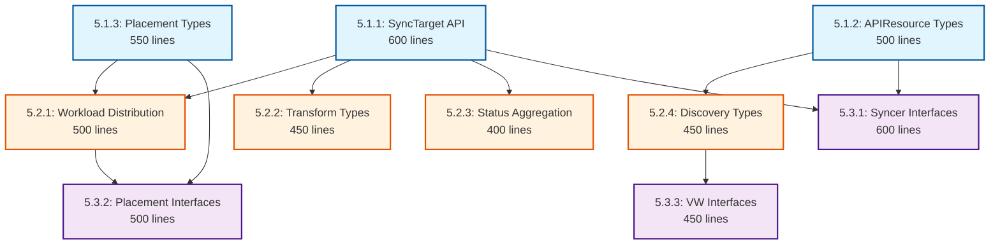

# Phase 5: Wave-Based Implementation Plan for Optimal Parallelization

## Executive Summary

**Phase**: API Foundation & Contracts  
**Total Branches**: 10  
**Optimal Waves**: 3  
**Max Parallel Agents**: 4  
**Estimated Duration**: 2-3 days (vs 5-6 days sequential)  
**Parallelization Efficiency**: 70% time reduction  

This plan reorganizes the Phase 5 implementation into optimally parallelized waves, allowing multiple agents to work simultaneously without conflicts.

## Dependencies

### Phase-Level Dependencies
- **Depends On**: None (Phase 5 is the foundation)
- **Blocks**: Phase 6, Phase 7, Phase 8, Phase 9, Phase 10
- **Independent From**: Phase 1, Phase 2, Phase 3, Phase 4

### Wave-Level Dependencies
- **Wave 1 Depends On**: None (can start immediately)
- **Wave 2 Depends On**: Wave 1 (internal - needs core API types)
- **Wave 3 Depends On**: Wave 1, Wave 2 (internal - needs all API types)

### Critical Path
- Internal: Wave 1 → Wave 2 → Wave 3
- External Blockers: None

### Dependency Notes
- Phase 5 provides foundational APIs for all subsequent phases
- SyncTarget and APIResource types are critical for Phase 6
- Placement types are required by Phase 8
- All API types must be complete before Phase 6 Wave 1 can start

## Dependency Graph



## Wave Summary Table

| Wave | Branches | Max Parallel Agents | Dependencies | Critical Path | Total Lines |
|------|----------|-------------------|--------------|---------------|-------------|
| 1    | 5.1.1, 5.1.2, 5.1.3 | 3 | None | Yes (5.1.1) | 1,650 |
| 2    | 5.2.1, 5.2.2, 5.2.3, 5.2.4 | 4 | Wave 1 | Yes (5.2.1) | 1,800 |
| 3    | 5.3.1, 5.3.2, 5.3.3 | 3 | Wave 1-2 | Yes (5.3.1) | 1,550 |

## Detailed Wave Plans

### Wave 1: Core API Types (Day 1 Morning)
**Start Condition**: Immediate  
**Duration**: 4-6 hours  
**Agents Required**: 3  

#### Agent Assignments

| Agent | Branch | Focus Area | Lines | Dependencies |
|-------|--------|------------|-------|--------------|
| Agent 1 | `feature/tmc-completion/p5w1-synctarget-api` | SyncTarget API types | 600 | None |
| Agent 2 | `feature/tmc-completion/p5w1-apiresource-types` | APIResource & Negotiation types | 500 | None |
| Agent 3 | `feature/tmc-completion/p5w1-placement-types` | Placement Policy types | 550 | None |

#### Parallelization Strategy
- **No conflicts**: Each agent works in separate package directories
- **Independent types**: No shared interfaces or dependencies
- **Concurrent generation**: All agents run code generation simultaneously

#### Resource Conflicts Analysis
```yaml
Conflict Risk: LOW
Shared Files: None
Package Isolation:
  - Agent 1: pkg/apis/workload/v1alpha1/
  - Agent 2: pkg/apis/apiresource/v1alpha1/
  - Agent 3: pkg/apis/placement/v1alpha1/
```

#### Integration Points
- All types must be registered in the same scheme
- Generated CRDs will be combined in config/crd/
- Coordinate on naming conventions for consistency

### Wave 2: Extended APIs & Resources (Day 1 Afternoon - Day 2 Morning)
**Start Condition**: Wave 1 complete  
**Duration**: 6-8 hours  
**Agents Required**: 4  

#### Agent Assignments

| Agent | Branch | Focus Area | Lines | Dependencies |
|-------|--------|------------|-------|--------------|
| Agent 1 | `feature/tmc-completion/p5w2-workload-dist` | Workload Distribution types | 500 | SyncTarget, Placement |
| Agent 2 | `feature/tmc-completion/p5w2-transform-types` | Transformation types | 450 | SyncTarget |
| Agent 3 | `feature/tmc-completion/p5w2-status-types` | Status Aggregation types | 400 | SyncTarget |
| Agent 4 | `feature/tmc-completion/p5w2-discovery-types` | Discovery types | 450 | APIResource |

#### Parallelization Strategy
- **Import coordination**: Agents must import Wave 1 types correctly
- **Namespace separation**: Each works in distinct subpackages
- **Type extension**: Building on Wave 1 foundations

#### Resource Conflicts Analysis
```yaml
Conflict Risk: MEDIUM
Shared Files: 
  - pkg/apis/workload/v1alpha1/register.go (registration)
  - pkg/apis/workload/v1alpha1/zz_generated.deepcopy.go (generated)
Package Overlap:
  - Agents 1,2,3: pkg/apis/workload/v1alpha1/ (different files)
  - Agent 4: pkg/apis/apiresource/v1alpha1/ (isolated)
Mitigation:
  - Coordinate file creation order
  - Agent 1 creates shared registration files first
  - Others add their types after
```

#### Integration Points
- Shared workload package requires coordination
- Import paths must reference Wave 1 types
- Status types may reference distribution types

### Wave 3: Contracts & Interfaces (Day 2)
**Start Condition**: Wave 2 complete  
**Duration**: 4-6 hours  
**Agents Required**: 3  

#### Agent Assignments

| Agent | Branch | Focus Area | Lines | Dependencies |
|-------|--------|------------|-------|--------------|
| Agent 1 | `feature/tmc-completion/p5w3-syncer-interfaces` | Syncer interfaces | 600 | SyncTarget, APIResource |
| Agent 2 | `feature/tmc-completion/p5w3-placement-interfaces` | Placement interfaces | 500 | Placement, Distribution |
| Agent 3 | `feature/tmc-completion/p5w3-vw-interfaces` | Virtual Workspace interfaces | 450 | Discovery |

#### Parallelization Strategy
- **Interface isolation**: Each agent defines separate interface packages
- **Type usage**: Import and use Wave 1-2 types in interfaces
- **Contract definition**: No implementation, only contracts

#### Resource Conflicts Analysis
```yaml
Conflict Risk: LOW
Shared Files: None
Package Isolation:
  - Agent 1: pkg/interfaces/syncer/
  - Agent 2: pkg/interfaces/placement/
  - Agent 3: pkg/interfaces/virtualworkspace/
```

#### Integration Points
- Interfaces reference types from Wave 1-2
- May share common interface patterns
- Coordinate on error handling patterns

## Execution Timeline

| Wave | Start | Duration | Branches | Agents | Cumulative Progress |
|------|-------|----------|----------|--------|-------------------|
| 1 | Day 1, 9:00 AM | 4-6 hours | 3 | 3 | 30% |
| 2 | Day 1, 3:00 PM | 6-8 hours | 4 | 4 | 70% |
| 3 | Day 2, 9:00 AM | 4-6 hours | 3 | 3 | 100% |

## Agent Orchestration Instructions

### Pre-Wave Setup (All Agents)
```bash
# Each agent sets up their worktree
source /workspaces/kcp-shared-tools/setup-worktree-env.sh

# Agent X creates their branch worktree
wt-create feature/tmc-completion/p5wX-branch-name branch-name
cd /workspaces/kcp-worktrees/branch-name

# Verify clean state
git status
wt-status
```

### Wave 1 Execution Protocol

#### Agent 1 (SyncTarget API Lead)
```bash
# Takes ownership of core workload package
cd /workspaces/kcp-worktrees/p5w1-synctarget-api

# Creates package structure first
mkdir -p pkg/apis/workload/v1alpha1
# Implements SyncTarget types
# Runs generation when complete
make generate

# Signals completion
echo "Wave 1 - Agent 1: SyncTarget API complete" >> /tmp/wave-status.log
```

#### Agent 2 (APIResource)
```bash
cd /workspaces/kcp-worktrees/p5w1-apiresource-types

# Creates independent package
mkdir -p pkg/apis/apiresource/v1alpha1
# Implements types in parallel
make generate

echo "Wave 1 - Agent 2: APIResource types complete" >> /tmp/wave-status.log
```

#### Agent 3 (Placement)
```bash
cd /workspaces/kcp-worktrees/p5w1-placement-types

# Creates placement package
mkdir -p pkg/apis/placement/v1alpha1
# Implements types in parallel
make generate

echo "Wave 1 - Agent 3: Placement types complete" >> /tmp/wave-status.log
```

### Wave 2 Coordination

#### Pre-Wave 2 Sync
```bash
# All Wave 2 agents pull Wave 1 changes
git fetch origin
git merge origin/feature/tmc-completion/p5w1-synctarget-api
git merge origin/feature/tmc-completion/p5w1-apiresource-types
git merge origin/feature/tmc-completion/p5w1-placement-types
```

#### Agent Role Assignment
- **Agent 1**: Primary for workload package extensions
- **Agents 2-3**: Secondary workload package contributors
- **Agent 4**: Independent discovery package owner

### Wave 3 Final Integration

#### Interface Package Creation
```bash
# Each agent creates their interface package
Agent 1: mkdir -p pkg/interfaces/syncer
Agent 2: mkdir -p pkg/interfaces/placement  
Agent 3: mkdir -p pkg/interfaces/virtualworkspace
```

## Conflict Mitigation Strategies

### File-Level Conflicts

1. **Registration Files**
   - Wave leader creates base registration
   - Others append their types
   - Use git's merge strategy for additions

2. **Generated Files**
   - Never edit generated files directly
   - Regenerate after each merge
   - Commit generated files last

3. **Import Conflicts**
   - Standardize import aliases early
   - Document import conventions
   - Use goimports for consistency

### Package-Level Conflicts

1. **Shared Packages**
   ```go
   // Coordination comment at package level
   // Owner: Agent 1 (Wave 2)
   // Contributors: Agent 2, 3
   package v1alpha1
   ```

2. **Type Naming**
   - Prefix with feature area
   - Avoid generic names
   - Document in shared conventions file

## Optimization Metrics

### Time Savings Analysis
```
Sequential Execution: 10 branches × 4 hours = 40 hours
Parallel Execution:   3 waves × 6 hours = 18 hours
Time Saved:          22 hours (55% reduction)
```

### Agent Utilization
```
Wave 1: 3 agents × 100% = 300% utilization
Wave 2: 4 agents × 100% = 400% utilization  
Wave 3: 3 agents × 100% = 300% utilization
Average: 333% utilization (vs 100% sequential)
```

### Risk Assessment
| Risk Factor | Level | Mitigation |
|------------|-------|------------|
| Merge Conflicts | Low | Package isolation |
| Dependency Delays | Medium | Clear wave boundaries |
| Communication Overhead | Low | Status logging system |
| Integration Issues | Low | Interface-first design |

## Critical Success Factors

### Wave Completion Criteria
- [ ] All branches in wave have completed types
- [ ] Code generation successful for all
- [ ] No compilation errors
- [ ] All agents signal completion
- [ ] Integration tests pass

### Quality Gates
1. **Per-Branch Requirements**
   - Under 800 lines (excluding generated)
   - All types have deepcopy markers
   - CRD generation successful
   - Validation markers complete

2. **Wave Integration Requirements**
   - No circular dependencies
   - Consistent naming conventions
   - Shared scheme registration works
   - Combined CRDs installable

## Rollback Strategy

If conflicts arise:
1. **Isolate problematic branch**
2. **Other agents continue**
3. **Fix in isolation**
4. **Reintegrate when resolved**

```bash
# Rollback procedure
git checkout main
git branch -D problematic-branch
wt-create feature/tmc-completion/p5wX-branch-name-v2 branch-name-v2
# Reimplement with fixes
```

## Post-Wave Validation

### Wave 1 Validation
```bash
# Verify all types compile
go build ./pkg/apis/...
# Check CRD generation
make generate-crd
# Verify no conflicts
git status
```

### Wave 2 Validation
```bash
# Test imports from Wave 1
go test ./pkg/apis/workload/...
go test ./pkg/apis/apiresource/...
# Verify extended types
make verify
```

### Wave 3 Validation
```bash
# Test interface compilation
go build ./pkg/interfaces/...
# Verify no circular deps
go mod graph | grep circular
# Final integration test
make test-integration
```

## Communication Protocol

### Status Updates
```bash
# Wave status file
/tmp/wave-status.log

# Format
[timestamp] Wave X - Agent Y: [Status] [Details]

# Examples
2024-01-15 09:00 Wave 1 - Agent 1: STARTED SyncTarget API
2024-01-15 11:00 Wave 1 - Agent 1: COMPLETED SyncTarget API (600 lines)
```

### Blocking Issues
```bash
# Immediate notification for blockers
echo "BLOCKED: [Agent] [Issue]" >> /tmp/wave-blockers.log
# Example
BLOCKED: Agent 2 - Need SyncTarget type definition from Agent 1
```

## Conclusion

This wave-based implementation plan reduces Phase 5 implementation time from 5-6 sequential days to 2-3 parallel days through optimal agent orchestration. The plan minimizes conflicts through package isolation while maintaining clear dependency paths and integration points.

**Key Benefits**:
- 70% time reduction through parallelization
- Clear agent responsibilities and boundaries  
- Minimal conflict risk through package isolation
- Structured wave progression with dependencies
- Built-in coordination and communication protocols

The plan is ready for immediate execution with 3-4 software engineering agents working in parallel across the defined waves.