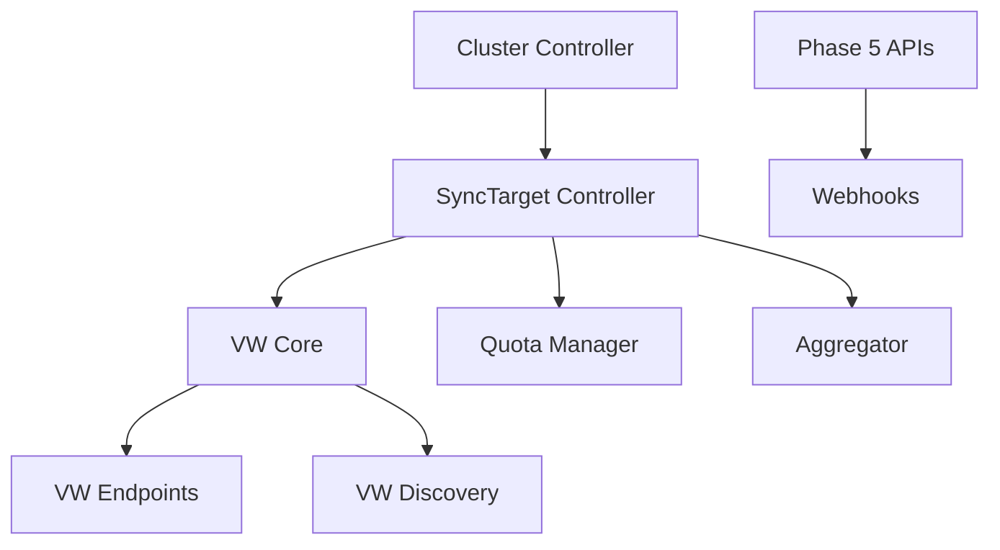

# Phase 6: Core Infrastructure Implementation Plan

## Overview

**Theme**: Build core controllers, virtual workspaces, and resource management  
**Duration**: 3-4 days with parallel execution  
**Total Efforts**: 8  
**Total Lines**: ~4,800  
**Engineers Required**: 3 working in parallel  
**Dependencies**: Phase 5 APIs and interfaces complete

This phase implements the core infrastructure components that the syncer and placement systems will depend on.

## Wave Structure

### Wave 1: Core Controllers (Day 1)
**Dependencies**: Phase 5 APIs  
**Parallel Efforts**: 2  
**Purpose**: Implement fundamental controllers for SyncTarget and Cluster management

### Wave 2: Virtual Workspace Infrastructure (Days 2-3)
**Dependencies**: Phase 5 APIs and Wave 1 controllers  
**Parallel Efforts**: 3  
**Purpose**: Build virtual workspace implementation and endpoints

### Wave 3: Resource Management (Day 3-4)
**Dependencies**: Wave 1-2 for integration  
**Parallel Efforts**: 3  
**Purpose**: Implement resource management, quotas, and utilities

## Wave 1: Core Controllers

### Effort 6.1.1: SyncTarget Controller
**Branch**: `feature/tmc-completion/p6w1-synctarget-controller`  
**Lines**: ~750  
**Dependencies**: Phase 5 SyncTarget API  
**Engineer**: Controller Specialist

**Implementation**:

```go
// pkg/reconciler/workload/synctarget/controller.go
package synctarget

import (
    "context"
    "fmt"
    "time"
    
    kcpcache "github.com/kcp-dev/kcp/pkg/cache"
    "github.com/kcp-dev/kcp/pkg/logging"
    "github.com/kcp-dev/kcp/pkg/reconciler/committer"
    workloadv1alpha1 "github.com/kcp-dev/kcp/pkg/apis/workload/v1alpha1"
    kcpclientset "github.com/kcp-dev/kcp/pkg/client/clientset/versioned/cluster"
    workloadinformers "github.com/kcp-dev/kcp/pkg/client/informers/externalversions/workload/v1alpha1"
    workloadlisters "github.com/kcp-dev/kcp/pkg/client/listers/workload/v1alpha1"
    conditionsv1alpha1 "github.com/kcp-dev/kcp/pkg/apis/third_party/conditions/apis/conditions/v1alpha1"
    "github.com/kcp-dev/kcp/pkg/apis/third_party/conditions/util/conditions"
    
    "k8s.io/apimachinery/pkg/api/errors"
    "k8s.io/apimachinery/pkg/util/runtime"
    "k8s.io/apimachinery/pkg/util/wait"
    "k8s.io/client-go/tools/cache"
    "k8s.io/client-go/util/workqueue"
    "k8s.io/klog/v2"
)

const (
    controllerName = "kcp-synctarget"
    
    // Conditions
    ConditionReady        = "Ready"
    ConditionSyncerReady  = "SyncerReady"
    ConditionAPIAvailable = "APIAvailable"
)

// Controller manages SyncTarget resources
type Controller struct {
    queue workqueue.RateLimitingInterface
    
    kcpClusterClient kcpclientset.ClusterInterface
    
    syncTargetLister  workloadlisters.SyncTargetClusterLister
    syncTargetIndexer cache.Indexer
    
    clusterLister  clusterlisters.ClusterClusterLister
    
    commit committer.Committer[*SyncTargetResource]
    
    syncerManager SyncerManager
}

// NewController creates a new SyncTarget controller
func NewController(
    kcpClusterClient kcpclientset.ClusterInterface,
    syncTargetInformer workloadinformers.SyncTargetClusterInformer,
    clusterInformer clusterinformers.ClusterClusterInformer,
) (*Controller, error) {
    logger := logging.WithReconciler(klog.Background(), controllerName)
    
    c := &Controller{
        queue: workqueue.NewNamedRateLimitingQueue(
            workqueue.DefaultControllerRateLimiter(),
            controllerName,
        ),
        kcpClusterClient: kcpClusterClient,
        syncTargetLister: syncTargetInformer.Lister(),
        syncTargetIndexer: syncTargetInformer.Informer().GetIndexer(),
        clusterLister: clusterInformer.Lister(),
        syncerManager: NewSyncerManager(kcpClusterClient),
    }
    
    // Set up committer
    c.commit = committer.NewCommitter[*SyncTargetResource](
        kcpClusterClient,
        func(ns, name string) (*SyncTargetResource, error) {
            return c.getSyncTargetResource(ns, name)
        },
    )
    
    // Add event handlers
    syncTargetInformer.Informer().AddEventHandler(cache.ResourceEventHandlerFuncs{
        AddFunc:    func(obj interface{}) { c.enqueue(obj) },
        UpdateFunc: func(old, obj interface{}) { c.enqueue(obj) },
        DeleteFunc: func(obj interface{}) { c.enqueue(obj) },
    })
    
    // Index by cluster reference
    indexers.AddIfNotPresentOrDie(
        syncTargetInformer.Informer().GetIndexer(),
        indexers.BySyncTargetClusterReference,
        indexers.IndexBySyncTargetClusterReference,
    )
    
    return c, nil
}

// Start begins the controller loops
func (c *Controller) Start(ctx context.Context, numThreads int) {
    defer runtime.HandleCrash()
    defer c.queue.ShutDown()
    
    logger := logging.WithReconciler(klog.FromContext(ctx), controllerName)
    ctx = klog.NewContext(ctx, logger)
    logger.Info("Starting controller")
    
    for i := 0; i < numThreads; i++ {
        go wait.UntilWithContext(ctx, c.startWorker, time.Second)
    }
    
    // Start syncer manager
    go c.syncerManager.Start(ctx)
    
    <-ctx.Done()
    logger.Info("Stopping controller")
}

func (c *Controller) startWorker(ctx context.Context) {
    for c.processNextWorkItem(ctx) {
    }
}

func (c *Controller) processNextWorkItem(ctx context.Context) bool {
    key, quit := c.queue.Get()
    if quit {
        return false
    }
    defer c.queue.Done(key)
    
    logger := logging.WithQueueKey(klog.FromContext(ctx), key)
    ctx = klog.NewContext(ctx, logger)
    logger.V(4).Info("Processing key")
    
    if err := c.process(ctx, key.(string)); err != nil {
        runtime.HandleError(fmt.Errorf("%s: failed to process %q: %w", controllerName, key, err))
        c.queue.AddRateLimited(key)
        return true
    }
    
    c.queue.Forget(key)
    return true
}

func (c *Controller) process(ctx context.Context, key string) error {
    logger := klog.FromContext(ctx)
    
    cluster, _, name, err := kcpcache.SplitMetaClusterNamespaceKey(key)
    if err != nil {
        logger.Error(err, "Failed to split key")
        return nil
    }
    
    syncTarget, err := c.syncTargetLister.Cluster(cluster).Get(name)
    if err != nil {
        if errors.IsNotFound(err) {
            logger.V(2).Info("SyncTarget not found")
            return nil
        }
        return err
    }
    
    // Deep copy for modification
    syncTarget = syncTarget.DeepCopy()
    logger = logging.WithObject(logger, syncTarget)
    ctx = klog.NewContext(ctx, logger)
    
    var errs []error
    
    // Reconcile the SyncTarget
    if err := c.reconcile(ctx, syncTarget); err != nil {
        errs = append(errs, err)
    }
    
    // Update status
    oldStatus := syncTarget.Status.DeepCopy()
    c.updateStatus(syncTarget, errs)
    
    // Commit changes if status changed
    if !equality.Semantic.DeepEqual(oldStatus, &syncTarget.Status) {
        if err := c.commit.Commit(ctx, &SyncTargetResource{
            SyncTarget: syncTarget,
            Cluster:    cluster,
        }); err != nil {
            return err
        }
    }
    
    return utilerrors.NewAggregate(errs)
}

func (c *Controller) reconcile(ctx context.Context, st *workloadv1alpha1.SyncTarget) error {
    logger := klog.FromContext(ctx)
    
    // Phase 1: Validate cluster reference
    cluster, err := c.validateClusterRef(ctx, st)
    if err != nil {
        conditions.MarkFalse(
            st,
            ConditionReady,
            "ClusterNotFound",
            conditionsv1alpha1.ConditionSeverityError,
            "Referenced cluster not found: %v", err,
        )
        return err
    }
    
    // Phase 2: Ensure syncer deployment
    if err := c.ensureSyncerDeployment(ctx, st, cluster); err != nil {
        conditions.MarkFalse(
            st,
            ConditionSyncerReady,
            "SyncerDeploymentFailed",
            conditionsv1alpha1.ConditionSeverityError,
            "Failed to deploy syncer: %v", err,
        )
        return err
    }
    
    // Phase 3: Check syncer health
    healthy, err := c.checkSyncerHealth(ctx, st)
    if err != nil {
        logger.Error(err, "Failed to check syncer health")
    }
    
    if healthy {
        conditions.MarkTrue(st, ConditionSyncerReady)
    } else {
        conditions.MarkFalse(
            st,
            ConditionSyncerReady,
            "SyncerUnhealthy",
            conditionsv1alpha1.ConditionSeverityWarning,
            "Syncer is not healthy",
        )
    }
    
    // Phase 4: Update resource capacity
    if err := c.updateResourceCapacity(ctx, st, cluster); err != nil {
        logger.Error(err, "Failed to update resource capacity")
    }
    
    // Phase 5: Setup virtual workspace URL
    if st.Status.VirtualWorkspaceURL == "" {
        st.Status.VirtualWorkspaceURL = c.generateVirtualWorkspaceURL(st)
    }
    
    // Mark as ready if all checks pass
    if healthy {
        conditions.MarkTrue(st, ConditionReady)
        st.Status.Phase = workloadv1alpha1.SyncTargetPhaseReady
    }
    
    return nil
}

func (c *Controller) ensureSyncerDeployment(ctx context.Context, st *workloadv1alpha1.SyncTarget, cluster *clusterv1alpha1.Cluster) error {
    logger := klog.FromContext(ctx)
    
    // Generate syncer configuration
    config := &SyncerConfig{
        SyncTarget:    st,
        Cluster:       cluster,
        Image:         st.Spec.SyncerConfig.Image,
        Replicas:      st.Spec.SyncerConfig.Replicas,
        Namespace:     st.Spec.SyncerConfig.DownstreamNamespace,
        ResyncPeriod:  st.Spec.SyncerConfig.ResyncPeriod.Duration,
    }
    
    // Deploy or update syncer
    deployment, err := c.syncerManager.EnsureSyncer(ctx, config)
    if err != nil {
        return fmt.Errorf("failed to ensure syncer: %w", err)
    }
    
    // Update status with deployment info
    st.Status.SyncerStatus = &workloadv1alpha1.SyncerStatus{
        Ready:              deployment.Status.ReadyReplicas == deployment.Status.Replicas,
        ObservedGeneration: deployment.Generation,
        Replicas:           deployment.Status.Replicas,
        ReadyReplicas:      deployment.Status.ReadyReplicas,
    }
    
    logger.V(2).Info("Syncer deployment ensured",
        "ready", st.Status.SyncerStatus.Ready,
        "replicas", st.Status.SyncerStatus.Replicas,
    )
    
    return nil
}

func (c *Controller) checkSyncerHealth(ctx context.Context, st *workloadv1alpha1.SyncTarget) (bool, error) {
    // Check heartbeat timestamp
    if st.Status.LastHeartbeatTime == nil {
        return false, nil
    }
    
    heartbeatAge := time.Since(st.Status.LastHeartbeatTime.Time)
    maxAge := st.Spec.SyncerConfig.HeartbeatInterval.Duration * 3
    
    if heartbeatAge > maxAge {
        return false, fmt.Errorf("heartbeat too old: %v", heartbeatAge)
    }
    
    return true, nil
}

func (c *Controller) updateResourceCapacity(ctx context.Context, st *workloadv1alpha1.SyncTarget, cluster *clusterv1alpha1.Cluster) error {
    // Aggregate capacity from cells
    totalCapacity := corev1.ResourceList{}
    totalAllocated := corev1.ResourceList{}
    
    for _, cell := range st.Spec.Cells {
        for name, quantity := range cell.Capacity {
            if existing, ok := totalCapacity[name]; ok {
                existing.Add(quantity)
                totalCapacity[name] = existing
            } else {
                totalCapacity[name] = quantity.DeepCopy()
            }
        }
    }
    
    // Calculate available resources
    available := corev1.ResourceList{}
    for name, capacity := range totalCapacity {
        allocated := totalAllocated[name]
        diff := capacity.DeepCopy()
        diff.Sub(allocated)
        available[name] = diff
    }
    
    st.Status.AllocatedResources = totalAllocated
    st.Status.AvailableResources = available
    
    return nil
}

func (c *Controller) updateStatus(st *workloadv1alpha1.SyncTarget, errs []error) {
    // Set phase based on conditions
    if conditions.IsTrue(st, ConditionReady) {
        st.Status.Phase = workloadv1alpha1.SyncTargetPhaseReady
    } else if conditions.IsFalse(st, ConditionReady) {
        st.Status.Phase = workloadv1alpha1.SyncTargetPhaseNotReady
    } else {
        st.Status.Phase = workloadv1alpha1.SyncTargetPhasePending
    }
    
    // Update condition timestamps
    conditions.SetSummary(st, conditions.WithConditions(
        ConditionReady,
        ConditionSyncerReady,
        ConditionAPIAvailable,
    ))
}
```

**Key Implementation Points**:
1. Follow KCP reconciler patterns with committer
2. Use conditions for status management
3. Implement phased reconciliation
4. Integrate with syncer deployment manager
5. Handle resource capacity tracking

---

### Effort 6.1.2: Cluster Registration Controller
**Branch**: `feature/tmc-completion/p6w1-cluster-controller`  
**Lines**: ~650  
**Dependencies**: Phase 5 APIs  
**Engineer**: Controller Specialist

**Implementation**:

```go
// pkg/reconciler/workload/cluster/controller.go
package cluster

import (
    "context"
    "crypto/x509"
    "fmt"
    
    "github.com/kcp-dev/kcp/pkg/reconciler/committer"
    clusterv1alpha1 "github.com/kcp-dev/kcp/pkg/apis/cluster/v1alpha1"
    workloadv1alpha1 "github.com/kcp-dev/kcp/pkg/apis/workload/v1alpha1"
)

type Controller struct {
    queue workqueue.RateLimitingInterface
    
    kcpClusterClient kcpclientset.ClusterInterface
    kubeClient       kubernetes.ClusterInterface
    
    clusterLister    clusterlisters.ClusterClusterLister
    syncTargetLister workloadlisters.SyncTargetClusterLister
    
    // Certificate management
    certManager CertificateManager
    
    // Commit pattern
    commit committer.Committer[*ClusterResource]
}

func (c *Controller) reconcile(ctx context.Context, cluster *clusterv1alpha1.Cluster) error {
    logger := klog.FromContext(ctx)
    
    // Phase 1: Validate cluster credentials
    if err := c.validateCredentials(ctx, cluster); err != nil {
        conditions.MarkFalse(cluster, "CredentialsValid", "InvalidCredentials", 
            conditionsv1alpha1.ConditionSeverityError, "Failed to validate credentials: %v", err)
        return err
    }
    conditions.MarkTrue(cluster, "CredentialsValid")
    
    // Phase 2: Test cluster connectivity
    if err := c.testConnectivity(ctx, cluster); err != nil {
        conditions.MarkFalse(cluster, "Connected", "ConnectionFailed",
            conditionsv1alpha1.ConditionSeverityError, "Failed to connect: %v", err)
        return err
    }
    conditions.MarkTrue(cluster, "Connected")
    
    // Phase 3: Discover cluster capabilities
    capabilities, err := c.discoverCapabilities(ctx, cluster)
    if err != nil {
        logger.Error(err, "Failed to discover capabilities")
    } else {
        cluster.Status.Capabilities = capabilities
    }
    
    // Phase 4: Setup RBAC for syncer
    if err := c.setupSyncerRBAC(ctx, cluster); err != nil {
        return fmt.Errorf("failed to setup RBAC: %w", err)
    }
    
    // Phase 5: Create or update associated SyncTarget
    if err := c.ensureSyncTarget(ctx, cluster); err != nil {
        return fmt.Errorf("failed to ensure SyncTarget: %w", err)
    }
    
    // Mark cluster as ready
    conditions.MarkTrue(cluster, "Ready")
    cluster.Status.Phase = clusterv1alpha1.ClusterPhaseReady
    
    return nil
}

func (c *Controller) validateCredentials(ctx context.Context, cluster *clusterv1alpha1.Cluster) error {
    // Get kubeconfig from secret
    secret, err := c.kubeClient.Cluster(cluster.GetClusterName()).
        CoreV1().Secrets(cluster.Namespace).Get(ctx, cluster.Spec.KubeconfigSecretRef.Name, metav1.GetOptions{})
    if err != nil {
        return fmt.Errorf("failed to get kubeconfig secret: %w", err)
    }
    
    // Parse and validate kubeconfig
    kubeconfig := secret.Data["kubeconfig"]
    config, err := clientcmd.Load(kubeconfig)
    if err != nil {
        return fmt.Errorf("invalid kubeconfig: %w", err)
    }
    
    // Validate certificates if present
    for _, cluster := range config.Clusters {
        if len(cluster.CertificateAuthorityData) > 0 {
            if err := c.validateCertificate(cluster.CertificateAuthorityData); err != nil {
                return fmt.Errorf("invalid CA certificate: %w", err)
            }
        }
    }
    
    return nil
}

func (c *Controller) discoverCapabilities(ctx context.Context, cluster *clusterv1alpha1.Cluster) (*clusterv1alpha1.ClusterCapabilities, error) {
    client, err := c.getClusterClient(cluster)
    if err != nil {
        return nil, err
    }
    
    // Discover API groups
    groups, err := client.Discovery().ServerGroups()
    if err != nil {
        return nil, err
    }
    
    // Discover version
    version, err := client.Discovery().ServerVersion()
    if err != nil {
        return nil, err
    }
    
    return &clusterv1alpha1.ClusterCapabilities{
        KubernetesVersion: version.GitVersion,
        APIGroups:         groups.Groups,
        Features:          c.detectFeatures(groups),
    }, nil
}
```

## Wave 2: Virtual Workspace Infrastructure

### Effort 6.2.1: TMC Virtual Workspace Core
**Branch**: `feature/tmc-completion/p6w2-vw-core`  
**Lines**: ~700  
**Dependencies**: Phase 5 interfaces, Wave 1 controllers  
**Engineer**: VW Specialist

**Implementation**:

```go
// pkg/virtual/syncer/virtualworkspace.go
package syncer

import (
    "context"
    "fmt"
    
    "github.com/kcp-dev/kcp/pkg/virtual/framework"
    "github.com/kcp-dev/kcp/pkg/virtual/framework/internalapis"
    virtualworkspacesoptions "github.com/kcp-dev/kcp/pkg/virtual/options"
    workloadv1alpha1 "github.com/kcp-dev/kcp/pkg/apis/workload/v1alpha1"
)

// VirtualWorkspace implements the syncer virtual workspace
type VirtualWorkspace struct {
    framework.VirtualWorkspace
    
    rootPathResolver     framework.RootPathResolver
    cache               *syncerCache
    restStorageProviders map[string]RESTStorageProvider
    syncTargetLister    workloadlisters.SyncTargetClusterLister
    
    // Authorization
    authorizer authorizer.Authorizer
}

// NewVirtualWorkspace creates the TMC syncer virtual workspace
func NewVirtualWorkspace(
    rootPathResolver framework.RootPathResolver,
    syncTargetInformer workloadinformers.SyncTargetClusterInformer,
) (*VirtualWorkspace, error) {
    
    vw := &VirtualWorkspace{
        rootPathResolver:     rootPathResolver,
        restStorageProviders: make(map[string]RESTStorageProvider),
        syncTargetLister:    syncTargetInformer.Lister(),
    }
    
    // Initialize cache
    vw.cache = newSyncerCache(syncTargetInformer)
    
    // Register REST storage providers
    vw.registerStorageProviders()
    
    // Setup authorization
    vw.authorizer = vw.createAuthorizer()
    
    return vw, nil
}

// Register registers the virtual workspace
func (vw *VirtualWorkspace) Register(ctx context.Context, config *virtualworkspacesoptions.Config) error {
    return config.Extra.Core.V1().AddVirtualWorkspace(
        &virtualworkspaces.VirtualWorkspace{
            Name:             "syncer",
            URLPathPrefix:    "/services/syncer",
            VirtualWorkspace: vw,
        },
    )
}

// IsReady returns true when the virtual workspace is ready
func (vw *VirtualWorkspace) IsReady() bool {
    return vw.cache.HasSynced()
}

// Authorizer returns the authorizer for this virtual workspace
func (vw *VirtualWorkspace) Authorizer() (authorizer.Authorizer, error) {
    return vw.authorizer, nil
}

// GetAPIResourceSchema returns the API resource schema
func (vw *VirtualWorkspace) GetAPIResourceSchema(ctx context.Context, gvr schema.GroupVersionResource) (*internalapis.APIResourceSchema, error) {
    // Lookup schema based on GVR
    provider, exists := vw.restStorageProviders[gvr.String()]
    if !exists {
        return nil, fmt.Errorf("no schema for %v", gvr)
    }
    
    return provider.GetSchema(ctx)
}

// GetRestStorage returns REST storage for the virtual workspace
func (vw *VirtualWorkspace) GetRestStorage(ctx context.Context) (map[string]rest.Storage, error) {
    storage := make(map[string]rest.Storage)
    
    // Create storage for each supported resource
    for gvr, provider := range vw.restStorageProviders {
        restStorage, err := provider.GetStorage(ctx, vw.syncTargetLister)
        if err != nil {
            return nil, fmt.Errorf("failed to get storage for %s: %w", gvr, err)
        }
        storage[gvr] = restStorage
    }
    
    return storage, nil
}

// registerStorageProviders registers all REST storage providers
func (vw *VirtualWorkspace) registerStorageProviders() {
    // Register syncer endpoints
    vw.restStorageProviders["syncer/connect"] = &SyncerConnectProvider{}
    vw.restStorageProviders["syncer/heartbeat"] = &SyncerHeartbeatProvider{}
    vw.restStorageProviders["syncer/resources"] = &SyncerResourceProvider{}
    
    // Register upsyncer endpoints
    vw.restStorageProviders["upsyncer/status"] = &UpsyncerStatusProvider{}
    vw.restStorageProviders["upsyncer/events"] = &UpsyncerEventProvider{}
}

// createAuthorizer creates the authorizer for the virtual workspace
func (vw *VirtualWorkspace) createAuthorizer() authorizer.Authorizer {
    return authorizer.AuthorizerFunc(func(ctx context.Context, a authorizer.Attributes) (authorizer.Decision, string, error) {
        // Check if user is a syncer service account
        user := a.GetUser()
        if !strings.HasPrefix(user.GetName(), "system:syncer:") {
            return authorizer.DecisionDeny, "not a syncer", nil
        }
        
        // Extract sync target name from user
        parts := strings.Split(user.GetName(), ":")
        if len(parts) != 3 {
            return authorizer.DecisionDeny, "invalid syncer name", nil
        }
        syncTargetName := parts[2]
        
        // Verify sync target exists and is ready
        syncTarget, err := vw.syncTargetLister.Get(syncTargetName)
        if err != nil {
            return authorizer.DecisionDeny, "sync target not found", nil
        }
        
        if syncTarget.Status.Phase != workloadv1alpha1.SyncTargetPhaseReady {
            return authorizer.DecisionDeny, "sync target not ready", nil
        }
        
        // Allow access
        return authorizer.DecisionAllow, "", nil
    })
}

// SyncerConnectProvider handles syncer connections
type SyncerConnectProvider struct{}

func (p *SyncerConnectProvider) GetStorage(ctx context.Context, lister workloadlisters.SyncTargetClusterLister) (rest.Storage, error) {
    return &SyncerConnectREST{
        lister: lister,
    }, nil
}

// SyncerConnectREST implements the connect endpoint
type SyncerConnectREST struct {
    lister workloadlisters.SyncTargetClusterLister
}

func (r *SyncerConnectREST) New() runtime.Object {
    return &SyncerConnect{}
}

func (r *SyncerConnectREST) Connect(ctx context.Context, name string, opts runtime.Object, responder rest.Responder) (http.Handler, error) {
    // Get sync target
    syncTarget, err := r.lister.Get(name)
    if err != nil {
        return nil, err
    }
    
    // Create WebSocket handler for syncer connection
    return &SyncerWebSocketHandler{
        syncTarget: syncTarget,
        upgrader: &websocket.Upgrader{
            CheckOrigin: func(r *http.Request) bool {
                // Validate origin
                return true
            },
        },
    }, nil
}
```

### Effort 6.2.2: Virtual Workspace Endpoints
**Branch**: `feature/tmc-completion/p6w2-vw-endpoints`  
**Lines**: ~600  
**Dependencies**: Wave 2.1 VW Core  
**Engineer**: VW Specialist

### Effort 6.2.3: Virtual Workspace Discovery
**Branch**: `feature/tmc-completion/p6w2-vw-discovery`  
**Lines**: ~500  
**Dependencies**: Phase 5 discovery types  
**Engineer**: Discovery Specialist

## Wave 3: Resource Management

### Effort 6.3.1: Resource Quota Manager
**Branch**: `feature/tmc-completion/p6w3-quota-manager`  
**Lines**: ~550  
**Dependencies**: Wave 1 controllers  
**Engineer**: Resource Specialist

**Implementation**:

```go
// pkg/quota/manager.go
package quota

import (
    "context"
    "sync"
    
    workloadv1alpha1 "github.com/kcp-dev/kcp/pkg/apis/workload/v1alpha1"
    "k8s.io/apimachinery/pkg/api/resource"
)

// Manager manages resource quotas across sync targets
type Manager struct {
    mu sync.RWMutex
    
    // Quotas by sync target
    quotas map[string]*QuotaSet
    
    // Usage tracking
    usage map[string]*ResourceUsage
    
    syncTargetLister workloadlisters.SyncTargetClusterLister
}

// QuotaSet represents quotas for a sync target
type QuotaSet struct {
    // Hard limits
    Hard corev1.ResourceList
    
    // Soft limits (for warnings)
    Soft corev1.ResourceList
    
    // Scoped quotas
    Scopes []QuotaScope
}

// CanAllocate checks if resources can be allocated
func (m *Manager) CanAllocate(ctx context.Context, syncTarget string, resources corev1.ResourceList) (bool, error) {
    m.mu.RLock()
    defer m.mu.RUnlock()
    
    quota, exists := m.quotas[syncTarget]
    if !exists {
        // No quota means unlimited
        return true, nil
    }
    
    usage := m.usage[syncTarget]
    if usage == nil {
        usage = &ResourceUsage{
            Used: make(corev1.ResourceList),
        }
    }
    
    // Check each resource
    for name, requested := range resources {
        limit, hasLimit := quota.Hard[name]
        if !hasLimit {
            continue
        }
        
        used := usage.Used[name]
        available := limit.DeepCopy()
        available.Sub(used)
        
        if requested.Cmp(available) > 0 {
            return false, fmt.Errorf("insufficient quota for %s: requested %v, available %v", 
                name, requested, available)
        }
    }
    
    return true, nil
}

// Allocate reserves resources
func (m *Manager) Allocate(ctx context.Context, syncTarget string, resources corev1.ResourceList) error {
    m.mu.Lock()
    defer m.mu.Unlock()
    
    usage := m.usage[syncTarget]
    if usage == nil {
        usage = &ResourceUsage{
            Used: make(corev1.ResourceList),
        }
        m.usage[syncTarget] = usage
    }
    
    // Add to usage
    for name, quantity := range resources {
        if existing, ok := usage.Used[name]; ok {
            existing.Add(quantity)
            usage.Used[name] = existing
        } else {
            usage.Used[name] = quantity.DeepCopy()
        }
    }
    
    return nil
}

// Release frees allocated resources
func (m *Manager) Release(ctx context.Context, syncTarget string, resources corev1.ResourceList) error {
    m.mu.Lock()
    defer m.mu.Unlock()
    
    usage := m.usage[syncTarget]
    if usage == nil {
        return nil
    }
    
    // Subtract from usage
    for name, quantity := range resources {
        if existing, ok := usage.Used[name]; ok {
            existing.Sub(quantity)
            if existing.Sign() <= 0 {
                delete(usage.Used, name)
            } else {
                usage.Used[name] = existing
            }
        }
    }
    
    return nil
}
```

### Effort 6.3.2: Resource Aggregator
**Branch**: `feature/tmc-completion/p6w3-aggregator`  
**Lines**: ~500  
**Dependencies**: Wave 1 controllers  
**Engineer**: Resource Specialist

### Effort 6.3.3: Admission Webhooks
**Branch**: `feature/tmc-completion/p6w3-webhooks`  
**Lines**: ~550  
**Dependencies**: Phase 5 APIs  
**Engineer**: Security Specialist

## Implementation Guidelines

### Controller Patterns

All controllers must follow KCP patterns:

```go
// Use typed workqueue
queue workqueue.TypedRateLimitingInterface[key]

// Use committer for updates
commit committer.Committer[*ResourceType]

// Return reconcileStatus
func reconcile() (reconcileStatus, error)

// Use cluster-aware clients
kcpClusterClient kcpclientset.ClusterInterface
```

### Virtual Workspace Patterns

Follow the framework patterns:

```go
// Implement required interfaces
framework.VirtualWorkspace
framework.RootPathResolver

// Register with config
config.Extra.Core.V1().AddVirtualWorkspace()

// Provide REST storage
GetRestStorage() (map[string]rest.Storage, error)
```

## Quality Checklist

For each effort:
- [ ] Follows KCP controller patterns
- [ ] Uses committer for updates
- [ ] Implements proper indexing
- [ ] Has comprehensive error handling
- [ ] Includes metrics and logging
- [ ] Unit tests with >70% coverage
- [ ] Integration tests for key paths
- [ ] Under 800 lines limit

## Dependencies Between Efforts



## Success Criteria

Phase 6 is complete when:
1. ✅ SyncTarget controller reconciling successfully
2. ✅ Cluster registration working
3. ✅ Virtual workspace accessible at /services/syncer
4. ✅ Resource quotas enforced
5. ✅ Admission webhooks validating resources
6. ✅ All unit tests passing
7. ✅ Integration tests demonstrating functionality

---

*Phase 6 provides the core infrastructure that enables syncer implementation and cross-workspace functionality in later phases.*