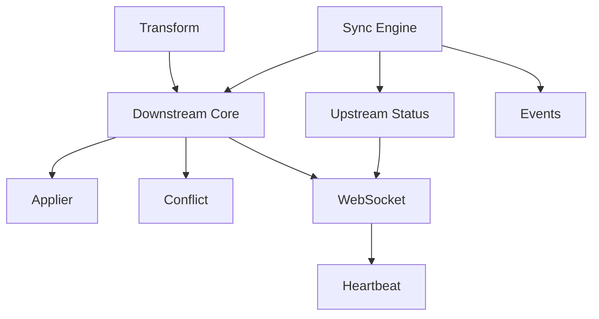

# Phase 7: Syncer Implementation Plan

## Overview

**Theme**: Implement actual resource synchronization between KCP and physical clusters  
**Duration**: 4-5 days with parallel execution  
**Total Efforts**: 9  
**Total Lines**: ~6,200  
**Engineers Required**: 3-4 working in parallel  
**Dependencies**: Phase 5 APIs/interfaces, Phase 6 infrastructure

This phase implements the critical syncer functionality that actually moves resources between KCP and physical clusters.

## Wave Structure

### Wave 1: Sync Engine Core (Day 1)
**Dependencies**: Phase 5 interfaces, Phase 6 controllers  
**Parallel Efforts**: 2  
**Purpose**: Build the core synchronization engine and transformation pipeline

### Wave 2: Downstream Synchronization (Days 2-3)
**Dependencies**: Wave 1 sync engine  
**Parallel Efforts**: 3  
**Purpose**: Implement KCP to physical cluster synchronization

### Wave 3: Upstream Synchronization (Days 3-4)
**Dependencies**: Wave 1 sync engine  
**Parallel Efforts**: 2  
**Purpose**: Implement physical cluster to KCP status/event synchronization

### Wave 4: Integration & Connection (Day 5)
**Dependencies**: Waves 1-3  
**Parallel Efforts**: 2  
**Purpose**: Wire everything together with connection management

## Wave 1: Sync Engine Core

### Effort 7.1.1: Sync Engine Implementation
**Branch**: `feature/tmc-completion/p7w1-sync-engine`  
**Lines**: ~750  
**Dependencies**: Phase 5 syncer interfaces  
**Engineer**: Sync Core Specialist

**Implementation**:

```go
// pkg/syncer/engine/engine.go
package engine

import (
    "context"
    "fmt"
    "sync"
    "time"
    
    "github.com/kcp-dev/kcp/pkg/syncer/interfaces"
    workloadv1alpha1 "github.com/kcp-dev/kcp/pkg/apis/workload/v1alpha1"
    "github.com/kcp-dev/kcp/pkg/syncer/transformation"
    
    "k8s.io/apimachinery/pkg/api/meta"
    metav1 "k8s.io/apimachinery/pkg/apis/meta/v1"
    "k8s.io/apimachinery/pkg/runtime"
    "k8s.io/apimachinery/pkg/runtime/schema"
    "k8s.io/apimachinery/pkg/util/wait"
    "k8s.io/client-go/dynamic"
    "k8s.io/client-go/dynamic/dynamicinformer"
    "k8s.io/client-go/tools/cache"
    "k8s.io/client-go/util/workqueue"
    "k8s.io/klog/v2"
)

// Engine implements the core sync engine
type Engine struct {
    // Clients
    kcpClient        dynamic.ClusterInterface
    downstreamClient dynamic.Interface
    
    // Sync target configuration
    syncTarget *workloadv1alpha1.SyncTarget
    
    // Resource management
    resourceSyncers map[schema.GroupVersionResource]*ResourceSyncer
    mu              sync.RWMutex
    
    // Transformation pipeline
    transformers map[schema.GroupVersionResource]interfaces.ResourceTransformer
    
    // Filters
    filters []interfaces.SyncFilter
    
    // Conflict resolution
    conflictResolver interfaces.ConflictResolver
    
    // Informer factories
    kcpInformerFactory        dynamicinformer.DynamicSharedInformerFactory
    downstreamInformerFactory dynamicinformer.DynamicSharedInformerFactory
    
    // Work queue
    queue workqueue.RateLimitingInterface
    
    // Status tracking
    status *SyncStatus
    
    // Context for lifecycle
    ctx    context.Context
    cancel context.CancelFunc
}

// NewEngine creates a new sync engine
func NewEngine(
    kcpClient dynamic.ClusterInterface,
    downstreamClient dynamic.Interface,
    syncTarget *workloadv1alpha1.SyncTarget,
) *Engine {
    ctx, cancel := context.WithCancel(context.Background())
    
    return &Engine{
        kcpClient:        kcpClient,
        downstreamClient: downstreamClient,
        syncTarget:       syncTarget,
        resourceSyncers:  make(map[schema.GroupVersionResource]*ResourceSyncer),
        transformers:     make(map[schema.GroupVersionResource]interfaces.ResourceTransformer),
        filters:          []interfaces.SyncFilter{},
        queue: workqueue.NewNamedRateLimitingQueue(
            workqueue.DefaultControllerRateLimiter(),
            "sync-engine",
        ),
        status: &SyncStatus{
            Connected:        false,
            SyncedResources:  make(map[schema.GroupVersionResource]int),
            PendingResources: make(map[schema.GroupVersionResource]int),
            FailedResources:  make(map[schema.GroupVersionResource]int),
        },
        ctx:    ctx,
        cancel: cancel,
    }
}

// Start begins the sync engine
func (e *Engine) Start(ctx context.Context) error {
    logger := klog.FromContext(ctx)
    logger.Info("Starting sync engine")
    
    // Initialize informer factories
    e.kcpInformerFactory = dynamicinformer.NewFilteredDynamicSharedInformerFactory(
        e.kcpClient,
        time.Minute*10,
        metav1.NamespaceAll,
        nil,
    )
    
    e.downstreamInformerFactory = dynamicinformer.NewFilteredDynamicSharedInformerFactory(
        e.downstreamClient,
        time.Minute*10,
        metav1.NamespaceAll,
        nil,
    )
    
    // Setup resource syncers for configured resources
    for _, resource := range e.syncTarget.Spec.SupportedAPIResources {
        gvr := schema.GroupVersionResource{
            Group:    resource.Group,
            Version:  resource.Version,
            Resource: resource.Resource,
        }
        
        if err := e.setupResourceSyncer(ctx, gvr); err != nil {
            logger.Error(err, "Failed to setup syncer", "gvr", gvr)
            continue
        }
    }
    
    // Start informer factories
    e.kcpInformerFactory.Start(e.ctx.Done())
    e.downstreamInformerFactory.Start(e.ctx.Done())
    
    // Wait for caches to sync
    logger.Info("Waiting for caches to sync")
    e.kcpInformerFactory.WaitForCacheSync(e.ctx.Done())
    e.downstreamInformerFactory.WaitForCacheSync(e.ctx.Done())
    
    // Mark as connected
    e.status.Connected = true
    e.status.LastSyncTime = &metav1.Time{Time: time.Now()}
    
    // Start workers
    for i := 0; i < 5; i++ {
        go wait.UntilWithContext(e.ctx, e.worker, time.Second)
    }
    
    // Start status reporter
    go e.reportStatus(e.ctx)
    
    logger.Info("Sync engine started")
    return nil
}

// setupResourceSyncer creates a syncer for a specific resource
func (e *Engine) setupResourceSyncer(ctx context.Context, gvr schema.GroupVersionResource) error {
    logger := klog.FromContext(ctx).WithValues("gvr", gvr)
    
    // Create resource syncer
    syncer := &ResourceSyncer{
        gvr:              gvr,
        engine:           e,
        kcpClient:        e.kcpClient,
        downstreamClient: e.downstreamClient,
        syncTarget:       e.syncTarget,
    }
    
    // Setup KCP informer
    kcpInformer := e.kcpInformerFactory.ForResource(gvr)
    kcpInformer.Informer().AddEventHandler(cache.ResourceEventHandlerFuncs{
        AddFunc: func(obj interface{}) {
            e.enqueue(gvr, obj, "add")
        },
        UpdateFunc: func(old, new interface{}) {
            e.enqueue(gvr, new, "update")
        },
        DeleteFunc: func(obj interface{}) {
            e.enqueue(gvr, obj, "delete")
        },
    })
    syncer.kcpInformer = kcpInformer
    
    // Setup downstream informer for status
    downstreamInformer := e.downstreamInformerFactory.ForResource(gvr)
    downstreamInformer.Informer().AddEventHandler(cache.ResourceEventHandlerFuncs{
        UpdateFunc: func(old, new interface{}) {
            // Only care about status updates
            if !e.hasStatusChanged(old, new) {
                return
            }
            e.enqueue(gvr, new, "status")
        },
    })
    syncer.downstreamInformer = downstreamInformer
    
    // Register syncer
    e.mu.Lock()
    e.resourceSyncers[gvr] = syncer
    e.mu.Unlock()
    
    logger.Info("Resource syncer setup complete")
    return nil
}

// enqueue adds an item to the work queue
func (e *Engine) enqueue(gvr schema.GroupVersionResource, obj interface{}, action string) {
    key, err := cache.MetaNamespaceKeyFunc(obj)
    if err != nil {
        klog.Error(err, "Failed to get key for object")
        return
    }
    
    item := &SyncItem{
        GVR:    gvr,
        Key:    key,
        Action: action,
        Object: obj,
    }
    
    e.queue.Add(item)
}

// worker processes items from the queue
func (e *Engine) worker(ctx context.Context) {
    for e.processNextWorkItem(ctx) {
    }
}

func (e *Engine) processNextWorkItem(ctx context.Context) bool {
    item, quit := e.queue.Get()
    if quit {
        return false
    }
    defer e.queue.Done(item)
    
    syncItem := item.(*SyncItem)
    logger := klog.FromContext(ctx).WithValues("gvr", syncItem.GVR, "key", syncItem.Key, "action", syncItem.Action)
    
    if err := e.sync(ctx, syncItem); err != nil {
        logger.Error(err, "Sync failed")
        e.queue.AddRateLimited(item)
        
        // Update failed count
        e.mu.Lock()
        e.status.FailedResources[syncItem.GVR]++
        e.mu.Unlock()
        
        return true
    }
    
    e.queue.Forget(item)
    
    // Update synced count
    e.mu.Lock()
    e.status.SyncedResources[syncItem.GVR]++
    e.status.LastSyncTime = &metav1.Time{Time: time.Now()}
    e.mu.Unlock()
    
    return true
}

// sync performs the actual synchronization
func (e *Engine) sync(ctx context.Context, item *SyncItem) error {
    logger := klog.FromContext(ctx)
    
    // Get the resource syncer
    e.mu.RLock()
    syncer, exists := e.resourceSyncers[item.GVR]
    e.mu.RUnlock()
    
    if !exists {
        return fmt.Errorf("no syncer for %v", item.GVR)
    }
    
    switch item.Action {
    case "add", "update":
        return e.syncDownstream(ctx, syncer, item)
    case "delete":
        return e.deleteDownstream(ctx, syncer, item)
    case "status":
        return e.syncUpstream(ctx, syncer, item)
    default:
        return fmt.Errorf("unknown action: %s", item.Action)
    }
}

// syncDownstream syncs a resource to the physical cluster
func (e *Engine) syncDownstream(ctx context.Context, syncer *ResourceSyncer, item *SyncItem) error {
    logger := klog.FromContext(ctx)
    
    // Convert to unstructured
    obj := item.Object.(*unstructured.Unstructured)
    
    // Apply filters
    for _, filter := range e.filters {
        if !filter.ShouldSync(obj) {
            logger.V(4).Info("Filtered out by sync filter", "filter", filter)
            return nil
        }
    }
    
    // Get transformer if registered
    transformer, hasTransformer := e.transformers[item.GVR]
    
    // Transform for downstream
    var transformed runtime.Object = obj
    if hasTransformer && transformer.ShouldTransform(obj) {
        var err error
        transformed, err = transformer.TransformForDownstream(obj, e.syncTarget)
        if err != nil {
            return fmt.Errorf("transformation failed: %w", err)
        }
    }
    
    // Apply to downstream
    return syncer.ApplyToDownstream(ctx, transformed.(*unstructured.Unstructured))
}

// deleteDownstream removes a resource from the physical cluster
func (e *Engine) deleteDownstream(ctx context.Context, syncer *ResourceSyncer, item *SyncItem) error {
    namespace, name, err := cache.SplitMetaNamespaceKey(item.Key)
    if err != nil {
        return err
    }
    
    // Apply deletion filters
    for _, filter := range e.filters {
        if !filter.ShouldDelete(item.GVR, name, namespace) {
            return nil
        }
    }
    
    return syncer.DeleteFromDownstream(ctx, namespace, name)
}

// syncUpstream syncs status from physical cluster to KCP
func (e *Engine) syncUpstream(ctx context.Context, syncer *ResourceSyncer, item *SyncItem) error {
    // This will be implemented in the upstream syncer
    return syncer.SyncStatusToKCP(ctx, item.Object.(*unstructured.Unstructured))
}

// RegisterTransformer adds a resource transformer
func (e *Engine) RegisterTransformer(gvr schema.GroupVersionResource, transformer interfaces.ResourceTransformer) {
    e.mu.Lock()
    defer e.mu.Unlock()
    e.transformers[gvr] = transformer
}

// RegisterFilter adds a sync filter
func (e *Engine) RegisterFilter(filter interfaces.SyncFilter) {
    e.mu.Lock()
    defer e.mu.Unlock()
    e.filters = append(e.filters, filter)
    
    // Sort by priority
    sort.Slice(e.filters, func(i, j int) bool {
        return e.filters[i].Priority() > e.filters[j].Priority()
    })
}

// GetStatus returns current sync status
func (e *Engine) GetStatus() (*interfaces.SyncStatus, error) {
    e.mu.RLock()
    defer e.mu.RUnlock()
    
    status := &interfaces.SyncStatus{
        Connected:        e.status.Connected,
        LastSyncTime:     e.status.LastSyncTime,
        SyncedResources:  0,
        PendingResources: 0,
        FailedResources:  0,
    }
    
    // Calculate totals
    for _, count := range e.status.SyncedResources {
        status.SyncedResources += count
    }
    for _, count := range e.status.PendingResources {
        status.PendingResources += count
    }
    for _, count := range e.status.FailedResources {
        status.FailedResources += count
    }
    
    return status, nil
}

// Stop gracefully stops the engine
func (e *Engine) Stop() error {
    e.cancel()
    e.queue.ShutDown()
    return nil
}
```

---

### Effort 7.1.2: Transformation Pipeline
**Branch**: `feature/tmc-completion/p7w1-transform`  
**Lines**: ~650  
**Dependencies**: Phase 5 transformation interfaces  
**Engineer**: Transform Specialist

**Implementation**:

```go
// pkg/syncer/transformation/pipeline.go
package transformation

import (
    "fmt"
    "strings"
    
    workloadv1alpha1 "github.com/kcp-dev/kcp/pkg/apis/workload/v1alpha1"
    "github.com/kcp-dev/kcp/pkg/syncer/interfaces"
    
    "k8s.io/apimachinery/pkg/apis/meta/v1/unstructured"
    "k8s.io/apimachinery/pkg/runtime"
)

// Pipeline implements a transformation pipeline
type Pipeline struct {
    transformers []interfaces.ResourceTransformer
}

// NewPipeline creates a new transformation pipeline with default transformers
func NewPipeline() *Pipeline {
    return &Pipeline{
        transformers: []interfaces.ResourceTransformer{
            NewNamespaceTransformer(),
            NewLabelTransformer(),
            NewAnnotationTransformer(),
            NewOwnerReferenceTransformer(),
            NewSecretTransformer(),
        },
    }
}

// TransformForDownstream applies all transformations for downstream sync
func (p *Pipeline) TransformForDownstream(obj runtime.Object, target *workloadv1alpha1.SyncTarget) (runtime.Object, error) {
    result := obj.DeepCopyObject()
    
    for _, transformer := range p.transformers {
        if transformer.ShouldTransform(result) {
            var err error
            result, err = transformer.TransformForDownstream(result, target)
            if err != nil {
                return nil, fmt.Errorf("transformer %T failed: %w", transformer, err)
            }
        }
    }
    
    return result, nil
}

// NamespaceTransformer handles namespace mapping
type NamespaceTransformer struct {
    namespacePrefix string
}

func NewNamespaceTransformer() *NamespaceTransformer {
    return &NamespaceTransformer{
        namespacePrefix: "kcp-",
    }
}

func (t *NamespaceTransformer) TransformForDownstream(obj runtime.Object, target *workloadv1alpha1.SyncTarget) (runtime.Object, error) {
    u, ok := obj.(*unstructured.Unstructured)
    if !ok {
        return obj, nil
    }
    
    // Transform namespace
    namespace := u.GetNamespace()
    if namespace != "" {
        // Prefix namespace with workspace identifier
        workspaceName := target.GetClusterName()
        transformedNamespace := fmt.Sprintf("%s%s-%s", t.namespacePrefix, workspaceName, namespace)
        u.SetNamespace(transformedNamespace)
    }
    
    return u, nil
}

func (t *NamespaceTransformer) TransformForUpstream(obj runtime.Object, source *workloadv1alpha1.SyncTarget) (runtime.Object, error) {
    u, ok := obj.(*unstructured.Unstructured)
    if !ok {
        return obj, nil
    }
    
    // Reverse namespace transformation
    namespace := u.GetNamespace()
    if strings.HasPrefix(namespace, t.namespacePrefix) {
        // Remove prefix to get original namespace
        parts := strings.SplitN(namespace, "-", 3)
        if len(parts) >= 3 {
            u.SetNamespace(parts[2])
        }
    }
    
    return u, nil
}

func (t *NamespaceTransformer) ShouldTransform(obj runtime.Object) bool {
    u, ok := obj.(*unstructured.Unstructured)
    if !ok {
        return false
    }
    
    // Transform namespaced resources
    return u.GetNamespace() != ""
}

// LabelTransformer adds/removes labels
type LabelTransformer struct{}

func NewLabelTransformer() *LabelTransformer {
    return &LabelTransformer{}
}

func (t *LabelTransformer) TransformForDownstream(obj runtime.Object, target *workloadv1alpha1.SyncTarget) (runtime.Object, error) {
    u, ok := obj.(*unstructured.Unstructured)
    if !ok {
        return obj, nil
    }
    
    labels := u.GetLabels()
    if labels == nil {
        labels = make(map[string]string)
    }
    
    // Add TMC labels
    labels["kcp.io/sync-target"] = target.Name
    labels["kcp.io/workspace"] = string(target.GetClusterName())
    labels["kcp.io/managed"] = "true"
    
    u.SetLabels(labels)
    return u, nil
}

// AnnotationTransformer handles annotations
type AnnotationTransformer struct{}

func NewAnnotationTransformer() *AnnotationTransformer {
    return &AnnotationTransformer{}
}

func (t *AnnotationTransformer) TransformForDownstream(obj runtime.Object, target *workloadv1alpha1.SyncTarget) (runtime.Object, error) {
    u, ok := obj.(*unstructured.Unstructured)
    if !ok {
        return obj, nil
    }
    
    annotations := u.GetAnnotations()
    if annotations == nil {
        annotations = make(map[string]string)
    }
    
    // Add sync metadata
    annotations["kcp.io/synced-at"] = time.Now().Format(time.RFC3339)
    annotations["kcp.io/sync-generation"] = fmt.Sprintf("%d", u.GetGeneration())
    
    // Remove KCP-specific annotations that shouldn't propagate
    delete(annotations, "kcp.io/cluster")
    delete(annotations, "kcp.io/namespace")
    
    u.SetAnnotations(annotations)
    return u, nil
}

// SecretTransformer sanitizes secrets
type SecretTransformer struct{}

func NewSecretTransformer() *SecretTransformer {
    return &SecretTransformer{}
}

func (t *SecretTransformer) ShouldTransform(obj runtime.Object) bool {
    u, ok := obj.(*unstructured.Unstructured)
    if !ok {
        return false
    }
    
    return u.GetKind() == "Secret"
}

func (t *SecretTransformer) TransformForDownstream(obj runtime.Object, target *workloadv1alpha1.SyncTarget) (runtime.Object, error) {
    u, ok := obj.(*unstructured.Unstructured)
    if !ok {
        return obj, nil
    }
    
    // Check secret type
    secretType, found, err := unstructured.NestedString(u.Object, "type")
    if err != nil || !found {
        return u, nil
    }
    
    // Don't sync service account tokens
    if secretType == "kubernetes.io/service-account-token" {
        return nil, fmt.Errorf("service account tokens should not be synced")
    }
    
    // Sanitize docker config secrets
    if secretType == "kubernetes.io/dockerconfigjson" {
        // Validate and potentially transform docker config
        if err := t.sanitizeDockerConfig(u); err != nil {
            return nil, err
        }
    }
    
    return u, nil
}
```

## Wave 2: Downstream Synchronization

### Effort 7.2.1: Downstream Syncer Core
**Branch**: `feature/tmc-completion/p7w2-downstream-core`  
**Lines**: ~700  
**Dependencies**: Wave 1 sync engine  
**Engineer**: Downstream Specialist

**Implementation**:

```go
// pkg/syncer/downstream/syncer.go
package downstream

import (
    "context"
    "fmt"
    
    "github.com/kcp-dev/kcp/pkg/syncer/interfaces"
    workloadv1alpha1 "github.com/kcp-dev/kcp/pkg/apis/workload/v1alpha1"
    
    "k8s.io/apimachinery/pkg/apis/meta/v1/unstructured"
    "k8s.io/client-go/dynamic"
)

// Syncer handles downstream synchronization
type Syncer struct {
    kcpClient        dynamic.ClusterInterface
    downstreamClient dynamic.Interface
    
    syncTarget *workloadv1alpha1.SyncTarget
    
    transformer interfaces.ResourceTransformer
    
    // Conflict resolution
    conflictResolver interfaces.ConflictResolver
}

// ApplyToDownstream applies a resource to the downstream cluster
func (s *Syncer) ApplyToDownstream(ctx context.Context, obj *unstructured.Unstructured) error {
    logger := klog.FromContext(ctx)
    
    gvr := schema.GroupVersionResource{
        Group:    obj.GetAPIVersion(),
        Version:  obj.GetKind(),
        Resource: s.pluralize(obj.GetKind()),
    }
    
    namespace := obj.GetNamespace()
    name := obj.GetName()
    
    // Check if resource exists downstream
    existing, err := s.downstreamClient.
        Resource(gvr).
        Namespace(namespace).
        Get(ctx, name, metav1.GetOptions{})
    
    if err != nil {
        if errors.IsNotFound(err) {
            // Create new resource
            return s.createDownstream(ctx, gvr, obj)
        }
        return err
    }
    
    // Update existing resource
    return s.updateDownstream(ctx, gvr, existing, obj)
}

func (s *Syncer) createDownstream(ctx context.Context, gvr schema.GroupVersionResource, obj *unstructured.Unstructured) error {
    logger := klog.FromContext(ctx).WithValues("operation", "create")
    
    // Clean object for creation
    obj = s.cleanForCreate(obj)
    
    _, err := s.downstreamClient.
        Resource(gvr).
        Namespace(obj.GetNamespace()).
        Create(ctx, obj, metav1.CreateOptions{})
    
    if err != nil {
        return fmt.Errorf("failed to create: %w", err)
    }
    
    logger.Info("Created resource downstream")
    return nil
}

func (s *Syncer) updateDownstream(ctx context.Context, gvr schema.GroupVersionResource, existing, desired *unstructured.Unstructured) error {
    logger := klog.FromContext(ctx).WithValues("operation", "update")
    
    // Check for conflicts
    if existing.GetResourceVersion() != desired.GetResourceVersion() {
        // Resolve conflict
        resolved, err := s.conflictResolver.ResolveConflict(existing, desired)
        if err != nil {
            return fmt.Errorf("conflict resolution failed: %w", err)
        }
        desired = resolved.(*unstructured.Unstructured)
    }
    
    // Preserve downstream fields
    desired = s.preserveDownstreamFields(existing, desired)
    
    _, err := s.downstreamClient.
        Resource(gvr).
        Namespace(desired.GetNamespace()).
        Update(ctx, desired, metav1.UpdateOptions{})
    
    if err != nil {
        return fmt.Errorf("failed to update: %w", err)
    }
    
    logger.Info("Updated resource downstream")
    return nil
}

func (s *Syncer) cleanForCreate(obj *unstructured.Unstructured) *unstructured.Unstructured {
    clean := obj.DeepCopy()
    
    // Remove server-managed fields
    unstructured.RemoveNestedField(clean.Object, "metadata", "uid")
    unstructured.RemoveNestedField(clean.Object, "metadata", "resourceVersion")
    unstructured.RemoveNestedField(clean.Object, "metadata", "generation")
    unstructured.RemoveNestedField(clean.Object, "metadata", "creationTimestamp")
    unstructured.RemoveNestedField(clean.Object, "metadata", "deletionTimestamp")
    unstructured.RemoveNestedField(clean.Object, "metadata", "selfLink")
    unstructured.RemoveNestedField(clean.Object, "status")
    
    return clean
}

func (s *Syncer) preserveDownstreamFields(existing, desired *unstructured.Unstructured) *unstructured.Unstructured {
    merged := desired.DeepCopy()
    
    // Preserve resource version for updates
    merged.SetResourceVersion(existing.GetResourceVersion())
    
    // Preserve status (will be synced upstream separately)
    if status, found, _ := unstructured.NestedFieldNoCopy(existing.Object, "status"); found {
        unstructured.SetNestedField(merged.Object, status, "status")
    }
    
    return merged
}
```

### Effort 7.2.2: Resource Applier
**Branch**: `feature/tmc-completion/p7w2-applier`  
**Lines**: ~600  
**Dependencies**: Wave 2.1 downstream core  
**Engineer**: Resource Specialist

### Effort 7.2.3: Conflict Resolution
**Branch**: `feature/tmc-completion/p7w2-conflict`  
**Lines**: ~500  
**Dependencies**: Phase 5 interfaces  
**Engineer**: Conflict Specialist

## Wave 3: Upstream Synchronization

### Effort 7.3.1: Upstream Status Syncer
**Branch**: `feature/tmc-completion/p7w3-upstream-status`  
**Lines**: ~650  
**Dependencies**: Wave 1 sync engine  
**Engineer**: Status Specialist

**Implementation**:

```go
// pkg/syncer/upstream/status.go
package upstream

import (
    "context"
    "encoding/json"
    
    "k8s.io/apimachinery/pkg/apis/meta/v1/unstructured"
    "k8s.io/apimachinery/pkg/types"
)

// StatusSyncer syncs status from downstream to KCP
type StatusSyncer struct {
    kcpClient        dynamic.ClusterInterface
    downstreamClient dynamic.Interface
    
    syncTarget *workloadv1alpha1.SyncTarget
    
    statusExtractors map[schema.GroupVersionResource]interfaces.StatusExtractor
}

// SyncStatusToKCP syncs resource status to KCP
func (s *StatusSyncer) SyncStatusToKCP(ctx context.Context, downstreamObj *unstructured.Unstructured) error {
    logger := klog.FromContext(ctx)
    
    // Extract status
    status, found, err := unstructured.NestedFieldNoCopy(downstreamObj.Object, "status")
    if err != nil || !found {
        return nil // No status to sync
    }
    
    // Transform namespace back to KCP namespace
    namespace := s.reverseNamespaceTransform(downstreamObj.GetNamespace())
    name := downstreamObj.GetName()
    
    gvr := s.getGVR(downstreamObj)
    
    // Get KCP object
    kcpObj, err := s.kcpClient.
        Cluster(s.syncTarget.GetClusterName()).
        Resource(gvr).
        Namespace(namespace).
        Get(ctx, name, metav1.GetOptions{})
    
    if err != nil {
        return fmt.Errorf("failed to get KCP object: %w", err)
    }
    
    // Prepare status patch
    patch := map[string]interface{}{
        "status": status,
    }
    
    patchBytes, err := json.Marshal(patch)
    if err != nil {
        return err
    }
    
    // Apply status patch
    _, err = s.kcpClient.
        Cluster(s.syncTarget.GetClusterName()).
        Resource(gvr).
        Namespace(namespace).
        Patch(ctx, name, types.MergePatchType, patchBytes, metav1.PatchOptions{}, "status")
    
    if err != nil {
        return fmt.Errorf("failed to patch status: %w", err)
    }
    
    logger.V(4).Info("Synced status to KCP")
    return nil
}

// AggregateStatus aggregates status from multiple downstream clusters
func (s *StatusSyncer) AggregateStatus(ctx context.Context, gvr schema.GroupVersionResource, namespace, name string) (interface{}, error) {
    // Get status extractor
    extractor, exists := s.statusExtractors[gvr]
    if !exists {
        // Use default extraction
        extractor = &DefaultStatusExtractor{}
    }
    
    // Collect statuses from all sync targets
    var statuses []interface{}
    
    // Get downstream object
    downstreamNamespace := s.transformNamespace(namespace)
    obj, err := s.downstreamClient.
        Resource(gvr).
        Namespace(downstreamNamespace).
        Get(ctx, name, metav1.GetOptions{})
    
    if err != nil {
        if !errors.IsNotFound(err) {
            return nil, err
        }
    } else {
        status, err := extractor.ExtractStatus(obj)
        if err != nil {
            return nil, err
        }
        statuses = append(statuses, status)
    }
    
    // Merge statuses
    if len(statuses) == 0 {
        return nil, nil
    }
    
    return extractor.MergeStatus(statuses)
}

// DefaultStatusExtractor provides default status extraction
type DefaultStatusExtractor struct{}

func (e *DefaultStatusExtractor) ExtractStatus(obj runtime.Object) (interface{}, error) {
    u, ok := obj.(*unstructured.Unstructured)
    if !ok {
        return nil, fmt.Errorf("expected unstructured object")
    }
    
    status, found, err := unstructured.NestedFieldNoCopy(u.Object, "status")
    if err != nil || !found {
        return nil, err
    }
    
    return status, nil
}

func (e *DefaultStatusExtractor) MergeStatus(statuses []interface{}) (interface{}, error) {
    if len(statuses) == 0 {
        return nil, nil
    }
    
    // For now, just return the first status
    // More sophisticated merging can be implemented per resource type
    return statuses[0], nil
}
```

### Effort 7.3.2: Event Syncer
**Branch**: `feature/tmc-completion/p7w3-events`  
**Lines**: ~450  
**Dependencies**: Wave 1 sync engine  
**Engineer**: Event Specialist

## Wave 4: Integration & Connection

### Effort 7.4.1: WebSocket Connection Manager
**Branch**: `feature/tmc-completion/p7w4-websocket`  
**Lines**: ~600  
**Dependencies**: Waves 1-3  
**Engineer**: Network Specialist

**Implementation**:

```go
// pkg/syncer/tunnel/websocket.go
package tunnel

import (
    "context"
    "fmt"
    "time"
    
    "github.com/gorilla/websocket"
    "k8s.io/klog/v2"
)

// WebSocketTunnel manages the WebSocket connection to KCP
type WebSocketTunnel struct {
    url        string
    token      string
    syncTarget string
    
    conn *websocket.Conn
    
    // Channels for communication
    send   chan []byte
    recv   chan []byte
    errors chan error
    
    // Reconnection
    reconnectInterval time.Duration
    maxReconnectDelay time.Duration
}

// Connect establishes WebSocket connection to KCP
func (t *WebSocketTunnel) Connect(ctx context.Context) error {
    logger := klog.FromContext(ctx)
    
    dialer := websocket.Dialer{
        HandshakeTimeout: 30 * time.Second,
    }
    
    headers := http.Header{
        "Authorization": []string{fmt.Sprintf("Bearer %s", t.token)},
        "X-SyncTarget":  []string{t.syncTarget},
    }
    
    conn, resp, err := dialer.DialContext(ctx, t.url, headers)
    if err != nil {
        if resp != nil {
            logger.Error(err, "Failed to connect", "status", resp.StatusCode)
        }
        return fmt.Errorf("websocket dial failed: %w", err)
    }
    
    t.conn = conn
    
    // Start read/write pumps
    go t.readPump(ctx)
    go t.writePump(ctx)
    
    logger.Info("WebSocket connection established")
    return nil
}

func (t *WebSocketTunnel) readPump(ctx context.Context) {
    defer func() {
        t.conn.Close()
    }()
    
    t.conn.SetReadDeadline(time.Now().Add(60 * time.Second))
    t.conn.SetPongHandler(func(string) error {
        t.conn.SetReadDeadline(time.Now().Add(60 * time.Second))
        return nil
    })
    
    for {
        select {
        case <-ctx.Done():
            return
        default:
            messageType, message, err := t.conn.ReadMessage()
            if err != nil {
                if websocket.IsUnexpectedCloseError(err, websocket.CloseGoingAway, websocket.CloseAbnormalClosure) {
                    klog.Error(err, "WebSocket read error")
                }
                t.errors <- err
                return
            }
            
            if messageType == websocket.TextMessage || messageType == websocket.BinaryMessage {
                t.recv <- message
            }
        }
    }
}

func (t *WebSocketTunnel) writePump(ctx context.Context) {
    ticker := time.NewTicker(54 * time.Second)
    defer func() {
        ticker.Stop()
        t.conn.Close()
    }()
    
    for {
        select {
        case <-ctx.Done():
            return
            
        case message := <-t.send:
            t.conn.SetWriteDeadline(time.Now().Add(10 * time.Second))
            if err := t.conn.WriteMessage(websocket.TextMessage, message); err != nil {
                t.errors <- err
                return
            }
            
        case <-ticker.C:
            t.conn.SetWriteDeadline(time.Now().Add(10 * time.Second))
            if err := t.conn.WriteMessage(websocket.PingMessage, nil); err != nil {
                t.errors <- err
                return
            }
        }
    }
}

// Reconnect handles reconnection with exponential backoff
func (t *WebSocketTunnel) Reconnect(ctx context.Context) {
    delay := t.reconnectInterval
    
    for {
        select {
        case <-ctx.Done():
            return
        case <-time.After(delay):
            if err := t.Connect(ctx); err != nil {
                klog.Error(err, "Reconnection failed", "delay", delay)
                delay = delay * 2
                if delay > t.maxReconnectDelay {
                    delay = t.maxReconnectDelay
                }
            } else {
                return
            }
        }
    }
}
```

### Effort 7.4.2: Heartbeat & Health Monitoring
**Branch**: `feature/tmc-completion/p7w4-heartbeat`  
**Lines**: ~450  
**Dependencies**: Wave 4.1 websocket  
**Engineer**: Monitoring Specialist

## Implementation Guidelines

### Sync Engine Patterns

1. **Resource Watching**:
   - Use dynamic informers for flexibility
   - Set up both KCP and downstream informers
   - Handle add/update/delete events

2. **Transformation**:
   - Apply transformations in pipeline
   - Preserve downstream-specific fields
   - Handle namespace mapping

3. **Conflict Resolution**:
   - Detect conflicts via resource version
   - Apply resolution strategy
   - Log conflict resolutions

4. **Status Synchronization**:
   - Extract status from downstream
   - Patch status to KCP object
   - Aggregate from multiple targets

## Quality Checklist

For each effort:
- [ ] Implements interfaces from Phase 5
- [ ] Handles errors gracefully
- [ ] Includes retry logic
- [ ] Has comprehensive logging
- [ ] Metrics for monitoring
- [ ] Unit tests >70% coverage
- [ ] Integration tests
- [ ] Under 800 lines limit

## Dependencies Between Efforts



## Success Criteria

Phase 7 is complete when:
1. ✅ Resources sync from KCP to physical clusters
2. ✅ Status syncs back to KCP
3. ✅ Transformations applied correctly
4. ✅ Conflicts resolved appropriately
5. ✅ WebSocket connection stable
6. ✅ Heartbeat monitoring working
7. ✅ All tests passing
8. ✅ Can deploy and run a pod via syncer

---

*Phase 7 implements the critical syncer functionality that enables TMC to actually manage workloads across clusters.*