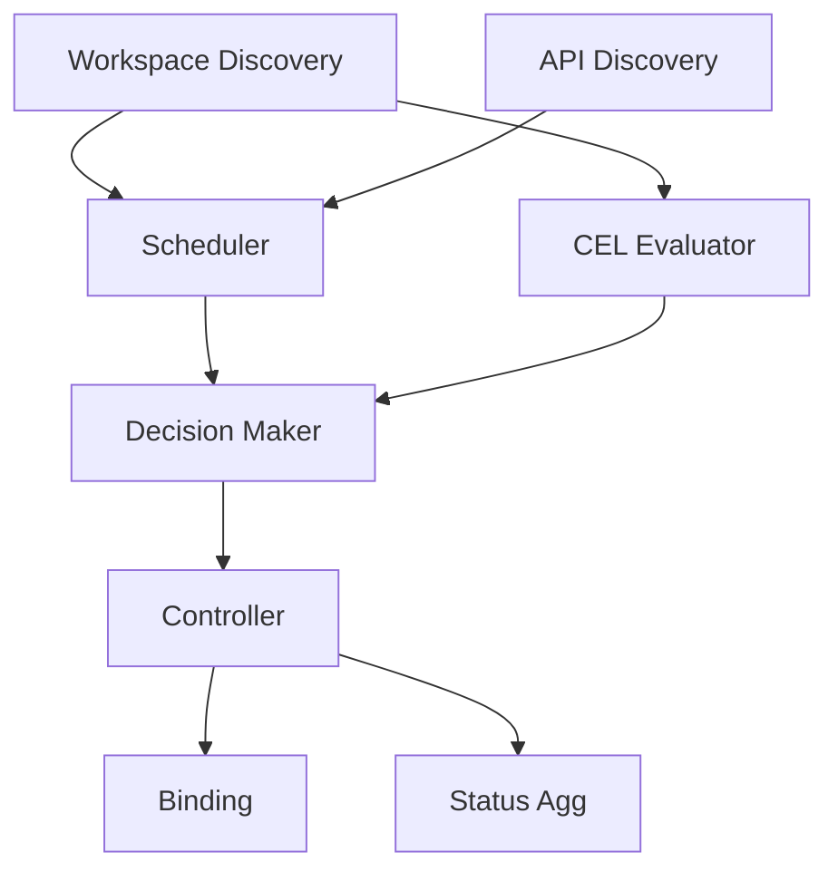

# Phase 8: Cross-Workspace Runtime Implementation Plan

## Overview

**Theme**: Implement cross-workspace placement and scheduling runtime  
**Duration**: 3-4 days with parallel execution  
**Total Efforts**: 8  
**Total Lines**: ~5,200  
**Engineers Required**: 3-4 working in parallel  
**Dependencies**: Phase 5-2 complete (APIs, infrastructure, syncer)

This phase implements the runtime components that enable workload distribution across workspaces and clusters using placement policies.

## Wave Structure

### Wave 1: Discovery & Foundation (Day 1)
**Dependencies**: Phase 5-2  
**Parallel Efforts**: 2  
**Purpose**: Build workspace discovery and foundation components

### Wave 2: Scheduling & Evaluation (Days 2-3)
**Dependencies**: Wave 1 discovery  
**Parallel Efforts**: 3  
**Purpose**: Implement placement scheduler and policy evaluation

### Wave 3: Runtime Integration (Days 3-4)
**Dependencies**: Waves 1-2  
**Parallel Efforts**: 3  
**Purpose**: Integrate all components into working runtime

## Wave 1: Discovery & Foundation

### Effort 8.1.1: Workspace Discovery Runtime
**Branch**: `feature/tmc-completion/p8w1-workspace-discovery`  
**Lines**: ~700  
**Dependencies**: Phase 5 interfaces, Phase 6 infrastructure  
**Engineer**: Workspace Specialist

**Implementation**:

```go
// pkg/placement/discovery/workspace_discoverer.go
package discovery

import (
    "context"
    "fmt"
    "sync"
    
    tenancyv1alpha1 "github.com/kcp-dev/kcp/pkg/apis/tenancy/v1alpha1"
    workloadv1alpha1 "github.com/kcp-dev/kcp/pkg/apis/workload/v1alpha1"
    tenancyclient "github.com/kcp-dev/kcp/pkg/client/clientset/versioned/cluster"
    "github.com/kcp-dev/kcp/pkg/apis/core/v1alpha1/logicalcluster"
    
    "k8s.io/apimachinery/pkg/labels"
    "k8s.io/client-go/tools/cache"
    "k8s.io/klog/v2"
)

// WorkspaceDiscoverer discovers workspaces for cross-workspace placement
type WorkspaceDiscoverer struct {
    tenancyClient tenancyclient.ClusterInterface
    
    // Cache for performance
    workspaceCache cache.Store
    clusterCache   cache.Store
    
    // Index for efficient lookup
    workspaceByLabel map[string][]*tenancyv1alpha1.Workspace
    mu               sync.RWMutex
    
    // Authorization checker
    authChecker AuthorizationChecker
}

// NewWorkspaceDiscoverer creates a new workspace discoverer
func NewWorkspaceDiscoverer(
    tenancyClient tenancyclient.ClusterInterface,
    workspaceInformer tenancyinformers.WorkspaceClusterInformer,
    syncTargetInformer workloadinformers.SyncTargetClusterInformer,
) *WorkspaceDiscoverer {
    
    d := &WorkspaceDiscoverer{
        tenancyClient:    tenancyClient,
        workspaceCache:   workspaceInformer.Informer().GetStore(),
        clusterCache:     syncTargetInformer.Informer().GetStore(),
        workspaceByLabel: make(map[string][]*tenancyv1alpha1.Workspace),
        authChecker:      NewAuthorizationChecker(tenancyClient),
    }
    
    // Set up indexing
    workspaceInformer.Informer().AddEventHandler(cache.ResourceEventHandlerFuncs{
        AddFunc:    d.indexWorkspace,
        UpdateFunc: func(old, new interface{}) { d.indexWorkspace(new) },
        DeleteFunc: d.unindexWorkspace,
    })
    
    return d
}

// DiscoverWorkspaces finds workspaces matching the selector
func (d *WorkspaceDiscoverer) DiscoverWorkspaces(ctx context.Context, selector labels.Selector, requester User) ([]*WorkspaceTarget, error) {
    logger := klog.FromContext(ctx)
    
    // Get all workspaces from cache
    allWorkspaces := d.workspaceCache.List()
    
    var discovered []*WorkspaceTarget
    var wg sync.WaitGroup
    results := make(chan *WorkspaceTarget, len(allWorkspaces))
    errors := make(chan error, len(allWorkspaces))
    
    // Check each workspace in parallel
    for _, obj := range allWorkspaces {
        workspace := obj.(*tenancyv1alpha1.Workspace)
        
        // Check selector match
        if !selector.Matches(labels.Set(workspace.Labels)) {
            continue
        }
        
        wg.Add(1)
        go func(ws *tenancyv1alpha1.Workspace) {
            defer wg.Done()
            
            // Check authorization
            allowed, err := d.authChecker.CanAccessWorkspace(ctx, requester, ws)
            if err != nil {
                errors <- fmt.Errorf("auth check failed for %s: %w", ws.Name, err)
                return
            }
            
            if !allowed {
                logger.V(4).Info("Access denied to workspace", "workspace", ws.Name)
                return
            }
            
            // Discover sync targets in workspace
            targets, err := d.discoverSyncTargets(ctx, ws)
            if err != nil {
                errors <- fmt.Errorf("failed to discover targets in %s: %w", ws.Name, err)
                return
            }
            
            if len(targets) > 0 {
                results <- &WorkspaceTarget{
                    Workspace:   ws,
                    SyncTargets: targets,
                    Accessible:  true,
                }
            }
        }(workspace)
    }
    
    // Wait for all checks to complete
    go func() {
        wg.Wait()
        close(results)
        close(errors)
    }()
    
    // Collect results
    for result := range results {
        discovered = append(discovered, result)
    }
    
    // Check for errors
    var errs []error
    for err := range errors {
        errs = append(errs, err)
    }
    
    if len(errs) > 0 {
        logger.Error(errs[0], "Errors during workspace discovery", "totalErrors", len(errs))
    }
    
    logger.Info("Workspace discovery complete", "discovered", len(discovered))
    return discovered, nil
}

// discoverSyncTargets finds sync targets in a workspace
func (d *WorkspaceDiscoverer) discoverSyncTargets(ctx context.Context, workspace *tenancyv1alpha1.Workspace) ([]*workloadv1alpha1.SyncTarget, error) {
    clusterName := logicalcluster.From(workspace)
    
    // List sync targets in the workspace
    targets, err := d.getSyncTargetsForWorkspace(clusterName)
    if err != nil {
        return nil, err
    }
    
    // Filter to ready targets only
    var readyTargets []*workloadv1alpha1.SyncTarget
    for _, target := range targets {
        if target.Status.Phase == workloadv1alpha1.SyncTargetPhaseReady {
            readyTargets = append(readyTargets, target)
        }
    }
    
    return readyTargets, nil
}

// getSyncTargetsForWorkspace retrieves sync targets for a workspace
func (d *WorkspaceDiscoverer) getSyncTargetsForWorkspace(workspace logicalcluster.Name) ([]*workloadv1alpha1.SyncTarget, error) {
    // Get from cache
    var targets []*workloadv1alpha1.SyncTarget
    
    for _, obj := range d.clusterCache.List() {
        target := obj.(*workloadv1alpha1.SyncTarget)
        if target.GetClusterName() == workspace {
            targets = append(targets, target)
        }
    }
    
    return targets, nil
}

// indexWorkspace adds a workspace to the index
func (d *WorkspaceDiscoverer) indexWorkspace(obj interface{}) {
    workspace := obj.(*tenancyv1alpha1.Workspace)
    
    d.mu.Lock()
    defer d.mu.Unlock()
    
    // Index by each label
    for key, value := range workspace.Labels {
        labelKey := fmt.Sprintf("%s=%s", key, value)
        d.workspaceByLabel[labelKey] = append(d.workspaceByLabel[labelKey], workspace)
    }
}

// unindexWorkspace removes a workspace from the index
func (d *WorkspaceDiscoverer) unindexWorkspace(obj interface{}) {
    workspace := obj.(*tenancyv1alpha1.Workspace)
    
    d.mu.Lock()
    defer d.mu.Unlock()
    
    // Remove from all label indexes
    for key, value := range workspace.Labels {
        labelKey := fmt.Sprintf("%s=%s", key, value)
        d.removeFromSlice(labelKey, workspace)
    }
}

// WorkspaceTarget represents a discovered workspace with its sync targets
type WorkspaceTarget struct {
    Workspace   *tenancyv1alpha1.Workspace
    SyncTargets []*workloadv1alpha1.SyncTarget
    Accessible  bool
}

// AuthorizationChecker checks workspace access permissions
type AuthorizationChecker struct {
    client tenancyclient.ClusterInterface
}

func NewAuthorizationChecker(client tenancyclient.ClusterInterface) AuthorizationChecker {
    return AuthorizationChecker{client: client}
}

// CanAccessWorkspace checks if user can access a workspace
func (c AuthorizationChecker) CanAccessWorkspace(ctx context.Context, user User, workspace *tenancyv1alpha1.Workspace) (bool, error) {
    // Create SubjectAccessReview
    sar := &authv1.SubjectAccessReview{
        Spec: authv1.SubjectAccessReviewSpec{
            User: user.Name,
            Groups: user.Groups,
            ResourceAttributes: &authv1.ResourceAttributes{
                Verb:      "get",
                Group:     "workload.kcp.io",
                Version:   "v1alpha1",
                Resource:  "synctargets",
                Namespace: "",
            },
        },
    }
    
    // Check in the target workspace
    result, err := c.client.Cluster(logicalcluster.From(workspace)).
        AuthorizationV1().
        SubjectAccessReviews().
        Create(ctx, sar, metav1.CreateOptions{})
    
    if err != nil {
        return false, err
    }
    
    return result.Status.Allowed, nil
}

// TraverseHierarchy traverses the workspace hierarchy
func (d *WorkspaceDiscoverer) TraverseHierarchy(ctx context.Context, root *tenancyv1alpha1.Workspace, visitor func(*tenancyv1alpha1.Workspace) error) error {
    // BFS traversal of workspace tree
    queue := []*tenancyv1alpha1.Workspace{root}
    visited := make(map[string]bool)
    
    for len(queue) > 0 {
        current := queue[0]
        queue = queue[1:]
        
        if visited[current.Name] {
            continue
        }
        visited[current.Name] = true
        
        // Visit current workspace
        if err := visitor(current); err != nil {
            return err
        }
        
        // Find children
        children, err := d.getChildWorkspaces(ctx, current)
        if err != nil {
            return err
        }
        
        queue = append(queue, children...)
    }
    
    return nil
}
```

---

### Effort 8.1.2: APIResource Discovery
**Branch**: `feature/tmc-completion/p8w1-api-discovery`  
**Lines**: ~600  
**Dependencies**: Phase 5 APIResource types  
**Engineer**: API Specialist

**Implementation**:

```go
// pkg/placement/discovery/api_discoverer.go
package discovery

import (
    "context"
    "fmt"
    "sync"
    
    apiresourcev1alpha1 "github.com/kcp-dev/kcp/pkg/apis/apiresource/v1alpha1"
    "k8s.io/apimachinery/pkg/runtime/schema"
    "k8s.io/client-go/discovery"
)

// APIResourceDiscoverer discovers available APIs across workspaces and clusters
type APIResourceDiscoverer struct {
    // Cache of discovered resources by workspace
    resourcesByWorkspace map[string][]apiresourcev1alpha1.APIResourceImport
    mu                   sync.RWMutex
    
    // Negotiation for compatible versions
    negotiator APIVersionNegotiator
}

// DiscoverAPIs discovers available APIs in target workspaces
func (d *APIResourceDiscoverer) DiscoverAPIs(ctx context.Context, workspaces []*WorkspaceTarget) (map[string]*APICapabilities, error) {
    capabilities := make(map[string]*APICapabilities)
    
    var wg sync.WaitGroup
    var mu sync.Mutex
    
    for _, ws := range workspaces {
        wg.Add(1)
        go func(target *WorkspaceTarget) {
            defer wg.Done()
            
            apis, err := d.discoverWorkspaceAPIs(ctx, target)
            if err != nil {
                klog.Error(err, "Failed to discover APIs", "workspace", target.Workspace.Name)
                return
            }
            
            mu.Lock()
            capabilities[target.Workspace.Name] = apis
            mu.Unlock()
        }(ws)
    }
    
    wg.Wait()
    return capabilities, nil
}

func (d *APIResourceDiscoverer) discoverWorkspaceAPIs(ctx context.Context, target *WorkspaceTarget) (*APICapabilities, error) {
    caps := &APICapabilities{
        Workspace: target.Workspace.Name,
        Resources: make(map[schema.GroupVersionResource]*ResourceCapability),
    }
    
    // Discover from each sync target
    for _, syncTarget := range target.SyncTargets {
        resources, err := d.discoverSyncTargetAPIs(ctx, syncTarget)
        if err != nil {
            return nil, err
        }
        
        // Merge into capabilities
        for gvr, capability := range resources {
            if existing, ok := caps.Resources[gvr]; ok {
                // Merge capabilities
                existing.Merge(capability)
            } else {
                caps.Resources[gvr] = capability
            }
        }
    }
    
    return caps, nil
}

// NegotiateVersion finds compatible API version across targets
func (d *APIResourceDiscoverer) NegotiateVersion(
    ctx context.Context,
    resource schema.GroupResource,
    targets []*WorkspaceTarget,
) (*apiresourcev1alpha1.NegotiatedAPIResource, error) {
    
    // Collect all available versions
    versionSets := make(map[string][]string)
    
    for _, target := range targets {
        versions, err := d.getAvailableVersions(ctx, target, resource)
        if err != nil {
            return nil, err
        }
        versionSets[target.Workspace.Name] = versions
    }
    
    // Find common version
    commonVersion := d.negotiator.FindCommonVersion(versionSets)
    if commonVersion == "" {
        return nil, fmt.Errorf("no common version found for %v", resource)
    }
    
    // Create negotiated resource
    return &apiresourcev1alpha1.NegotiatedAPIResource{
        ObjectMeta: metav1.ObjectMeta{
            Name: fmt.Sprintf("%s.%s", resource.Resource, resource.Group),
        },
        Spec: apiresourcev1alpha1.NegotiatedAPIResourceSpec{
            CommonAPIResourceSpec: apiresourcev1alpha1.CommonAPIResourceSpec{
                GroupVersion: apiresourcev1alpha1.GroupVersion{
                    Group:   resource.Group,
                    Version: commonVersion,
                },
                Resource: resource.Resource,
            },
            SyncTargets: d.getSyncTargetRefs(targets),
        },
    }, nil
}
```

## Wave 2: Scheduling & Evaluation

### Effort 8.2.1: Placement Scheduler Runtime
**Branch**: `feature/tmc-completion/p8w2-scheduler`  
**Lines**: ~750  
**Dependencies**: Wave 1 discovery  
**Engineer**: Scheduler Specialist

**Implementation**:

```go
// pkg/placement/scheduler/scheduler.go
package scheduler

import (
    "context"
    "fmt"
    "sort"
    "sync"
    
    placementv1alpha1 "github.com/kcp-dev/kcp/pkg/apis/placement/v1alpha1"
    workloadv1alpha1 "github.com/kcp-dev/kcp/pkg/apis/workload/v1alpha1"
    "github.com/kcp-dev/kcp/pkg/placement/interfaces"
    
    "k8s.io/apimachinery/pkg/api/resource"
    "k8s.io/klog/v2"
)

// Scheduler implements placement scheduling logic
type Scheduler struct {
    // Scheduling strategies
    strategies map[placementv1alpha1.PlacementStrategy]interfaces.SchedulingStrategy
    
    // Scoring plugins
    scorers []interfaces.Scorer
    
    // Resource calculator
    resourceCalc ResourceCalculator
    
    // Metrics collector
    metrics MetricsCollector
}

// NewScheduler creates a new placement scheduler
func NewScheduler() *Scheduler {
    s := &Scheduler{
        strategies: make(map[placementv1alpha1.PlacementStrategy]interfaces.SchedulingStrategy),
        scorers:    []interfaces.Scorer{},
    }
    
    // Register default strategies
    s.RegisterStrategy(placementv1alpha1.PlacementStrategyBestFit, &BestFitStrategy{})
    s.RegisterStrategy(placementv1alpha1.PlacementStrategySpread, &SpreadStrategy{})
    s.RegisterStrategy(placementv1alpha1.PlacementStrategyBinpack, &BinpackStrategy{})
    s.RegisterStrategy(placementv1alpha1.PlacementStrategyLeastLoaded, &LeastLoadedStrategy{})
    
    // Register default scorers
    s.RegisterScorer(&ResourceScorer{Weight: 100})
    s.RegisterScorer(&AffinityScorer{Weight: 80})
    s.RegisterScorer(&LoadScorer{Weight: 60})
    s.RegisterScorer(&LatencyScorer{Weight: 40})
    
    return s
}

// Schedule determines placement for a workload
func (s *Scheduler) Schedule(
    ctx context.Context,
    placement *placementv1alpha1.WorkloadPlacement,
    targets []*CandidateTarget,
) (*placementv1alpha1.PlacementDecision, error) {
    
    logger := klog.FromContext(ctx)
    logger.Info("Starting scheduling", "placement", placement.Name, "candidates", len(targets))
    
    if len(targets) == 0 {
        return nil, fmt.Errorf("no candidate targets available")
    }
    
    // Phase 6: Filter feasible targets
    feasible := s.filterFeasible(ctx, placement, targets)
    if len(feasible) == 0 {
        return nil, fmt.Errorf("no feasible targets found")
    }
    
    // Phase 7: Score targets
    scored := s.scoreTargets(ctx, placement, feasible)
    
    // Phase 8: Apply strategy to select targets
    strategy, exists := s.strategies[placement.Spec.Strategy]
    if !exists {
        strategy = s.strategies[placementv1alpha1.PlacementStrategyBestFit]
    }
    
    selected, err := strategy.Select(scored, placement.Spec.Constraints)
    if err != nil {
        return nil, fmt.Errorf("strategy selection failed: %w", err)
    }
    
    // Phase 4: Create placement decision
    decision := s.createDecision(placement, selected, scored)
    
    logger.Info("Scheduling complete", "selected", len(selected))
    return decision, nil
}

// filterFeasible filters to feasible targets
func (s *Scheduler) filterFeasible(
    ctx context.Context,
    placement *placementv1alpha1.WorkloadPlacement,
    targets []*CandidateTarget,
) []*CandidateTarget {
    
    var feasible []*CandidateTarget
    
    for _, target := range targets {
        if s.isFeasible(ctx, placement, target) {
            feasible = append(feasible, target)
        }
    }
    
    return feasible
}

// isFeasible checks if target is feasible for placement
func (s *Scheduler) isFeasible(
    ctx context.Context,
    placement *placementv1alpha1.WorkloadPlacement,
    target *CandidateTarget,
) bool {
    
    // Check resource requirements
    if placement.Spec.ResourceRequirements != nil {
        if !s.hasEnoughResources(target, placement.Spec.ResourceRequirements) {
            return false
        }
    }
    
    // Check required labels
    if placement.Spec.ClusterSelector != nil {
        if !placement.Spec.ClusterSelector.Matches(labels.Set(target.SyncTarget.Labels)) {
            return false
        }
    }
    
    // Check taints and tolerations
    if !s.toleratesTaints(placement, target) {
        return false
    }
    
    return true
}

// scoreTargets scores all feasible targets
func (s *Scheduler) scoreTargets(
    ctx context.Context,
    placement *placementv1alpha1.WorkloadPlacement,
    targets []*CandidateTarget,
) []*ScoredTarget {
    
    var wg sync.WaitGroup
    scored := make([]*ScoredTarget, len(targets))
    
    for i, target := range targets {
        wg.Add(1)
        go func(idx int, t *CandidateTarget) {
            defer wg.Done()
            
            score := s.calculateScore(ctx, placement, t)
            scored[idx] = &ScoredTarget{
                Target:    t,
                Score:     score,
                Breakdown: s.getScoreBreakdown(ctx, placement, t),
            }
        }(i, target)
    }
    
    wg.Wait()
    
    // Sort by score (highest first)
    sort.Slice(scored, func(i, j int) bool {
        return scored[i].Score > scored[j].Score
    })
    
    return scored
}

// calculateScore calculates total score for a target
func (s *Scheduler) calculateScore(
    ctx context.Context,
    placement *placementv1alpha1.WorkloadPlacement,
    target *CandidateTarget,
) float64 {
    
    var totalScore float64
    var totalWeight float64
    
    for _, scorer := range s.scorers {
        score, err := scorer.Score(ctx, target.SyncTarget, placement)
        if err != nil {
            klog.Error(err, "Scorer failed", "scorer", scorer)
            continue
        }
        
        weight := float64(scorer.Priority())
        totalScore += score * weight
        totalWeight += weight
    }
    
    if totalWeight == 0 {
        return 0
    }
    
    return totalScore / totalWeight
}

// BestFitStrategy selects targets with best fit
type BestFitStrategy struct{}

func (s *BestFitStrategy) Name() string {
    return "BestFit"
}

func (s *BestFitStrategy) Select(
    candidates []*ScoredTarget,
    constraints *placementv1alpha1.SchedulingConstraint,
) ([]*SelectedTarget, error) {
    
    numTargets := 1
    if constraints != nil && constraints.MaxClusters != nil {
        numTargets = int(*constraints.MaxClusters)
    }
    
    var selected []*SelectedTarget
    for i := 0; i < numTargets && i < len(candidates); i++ {
        selected = append(selected, &SelectedTarget{
            Target: candidates[i].Target,
            Weight: 100, // Equal weight for now
        })
    }
    
    return selected, nil
}

// SpreadStrategy spreads across failure domains
type SpreadStrategy struct{}

func (s *SpreadStrategy) Select(
    candidates []*ScoredTarget,
    constraints *placementv1alpha1.SchedulingConstraint,
) ([]*SelectedTarget, error) {
    
    // Group by failure domain
    domainGroups := make(map[string][]*ScoredTarget)
    for _, candidate := range candidates {
        domain := s.getFailureDomain(candidate.Target)
        domainGroups[domain] = append(domainGroups[domain], candidate)
    }
    
    // Select from each domain
    var selected []*SelectedTarget
    for _, group := range domainGroups {
        if len(group) > 0 {
            selected = append(selected, &SelectedTarget{
                Target: group[0].Target, // Best from each domain
                Weight: 100,
            })
        }
    }
    
    return selected, nil
}

func (s *SpreadStrategy) getFailureDomain(target *CandidateTarget) string {
    // Extract from labels or use default
    if domain, ok := target.SyncTarget.Labels["topology.kubernetes.io/zone"]; ok {
        return domain
    }
    return "default"
}

// ResourceScorer scores based on available resources
type ResourceScorer struct {
    Weight int
}

func (s *ResourceScorer) Score(
    ctx context.Context,
    target *workloadv1alpha1.SyncTarget,
    placement interface{},
) (float64, error) {
    
    // Calculate resource availability score
    available := target.Status.AvailableResources
    allocated := target.Status.AllocatedResources
    
    // Calculate utilization
    cpuUtil := s.calculateUtilization(allocated.Cpu(), available.Cpu())
    memUtil := s.calculateUtilization(allocated.Memory(), available.Memory())
    
    // Lower utilization = higher score
    score := (2.0 - cpuUtil - memUtil) / 2.0 * 100
    
    return score, nil
}

func (s *ResourceScorer) Priority() int {
    return s.Weight
}

func (s *ResourceScorer) calculateUtilization(used, total *resource.Quantity) float64 {
    if total.IsZero() {
        return 1.0
    }
    
    utilization := float64(used.MilliValue()) / float64(total.MilliValue())
    if utilization > 1.0 {
        utilization = 1.0
    }
    
    return utilization
}
```

### Effort 8.2.2: CEL Policy Evaluator
**Branch**: `feature/tmc-completion/p8w2-cel-evaluator`  
**Lines**: ~650  
**Dependencies**: Phase 5 placement types  
**Engineer**: Policy Specialist

**Implementation**:

```go
// pkg/placement/policy/cel_evaluator.go
package policy

import (
    "context"
    "fmt"
    "sync"
    
    "github.com/google/cel-go/cel"
    "github.com/google/cel-go/common/types"
    "github.com/google/cel-go/common/types/ref"
    
    placementv1alpha1 "github.com/kcp-dev/kcp/pkg/apis/placement/v1alpha1"
)

// CELEvaluator evaluates CEL policy expressions
type CELEvaluator struct {
    // CEL environment with custom functions
    env *cel.Env
    
    // Compiled program cache
    programCache sync.Map
    
    // Custom function implementations
    functions map[string]cel.Function
}

// NewCELEvaluator creates a new CEL evaluator
func NewCELEvaluator() (*CELEvaluator, error) {
    e := &CELEvaluator{
        functions: make(map[string]cel.Function),
    }
    
    // Define custom functions
    e.registerCustomFunctions()
    
    // Create CEL environment
    env, err := cel.NewEnv(
        cel.Types(&placementv1alpha1.WorkloadPlacement{}),
        cel.Types(&workloadv1alpha1.SyncTarget{}),
        cel.Variable("target", cel.ObjectType("SyncTarget")),
        cel.Variable("placement", cel.ObjectType("WorkloadPlacement")),
        cel.Variable("workspace", cel.StringType),
        cel.Function("hasLabel",
            cel.MemberOverload("target_hasLabel",
                []*cel.Type{cel.ObjectType("SyncTarget"), cel.StringType, cel.StringType},
                cel.BoolType,
                cel.BinaryBinding(e.hasLabel),
            ),
        ),
        cel.Function("capacity",
            cel.MemberOverload("target_capacity",
                []*cel.Type{cel.ObjectType("SyncTarget"), cel.StringType},
                cel.IntType,
                cel.BinaryBinding(e.getCapacity),
            ),
        ),
        cel.Function("utilization",
            cel.MemberOverload("target_utilization",
                []*cel.Type{cel.ObjectType("SyncTarget"), cel.StringType},
                cel.DoubleType,
                cel.BinaryBinding(e.getUtilization),
            ),
        ),
        cel.Function("inWorkspace",
            cel.MemberOverload("target_inWorkspace",
                []*cel.Type{cel.ObjectType("SyncTarget"), cel.StringType},
                cel.BoolType,
                cel.BinaryBinding(e.inWorkspace),
            ),
        ),
    )
    
    if err != nil {
        return nil, fmt.Errorf("failed to create CEL environment: %w", err)
    }
    
    e.env = env
    return e, nil
}

// Evaluate evaluates a CEL expression
func (e *CELEvaluator) Evaluate(
    ctx context.Context,
    expression string,
    variables map[string]interface{},
) (interface{}, error) {
    
    // Get or compile program
    program, err := e.getOrCompileProgram(expression)
    if err != nil {
        return nil, fmt.Errorf("failed to compile expression: %w", err)
    }
    
    // Evaluate with variables
    out, _, err := program.Eval(variables)
    if err != nil {
        return nil, fmt.Errorf("evaluation failed: %w", err)
    }
    
    return out.Value(), nil
}

// EvaluatePolicy evaluates a placement policy
func (e *CELEvaluator) EvaluatePolicy(
    ctx context.Context,
    policy *placementv1alpha1.PlacementPolicy,
    target *workloadv1alpha1.SyncTarget,
    placement *placementv1alpha1.WorkloadPlacement,
) (bool, error) {
    
    // Prepare variables
    variables := map[string]interface{}{
        "target":    target,
        "placement": placement,
        "workspace": string(target.GetClusterName()),
    }
    
    // Evaluate each rule
    for _, rule := range policy.Spec.Rules {
        if rule.CELExpression == nil {
            continue
        }
        
        result, err := e.Evaluate(ctx, *rule.CELExpression, variables)
        if err != nil {
            return false, fmt.Errorf("rule %s failed: %w", rule.Name, err)
        }
        
        matches, ok := result.(bool)
        if !ok {
            return false, fmt.Errorf("rule %s returned non-boolean: %T", rule.Name, result)
        }
        
        // Apply rule effect
        switch rule.Effect {
        case placementv1alpha1.RuleEffectRequire:
            if !matches {
                return false, nil // Required rule not satisfied
            }
        case placementv1alpha1.RuleEffectForbid:
            if matches {
                return false, nil // Forbidden rule matched
            }
        }
    }
    
    return true, nil
}

// getOrCompileProgram gets a compiled program from cache or compiles it
func (e *CELEvaluator) getOrCompileProgram(expression string) (cel.Program, error) {
    // Check cache
    if cached, ok := e.programCache.Load(expression); ok {
        return cached.(cel.Program), nil
    }
    
    // Parse expression
    ast, issues := e.env.Parse(expression)
    if issues != nil && issues.Err() != nil {
        return nil, issues.Err()
    }
    
    // Type check
    checked, issues := e.env.Check(ast)
    if issues != nil && issues.Err() != nil {
        return nil, issues.Err()
    }
    
    // Compile to program
    program, err := e.env.Program(checked)
    if err != nil {
        return nil, err
    }
    
    // Cache for future use
    e.programCache.Store(expression, program)
    
    return program, nil
}

// Custom function implementations

func (e *CELEvaluator) hasLabel(target ref.Val, key ref.Val, value ref.Val) ref.Val {
    t, ok := target.Value().(*workloadv1alpha1.SyncTarget)
    if !ok {
        return types.False
    }
    
    k, ok := key.Value().(string)
    if !ok {
        return types.False
    }
    
    v, ok := value.Value().(string)
    if !ok {
        return types.False
    }
    
    if labelValue, exists := t.Labels[k]; exists && labelValue == v {
        return types.True
    }
    
    return types.False
}

func (e *CELEvaluator) getCapacity(target ref.Val, resource ref.Val) ref.Val {
    t, ok := target.Value().(*workloadv1alpha1.SyncTarget)
    if !ok {
        return types.IntZero
    }
    
    r, ok := resource.Value().(string)
    if !ok {
        return types.IntZero
    }
    
    // Sum capacity from all cells
    var total int64
    for _, cell := range t.Spec.Cells {
        if quantity, exists := cell.Capacity[corev1.ResourceName(r)]; exists {
            total += quantity.Value()
        }
    }
    
    return types.Int(total)
}

func (e *CELEvaluator) getUtilization(target ref.Val, resource ref.Val) ref.Val {
    t, ok := target.Value().(*workloadv1alpha1.SyncTarget)
    if !ok {
        return types.Double(1.0)
    }
    
    r, ok := resource.Value().(string)
    if !ok {
        return types.Double(1.0)
    }
    
    resourceName := corev1.ResourceName(r)
    
    allocated := t.Status.AllocatedResources[resourceName]
    available := t.Status.AvailableResources[resourceName]
    
    if available.IsZero() {
        return types.Double(1.0)
    }
    
    utilization := float64(allocated.MilliValue()) / float64(available.MilliValue())
    return types.Double(utilization)
}

func (e *CELEvaluator) inWorkspace(target ref.Val, workspace ref.Val) ref.Val {
    t, ok := target.Value().(*workloadv1alpha1.SyncTarget)
    if !ok {
        return types.False
    }
    
    ws, ok := workspace.Value().(string)
    if !ok {
        return types.False
    }
    
    if string(t.GetClusterName()) == ws {
        return types.True
    }
    
    return types.False
}
```

### Effort 8.2.3: Placement Decision Maker
**Branch**: `feature/tmc-completion/p8w2-decision`  
**Lines**: ~550  
**Dependencies**: Wave 2.1 scheduler  
**Engineer**: Decision Specialist

## Wave 3: Runtime Integration

### Effort 8.3.1: Cross-Workspace Controller
**Branch**: `feature/tmc-completion/p8w3-controller`  
**Lines**: ~700  
**Dependencies**: Waves 1-2  
**Engineer**: Controller Specialist

**Implementation**:

```go
// pkg/reconciler/placement/crossworkspace/controller.go
package crossworkspace

import (
    "context"
    "fmt"
    
    placementv1alpha1 "github.com/kcp-dev/kcp/pkg/apis/placement/v1alpha1"
    "github.com/kcp-dev/kcp/pkg/placement/discovery"
    "github.com/kcp-dev/kcp/pkg/placement/scheduler"
    "github.com/kcp-dev/kcp/pkg/placement/policy"
)

// Controller orchestrates cross-workspace placement
type Controller struct {
    queue workqueue.RateLimitingInterface
    
    kcpClusterClient kcpclientset.ClusterInterface
    
    placementLister placementlisters.WorkloadPlacementClusterLister
    policyLister    placementlisters.PlacementPolicyClusterLister
    
    // Components
    discoverer *discovery.WorkspaceDiscoverer
    scheduler  *scheduler.Scheduler
    evaluator  *policy.CELEvaluator
    
    // Multi-workspace clients
    workspaceClients map[logicalcluster.Name]kcpclientset.Interface
    mu               sync.RWMutex
}

func (c *Controller) reconcile(ctx context.Context, placement *placementv1alpha1.WorkloadPlacement) error {
    logger := klog.FromContext(ctx)
    
    // Phase 6: Discover target workspaces
    logger.Info("Discovering workspaces")
    workspaces, err := c.discoverTargetWorkspaces(ctx, placement)
    if err != nil {
        return fmt.Errorf("workspace discovery failed: %w", err)
    }
    
    // Phase 7: Evaluate placement policies
    logger.Info("Evaluating policies", "workspaces", len(workspaces))
    candidates, err := c.evaluatePolicies(ctx, placement, workspaces)
    if err != nil {
        return fmt.Errorf("policy evaluation failed: %w", err)
    }
    
    // Phase 8: Schedule placement
    logger.Info("Scheduling placement", "candidates", len(candidates))
    decision, err := c.scheduler.Schedule(ctx, placement, candidates)
    if err != nil {
        return fmt.Errorf("scheduling failed: %w", err)
    }
    
    // Phase 4: Apply placement decision
    logger.Info("Applying placement decision")
    if err := c.applyPlacement(ctx, placement, decision); err != nil {
        return fmt.Errorf("failed to apply placement: %w", err)
    }
    
    // Phase 5: Update placement status
    placement.Status.Phase = placementv1alpha1.PlacementPhaseScheduled
    placement.Status.Decision = decision
    
    return nil
}

func (c *Controller) applyPlacement(
    ctx context.Context,
    placement *placementv1alpha1.WorkloadPlacement,
    decision *placementv1alpha1.PlacementDecision,
) error {
    
    // Apply to each selected target
    var wg sync.WaitGroup
    errors := make(chan error, len(decision.Spec.Clusters))
    
    for _, cluster := range decision.Spec.Clusters {
        wg.Add(1)
        go func(target placementv1alpha1.ClusterDecision) {
            defer wg.Done()
            
            if err := c.applyToTarget(ctx, placement, target); err != nil {
                errors <- fmt.Errorf("failed to apply to %s: %w", target.ClusterName, err)
            }
        }(cluster)
    }
    
    wg.Wait()
    close(errors)
    
    // Collect errors
    var errs []error
    for err := range errors {
        errs = append(errs, err)
    }
    
    if len(errs) > 0 {
        return fmt.Errorf("placement failed: %v", errs)
    }
    
    return nil
}
```

### Effort 8.3.2: Placement Binding Controller
**Branch**: `feature/tmc-completion/p8w3-binding`  
**Lines**: ~600  
**Dependencies**: Wave 3.1 controller  
**Engineer**: Binding Specialist

### Effort 8.3.3: Status Aggregation Controller
**Branch**: `feature/tmc-completion/p8w3-status-agg`  
**Lines**: ~550  
**Dependencies**: Phase 7 syncer  
**Engineer**: Status Specialist

## Implementation Guidelines

### Discovery Patterns

1. **Workspace Traversal**:
   - Use BFS for hierarchy traversal
   - Cache discovered workspaces
   - Check permissions at each level

2. **API Discovery**:
   - Aggregate from all sync targets
   - Negotiate common versions
   - Cache discovery results

### Scheduling Patterns

1. **Scoring**:
   - Run scorers in parallel
   - Normalize scores to 0-100
   - Weight by priority

2. **Strategy Selection**:
   - Apply constraints first
   - Use strategy for final selection
   - Record decision reasoning

### Policy Evaluation

1. **CEL Expressions**:
   - Cache compiled programs
   - Provide rich context variables
   - Handle type safety

2. **Rule Processing**:
   - Short-circuit on required failures
   - Apply effects in order
   - Log evaluation results

## Quality Checklist

For each effort:
- [ ] Implements Phase 5 interfaces
- [ ] Handles cross-workspace authorization
- [ ] Caches for performance
- [ ] Parallel processing where possible
- [ ] Comprehensive error handling
- [ ] Metrics and logging
- [ ] Unit tests >70% coverage
- [ ] Under 800 lines limit

## Dependencies Between Efforts



## Success Criteria

Phase 8 is complete when:
1. ✅ Can discover workspaces with authorization
2. ✅ Can discover APIs across workspaces
3. ✅ Scheduler makes placement decisions
4. ✅ CEL policies evaluated correctly
5. ✅ Cross-workspace placement working
6. ✅ Status aggregated across targets
7. ✅ All tests passing
8. ✅ Can place workload across workspaces

---

*Phase 8 enables the advanced cross-workspace placement capabilities that make TMC truly multi-cluster and multi-tenant.*