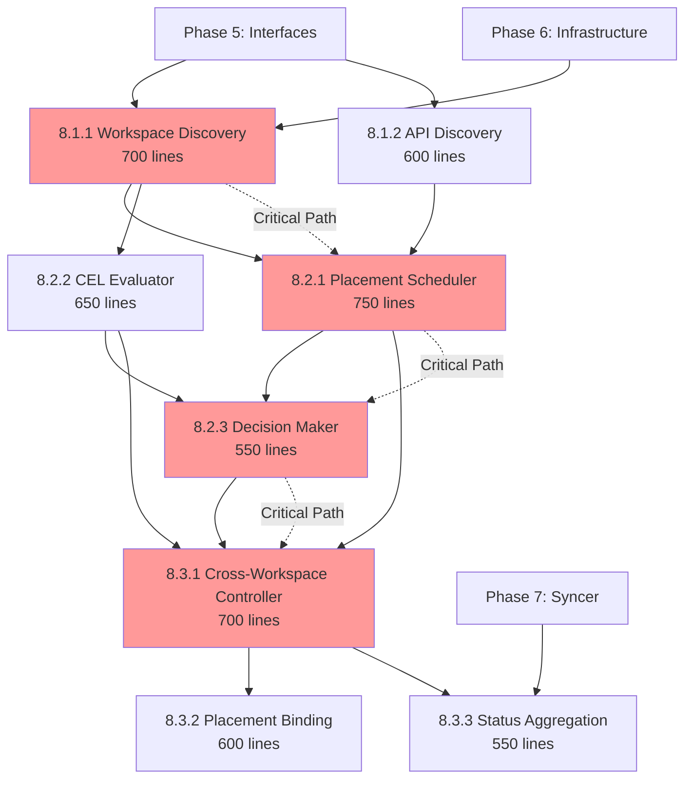

# Phase 8: Cross-Workspace Runtime - Wave Implementation Plan

## Executive Summary

**Phase**: Phase 8 - Cross-Workspace Runtime Implementation  
**Total Efforts**: 8 distinct implementation efforts  
**Maximum Parallelization**: 3-4 agents working simultaneously  
**Duration**: 3-4 days with optimal parallelization  
**Total Lines**: ~5,200 lines of code  
**Critical Path**: 3 waves with sequential dependencies

## Dependency Graph



## Wave Summary Table

| Wave | Branches | Max Parallel Agents | Dependencies | Critical Path | Duration |
|------|----------|-------------------|--------------|---------------|----------|
| 1    | 8.1.1, 8.1.2 | 2 | Phase 5-2 complete | 8.1.1 → Scheduler | Day 1 |
| 2    | 8.2.1, 8.2.2, 8.2.3 | 3 | Wave 1 complete | 8.2.1 → 8.2.3 → Controller | Days 2-3 |
| 3    | 8.3.1, 8.3.2, 8.3.3 | 3 | Wave 2 complete | 8.3.1 → Binding | Days 3-4 |

## Detailed Wave Implementation

### Wave 1: Discovery & Foundation (Day 1)

**Parallelization Potential**: HIGH - 2 agents can work independently  
**Integration Risk**: LOW - Minimal shared interfaces  
**Dependencies**: Phase 5-2 must be complete

#### Agent Assignments

**Agent 1: Workspace Discovery Specialist**
- Branch: `feature/tmc-completion/p8w1-workspace-discovery`
- Files: `pkg/placement/discovery/workspace_discoverer.go`
- Lines: ~700
- Focus: Workspace traversal, authorization, sync target discovery
- Key Interfaces:
  - `WorkspaceDiscoverer` struct
  - `DiscoverWorkspaces()` method
  - `AuthorizationChecker` interface

**Agent 2: API Discovery Specialist**
- Branch: `feature/tmc-completion/p8w1-api-discovery`
- Files: `pkg/placement/discovery/api_discoverer.go`
- Lines: ~600
- Focus: API resource discovery, version negotiation
- Key Interfaces:
  - `APIResourceDiscoverer` struct
  - `DiscoverAPIs()` method
  - `NegotiateVersion()` method

#### Coordination Points
- Both agents define discovery interfaces in `pkg/placement/interfaces`
- Minimal overlap - workspace discovery focuses on tenancy, API discovery on resources
- Results from both feed into Wave 2 scheduler

#### Resource Conflicts
- No file conflicts expected
- Both create separate discovery packages
- Interface definitions should be coordinated upfront

---

### Wave 2: Scheduling & Evaluation (Days 2-3)

**Parallelization Potential**: MEDIUM - 2-3 agents with staggered starts  
**Integration Risk**: MEDIUM - Shared scheduler interfaces  
**Dependencies**: Wave 1 discovery components must be complete

#### Agent Assignments

**Agent 1: Scheduler Specialist** (Start immediately)
- Branch: `feature/tmc-completion/p8w2-scheduler`
- Files: `pkg/placement/scheduler/scheduler.go`
- Lines: ~750
- Focus: Core scheduling logic, scoring, strategies
- Key Components:
  - `Scheduler` struct with strategy pattern
  - Scoring plugins (Resource, Affinity, Load, Latency)
  - Strategy implementations (BestFit, Spread, Binpack)
- Dependencies: Needs Wave 1 discovery interfaces

**Agent 2: Policy Specialist** (Start immediately)
- Branch: `feature/tmc-completion/p8w2-cel-evaluator`
- Files: `pkg/placement/policy/cel_evaluator.go`
- Lines: ~650
- Focus: CEL expression evaluation, custom functions
- Key Components:
  - `CELEvaluator` with compiled program cache
  - Custom CEL functions (hasLabel, capacity, utilization, inWorkspace)
  - Policy rule evaluation logic
- Dependencies: Needs Wave 1 workspace discovery types

**Agent 3: Decision Specialist** (Start after Agent 1 defines scheduler interfaces)
- Branch: `feature/tmc-completion/p8w2-decision`
- Files: `pkg/placement/decision/decision_maker.go`
- Lines: ~550
- Focus: Decision creation, binding generation
- Key Components:
  - Decision aggregation from scheduler and evaluator
  - Placement binding creation
  - Decision status management
- Dependencies: Needs scheduler output types from Agent 1

#### Coordination Points
- Agent 1 & 2 can work in parallel initially
- Agent 3 depends on Agent 1's scheduler interfaces
- All three converge in Wave 3 controller

#### Resource Conflicts
- Potential interface overlap between scheduler and decision maker
- Policy evaluator is independent
- Coordinate on shared types in `pkg/apis/placement/v1alpha1`

---

### Wave 3: Runtime Integration (Days 3-4)

**Parallelization Potential**: LOW initially, HIGH after controller interfaces  
**Integration Risk**: HIGH - Core runtime integration  
**Dependencies**: Wave 2 scheduling components must be complete

#### Agent Assignments

**Agent 1: Controller Specialist** (Start immediately when Wave 2 completes)
- Branch: `feature/tmc-completion/p8w3-controller`
- Files: `pkg/reconciler/placement/crossworkspace/controller.go`
- Lines: ~700
- Focus: Main reconciliation loop, orchestration
- Key Components:
  - Cross-workspace controller with multi-cluster clients
  - Reconciliation phases (discover → evaluate → schedule → apply)
  - Multi-workspace client management
- Dependencies: All Wave 1-2 components

**Agent 2: Binding Specialist** (Start after Agent 1 defines controller structure)
- Branch: `feature/tmc-completion/p8w3-binding`
- Files: `pkg/reconciler/placement/binding/controller.go`
- Lines: ~600
- Focus: Placement binding lifecycle
- Key Components:
  - Binding controller for placement decisions
  - Resource binding to target clusters
  - Binding status reconciliation
- Dependencies: Controller interfaces from Agent 1

**Agent 3: Status Specialist** (Can start in parallel with Agent 2)
- Branch: `feature/tmc-completion/p8w3-status-agg`
- Files: `pkg/reconciler/placement/status/aggregator.go`
- Lines: ~550
- Focus: Cross-workspace status aggregation
- Key Components:
  - Status aggregation from multiple clusters
  - Health monitoring across workspaces
  - Condition aggregation logic
- Dependencies: Phase 7 syncer, controller types from Agent 1

#### Coordination Points
- Agent 1 must complete controller structure first
- Agents 2 & 3 can then work in parallel
- Final integration testing requires all three

#### Resource Conflicts
- High risk of conflicts in controller package
- Coordinate on controller registration and initialization
- Shared status types need agreement

---

## Execution Timeline

| Wave | Day | Agent 1 | Agent 2 | Agent 3 | Agent 4 | Deliverables |
|------|-----|---------|---------|---------|---------|--------------|
| 1 | Day 1 AM | Workspace Discovery (350L) | API Discovery (300L) | - | - | Discovery interfaces |
| 1 | Day 1 PM | Workspace Discovery (350L) | API Discovery (300L) | - | - | Complete discovery |
| 2 | Day 2 AM | Scheduler Core (400L) | CEL Evaluator (350L) | - | - | Scheduler & policy base |
| 2 | Day 2 PM | Scheduler Strategies (350L) | CEL Functions (300L) | Decision Maker (275L) | - | Evaluation complete |
| 2 | Day 3 AM | - | - | Decision Maker (275L) | Testing/Integration | Decision system |
| 3 | Day 3 PM | Controller Core (400L) | - | - | Testing/Integration | Controller base |
| 3 | Day 4 AM | Controller Apply (300L) | Binding Controller (600L) | Status Aggregator (550L) | - | Runtime components |
| 3 | Day 4 PM | Integration | Integration | Integration | Integration | Full system test |

## Agent Orchestration Instructions

### Pre-Wave Setup (All Agents)
```bash
# Each agent sets up their environment
source /workspaces/kcp-shared-tools/setup-worktree-env.sh

# Verify Phase 5-2 completion
cd /workspaces/kcp-worktrees/main
make test  # Ensure base system works

# Check available worktrees
wt-list
wt-status
```

### Wave 1 Execution

**Agent 1 (Workspace Discovery)**:
```bash
wt-create feature/tmc-completion/p8w1-workspace-discovery p8w1-workspace-discovery
wt-switch p8w1-workspace-discovery
# Implement workspace discovery (~700 lines)
# Focus: workspace traversal, authorization, sync target discovery
```

**Agent 2 (API Discovery)**:
```bash
wt-create feature/tmc-completion/p8w1-api-discovery p8w1-api-discovery
wt-switch p8w1-api-discovery
# Implement API discovery (~600 lines)
# Focus: API resource discovery, version negotiation
```

### Wave 2 Execution

**Agent 1 (Scheduler)**:
```bash
wt-create feature/tmc-completion/p8w2-scheduler p8w2-scheduler
wt-switch p8w2-scheduler
# Pull Wave 1 changes
git fetch origin
git merge origin/feature/tmc-completion/p8w1-workspace-discovery
git merge origin/feature/tmc-completion/p8w1-api-discovery
# Implement scheduler (~750 lines)
```

**Agent 2 (CEL Evaluator)**:
```bash
wt-create feature/tmc-completion/p8w2-cel-evaluator p8w2-cel-evaluator
wt-switch p8w2-cel-evaluator
# Pull Wave 1 changes
git fetch origin
git merge origin/feature/tmc-completion/p8w1-workspace-discovery
# Implement CEL evaluator (~650 lines)
```

**Agent 3 (Decision Maker)** - Starts after Agent 1 defines interfaces:
```bash
wt-create feature/tmc-completion/p8w2-decision p8w2-decision
wt-switch p8w2-decision
# Pull scheduler interfaces
git fetch origin
git merge origin/feature/tmc-completion/p8w2-scheduler
# Implement decision maker (~550 lines)
```

### Wave 3 Execution

**Agent 1 (Controller)**:
```bash
wt-create feature/tmc-completion/p8w3-controller p8w3-controller
wt-switch p8w3-controller
# Pull all Wave 2 changes
git fetch origin
git merge origin/feature/tmc-completion/p8w2-scheduler
git merge origin/feature/tmc-completion/p8w2-cel-evaluator
git merge origin/feature/tmc-completion/p8w2-decision
# Implement controller (~700 lines)
```

**Agents 2 & 3** - Start after controller structure defined:
```bash
# Similar pattern, merge controller changes first
```

## Conflict Analysis

### Shared Files Requiring Coordination

1. **Interface Definitions** (`pkg/placement/interfaces/`)
   - Wave 1 agents must agree on discovery interfaces
   - Wave 2 agents must agree on scheduler/evaluator interfaces
   - Solution: Define interfaces collaboratively at wave start

2. **API Types** (`pkg/apis/placement/v1alpha1/`)
   - All agents use placement types
   - Solution: Types already defined in Phase 5

3. **Controller Registration** (`pkg/reconciler/placement/`)
   - Wave 3 controllers must coordinate registration
   - Solution: Agent 1 defines registration pattern

### Integration Touchpoints

1. **Wave 1 → Wave 2**:
   - Discovery results feed scheduler
   - Workspace targets used by evaluator
   - Clean interfaces critical

2. **Wave 2 → Wave 3**:
   - Scheduler output drives controller
   - Evaluator used by controller
   - Decision applied by binding controller

3. **Cross-Wave Testing**:
   - Each wave must maintain backward compatibility
   - Integration tests added progressively
   - No breaking changes to earlier waves

## Risk Mitigation

### High-Risk Areas

1. **Scheduler Performance** (Wave 2)
   - Risk: Slow scoring with many targets
   - Mitigation: Parallel scoring, caching

2. **Cross-Workspace Authorization** (Wave 1)
   - Risk: Permission errors across workspaces
   - Mitigation: Comprehensive auth checking, fallbacks

3. **Controller Complexity** (Wave 3)
   - Risk: Complex reconciliation logic
   - Mitigation: Clear phase separation, extensive logging

### Contingency Plans

1. **If Wave 1 Delayed**:
   - Wave 2 agents can start with mock discovery
   - Focus on unit tests until integration possible

2. **If Scheduler Too Complex**:
   - Split into basic scheduler + advanced strategies
   - Implement simple strategy first

3. **If Controller Too Large**:
   - Split into multiple smaller controllers
   - Use controller-runtime's builder pattern

## Success Metrics

### Per-Wave Validation

**Wave 1 Complete When**:
- [ ] Can discover workspaces with proper authorization
- [ ] Can discover APIs across workspaces and clusters
- [ ] Discovery results properly cached
- [ ] Unit tests >70% coverage

**Wave 2 Complete When**:
- [ ] Scheduler makes placement decisions
- [ ] CEL policies evaluate correctly
- [ ] Decisions include scoring breakdown
- [ ] Integration with discovery works

**Wave 3 Complete When**:
- [ ] Controller reconciles placements
- [ ] Bindings created in target clusters
- [ ] Status aggregated correctly
- [ ] End-to-end placement works

### Overall Phase 8 Success Criteria

1. ✅ **Functional**: Can place workload across workspaces
2. ✅ **Performant**: <5s for placement decision with 100 targets
3. ✅ **Reliable**: Handles workspace permission errors gracefully
4. ✅ **Observable**: Comprehensive metrics and logging
5. ✅ **Testable**: >70% test coverage across all components
6. ✅ **Maintainable**: Clear separation of concerns
7. ✅ **Documented**: API docs and user guides complete
8. ✅ **Integrated**: Works with Phase 5-2 components

## Optimization Recommendations

### Parallelization Improvements

1. **Wave 1**: Maximum parallelization achieved (2 agents)
2. **Wave 2**: Consider 4th agent for testing/integration
3. **Wave 3**: Binding and status can fully parallelize

### Time Reduction Strategies

1. **Pre-Implementation**:
   - Define all interfaces upfront
   - Create integration test framework early
   - Set up CI/CD pipeline first

2. **During Implementation**:
   - Daily sync meetings at wave boundaries
   - Continuous integration testing
   - Immediate conflict resolution

3. **Post-Implementation**:
   - Parallel documentation updates
   - Automated performance testing
   - Progressive rollout capability

## Conclusion

Phase 8's cross-workspace runtime can be efficiently parallelized across 3-4 agents working in coordinated waves. The critical path runs through workspace discovery → scheduler → decision maker → controller, requiring careful orchestration. With proper coordination and the wave structure defined above, Phase 8 can be completed in 3-4 days while maintaining high code quality and test coverage.

The key to success is:
1. Clear interface definitions at wave boundaries
2. Minimal shared file modifications
3. Progressive integration testing
4. Strong communication between agents at coordination points

This wave plan enables maximum parallelization while managing dependencies and reducing integration risk.