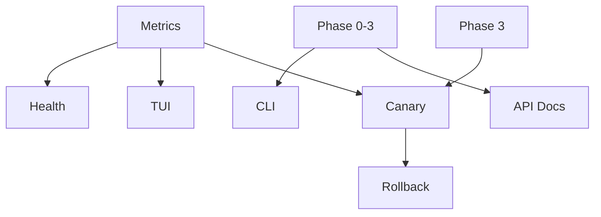

# Phase 4: Advanced Features Implementation Plan

## Overview

**Theme**: Add production features like monitoring, CLI, and advanced policies  
**Duration**: 3 days with parallel execution  
**Total Efforts**: 7  
**Total Lines**: ~4,200  
**Engineers Required**: 3 working in parallel  
**Dependencies**: Phase 0-3 complete (full core functionality)

This phase adds production-readiness features including observability, CLI tools, and advanced deployment strategies.

## Wave Structure

### Wave 1: Observability & Monitoring (Day 1)
**Dependencies**: Phase 0-3  
**Parallel Efforts**: 2  
**Purpose**: Add comprehensive monitoring and metrics

### Wave 2: CLI & User Experience (Day 2)
**Dependencies**: Phase 0-3  
**Parallel Efforts**: 3  
**Purpose**: Build CLI tools and improve user experience

### Wave 3: Advanced Deployment Features (Day 3)
**Dependencies**: Waves 1-2  
**Parallel Efforts**: 2  
**Purpose**: Implement canary deployments and rollback capabilities

## Wave 1: Observability & Monitoring

### Effort 4.1.1: Metrics & Telemetry
**Branch**: `feature/tmc-completion/p4w1-metrics`  
**Lines**: ~650  
**Dependencies**: Phase 2-3 runtime  
**Engineer**: SRE Specialist

**Implementation**:

```go
// pkg/metrics/tmc/metrics.go
package tmc

import (
    "context"
    "time"
    
    "github.com/prometheus/client_golang/prometheus"
    "github.com/prometheus/client_golang/prometheus/promauto"
    workloadv1alpha1 "github.com/kcp-dev/kcp/pkg/apis/workload/v1alpha1"
    
    "go.opentelemetry.io/otel"
    "go.opentelemetry.io/otel/attribute"
    "go.opentelemetry.io/otel/metric"
    "go.opentelemetry.io/otel/trace"
)

var (
    // Syncer metrics
    syncLatency = promauto.NewHistogramVec(
        prometheus.HistogramOpts{
            Namespace: "tmc",
            Subsystem: "syncer",
            Name:      "sync_duration_seconds",
            Help:      "Latency of resource synchronization operations",
            Buckets:   prometheus.ExponentialBuckets(0.001, 2, 15), // 1ms to 16s
        },
        []string{"direction", "resource", "cluster", "namespace", "result"},
    )
    
    syncedResources = promauto.NewGaugeVec(
        prometheus.GaugeOpts{
            Namespace: "tmc",
            Subsystem: "syncer",
            Name:      "synced_resources_total",
            Help:      "Total number of synced resources",
        },
        []string{"cluster", "resource", "namespace"},
    )
    
    syncErrors = promauto.NewCounterVec(
        prometheus.CounterOpts{
            Namespace: "tmc",
            Subsystem: "syncer",
            Name:      "sync_errors_total",
            Help:      "Total number of sync errors",
        },
        []string{"cluster", "resource", "error_type"},
    )
    
    // Placement metrics
    placementDecisions = promauto.NewCounterVec(
        prometheus.CounterOpts{
            Namespace: "tmc",
            Subsystem: "placement",
            Name:      "decisions_total",
            Help:      "Total placement decisions made",
        },
        []string{"strategy", "result", "workspace"},
    )
    
    placementLatency = promauto.NewHistogramVec(
        prometheus.HistogramOpts{
            Namespace: "tmc",
            Subsystem: "placement",
            Name:      "decision_duration_seconds",
            Help:      "Time to make placement decisions",
            Buckets:   prometheus.ExponentialBuckets(0.01, 2, 10), // 10ms to 5s
        },
        []string{"strategy", "candidates"},
    )
    
    placementTargets = promauto.NewGaugeVec(
        prometheus.GaugeOpts{
            Namespace: "tmc",
            Subsystem: "placement",
            Name:      "selected_targets",
            Help:      "Number of targets selected for placement",
        },
        []string{"placement", "workspace"},
    )
    
    // Cluster metrics
    clusterCapacity = promauto.NewGaugeVec(
        prometheus.GaugeOpts{
            Namespace: "tmc",
            Subsystem: "cluster",
            Name:      "capacity",
            Help:      "Cluster resource capacity",
        },
        []string{"cluster", "resource"},
    )
    
    clusterUtilization = promauto.NewGaugeVec(
        prometheus.GaugeOpts{
            Namespace: "tmc",
            Subsystem: "cluster",
            Name:      "utilization_ratio",
            Help:      "Cluster resource utilization ratio (0-1)",
        },
        []string{"cluster", "resource"},
    )
    
    // Connection metrics
    syncerConnections = promauto.NewGaugeVec(
        prometheus.GaugeOpts{
            Namespace: "tmc",
            Subsystem: "syncer",
            Name:      "connections",
            Help:      "Number of active syncer connections",
        },
        []string{"cluster", "status"},
    )
    
    heartbeatAge = promauto.NewGaugeVec(
        prometheus.GaugeOpts{
            Namespace: "tmc",
            Subsystem: "syncer",
            Name:      "heartbeat_age_seconds",
            Help:      "Age of last heartbeat from syncer",
        },
        []string{"cluster"},
    )
)

// MetricsRecorder records TMC metrics
type MetricsRecorder struct {
    tracer trace.Tracer
    meter  metric.Meter
    
    // OpenTelemetry metrics
    syncCounter   metric.Int64Counter
    syncHistogram metric.Float64Histogram
}

// NewMetricsRecorder creates a new metrics recorder
func NewMetricsRecorder() (*MetricsRecorder, error) {
    tracer := otel.Tracer("tmc")
    meter := otel.Meter("tmc")
    
    syncCounter, err := meter.Int64Counter(
        "tmc.sync.operations",
        metric.WithDescription("Count of sync operations"),
        metric.WithUnit("1"),
    )
    if err != nil {
        return nil, err
    }
    
    syncHistogram, err := meter.Float64Histogram(
        "tmc.sync.duration",
        metric.WithDescription("Duration of sync operations"),
        metric.WithUnit("s"),
    )
    if err != nil {
        return nil, err
    }
    
    return &MetricsRecorder{
        tracer:        tracer,
        meter:         meter,
        syncCounter:   syncCounter,
        syncHistogram: syncHistogram,
    }, nil
}

// RecordSync records a sync operation
func (r *MetricsRecorder) RecordSync(ctx context.Context, direction, resource, cluster, namespace string, duration time.Duration, err error) {
    result := "success"
    if err != nil {
        result = "error"
    }
    
    // Prometheus metrics
    syncLatency.WithLabelValues(direction, resource, cluster, namespace, result).Observe(duration.Seconds())
    
    if err != nil {
        errorType := categorizeError(err)
        syncErrors.WithLabelValues(cluster, resource, errorType).Inc()
    }
    
    // OpenTelemetry metrics
    attrs := []attribute.KeyValue{
        attribute.String("direction", direction),
        attribute.String("resource", resource),
        attribute.String("cluster", cluster),
        attribute.String("result", result),
    }
    
    r.syncCounter.Add(ctx, 1, metric.WithAttributes(attrs...))
    r.syncHistogram.Record(ctx, duration.Seconds(), metric.WithAttributes(attrs...))
}

// RecordPlacementDecision records a placement decision
func (r *MetricsRecorder) RecordPlacementDecision(
    ctx context.Context,
    placement *placementv1alpha1.WorkloadPlacement,
    decision *placementv1alpha1.PlacementDecision,
    duration time.Duration,
) {
    strategy := string(placement.Spec.Strategy)
    workspace := string(placement.GetClusterName())
    result := "success"
    if decision == nil || len(decision.Spec.Clusters) == 0 {
        result = "no_targets"
    }
    
    // Record decision
    placementDecisions.WithLabelValues(strategy, result, workspace).Inc()
    
    // Record latency
    candidates := fmt.Sprintf("%d", len(decision.Spec.Clusters))
    placementLatency.WithLabelValues(strategy, candidates).Observe(duration.Seconds())
    
    // Record selected targets
    if decision != nil {
        placementTargets.WithLabelValues(placement.Name, workspace).Set(float64(len(decision.Spec.Clusters)))
    }
}

// RecordClusterMetrics records cluster capacity and utilization
func (r *MetricsRecorder) RecordClusterMetrics(ctx context.Context, syncTarget *workloadv1alpha1.SyncTarget) {
    cluster := syncTarget.Name
    
    // Record capacity
    for resource, quantity := range syncTarget.Status.AvailableResources {
        clusterCapacity.WithLabelValues(cluster, string(resource)).Set(float64(quantity.Value()))
    }
    
    // Calculate and record utilization
    for resource, allocated := range syncTarget.Status.AllocatedResources {
        if available, ok := syncTarget.Status.AvailableResources[resource]; ok && !available.IsZero() {
            utilization := float64(allocated.MilliValue()) / float64(available.MilliValue())
            clusterUtilization.WithLabelValues(cluster, string(resource)).Set(utilization)
        }
    }
}

// RecordSyncerConnection records syncer connection status
func (r *MetricsRecorder) RecordSyncerConnection(cluster string, connected bool) {
    if connected {
        syncerConnections.WithLabelValues(cluster, "connected").Set(1)
        syncerConnections.WithLabelValues(cluster, "disconnected").Set(0)
    } else {
        syncerConnections.WithLabelValues(cluster, "connected").Set(0)
        syncerConnections.WithLabelValues(cluster, "disconnected").Set(1)
    }
}

// RecordHeartbeat records syncer heartbeat
func (r *MetricsRecorder) RecordHeartbeat(cluster string, lastHeartbeat time.Time) {
    age := time.Since(lastHeartbeat).Seconds()
    heartbeatAge.WithLabelValues(cluster).Set(age)
}

// StartMetricsServer starts the Prometheus metrics server
func StartMetricsServer(ctx context.Context, addr string) error {
    mux := http.NewServeMux()
    mux.Handle("/metrics", promhttp.Handler())
    mux.Handle("/healthz", http.HandlerFunc(healthzHandler))
    mux.Handle("/readyz", http.HandlerFunc(readyzHandler))
    
    server := &http.Server{
        Addr:    addr,
        Handler: mux,
    }
    
    go func() {
        <-ctx.Done()
        server.Shutdown(context.Background())
    }()
    
    return server.ListenAndServe()
}

// Custom span creation for tracing
func (r *MetricsRecorder) StartSyncSpan(ctx context.Context, operation string) (context.Context, trace.Span) {
    return r.tracer.Start(ctx, fmt.Sprintf("tmc.sync.%s", operation),
        trace.WithSpanKind(trace.SpanKindInternal),
        trace.WithAttributes(
            attribute.String("component", "tmc"),
            attribute.String("operation", operation),
        ),
    )
}

// categorizeError categorizes errors for metrics
func categorizeError(err error) string {
    switch {
    case errors.IsNotFound(err):
        return "not_found"
    case errors.IsConflict(err):
        return "conflict"
    case errors.IsTimeout(err):
        return "timeout"
    case errors.IsForbidden(err):
        return "forbidden"
    case errors.IsServerTimeout(err):
        return "server_timeout"
    case errors.IsTooManyRequests(err):
        return "rate_limited"
    default:
        return "unknown"
    }
}
```

---

### Effort 4.1.2: Health & Readiness Monitoring
**Branch**: `feature/tmc-completion/p4w1-health`  
**Lines**: ~500  
**Dependencies**: Phase 2 syncer  
**Engineer**: SRE Specialist

**Implementation**:

```go
// pkg/health/monitor.go
package health

import (
    "context"
    "sync"
    "time"
    
    workloadv1alpha1 "github.com/kcp-dev/kcp/pkg/apis/workload/v1alpha1"
)

// HealthMonitor monitors component health
type HealthMonitor struct {
    mu sync.RWMutex
    
    // Component health status
    components map[string]*ComponentHealth
    
    // Syncer health tracking
    syncerHealth map[string]*SyncerHealth
    
    // Readiness checks
    readinessChecks []ReadinessCheck
}

// ComponentHealth tracks health of a component
type ComponentHealth struct {
    Name        string
    Healthy     bool
    LastCheck   time.Time
    LastError   error
    Checks      int64
    Failures    int64
    ConsecutiveFails int
}

// SyncerHealth tracks syncer-specific health
type SyncerHealth struct {
    Cluster          string
    Connected        bool
    LastHeartbeat    time.Time
    SyncedResources  int
    PendingResources int
    FailedResources  int
    Latency          time.Duration
}

// CheckHealth performs health checks
func (m *HealthMonitor) CheckHealth(ctx context.Context) *HealthStatus {
    m.mu.RLock()
    defer m.mu.RUnlock()
    
    status := &HealthStatus{
        Healthy:    true,
        Components: make(map[string]ComponentStatus),
        Timestamp:  time.Now(),
    }
    
    // Check each component
    for name, component := range m.components {
        compStatus := ComponentStatus{
            Name:    name,
            Healthy: component.Healthy,
            Message: m.getHealthMessage(component),
        }
        
        if !component.Healthy {
            status.Healthy = false
            status.Degraded = true
        }
        
        status.Components[name] = compStatus
    }
    
    // Check syncer health
    unhealthySyncers := 0
    for _, syncer := range m.syncerHealth {
        if !m.isSyncerHealthy(syncer) {
            unhealthySyncers++
        }
    }
    
    if unhealthySyncers > 0 {
        status.Degraded = true
        if unhealthySyncers == len(m.syncerHealth) {
            status.Healthy = false
        }
    }
    
    return status
}

// MonitorSyncTarget monitors a sync target's health
func (m *HealthMonitor) MonitorSyncTarget(ctx context.Context, target *workloadv1alpha1.SyncTarget) {
    ticker := time.NewTicker(30 * time.Second)
    defer ticker.Stop()
    
    for {
        select {
        case <-ctx.Done():
            return
        case <-ticker.C:
            m.checkSyncTargetHealth(target)
        }
    }
}

func (m *HealthMonitor) checkSyncTargetHealth(target *workloadv1alpha1.SyncTarget) {
    m.mu.Lock()
    defer m.mu.Unlock()
    
    health, exists := m.syncerHealth[target.Name]
    if !exists {
        health = &SyncerHealth{
            Cluster: target.Name,
        }
        m.syncerHealth[target.Name] = health
    }
    
    // Update health from target status
    if target.Status.LastHeartbeatTime != nil {
        health.LastHeartbeat = target.Status.LastHeartbeatTime.Time
        health.Connected = time.Since(health.LastHeartbeat) < 2*time.Minute
    }
    
    if target.Status.SyncerStatus != nil {
        health.SyncedResources = int(target.Status.SyncerStatus.SyncedResources)
    }
}

func (m *HealthMonitor) isSyncerHealthy(syncer *SyncerHealth) bool {
    if !syncer.Connected {
        return false
    }
    
    if time.Since(syncer.LastHeartbeat) > 2*time.Minute {
        return false
    }
    
    if syncer.FailedResources > syncer.SyncedResources/10 { // >10% failure rate
        return false
    }
    
    return true
}

// ReadinessCheck checks if system is ready
type ReadinessCheck interface {
    Name() string
    Check(ctx context.Context) error
}

// APIServerReadiness checks API server availability
type APIServerReadiness struct {
    client kcpclientset.ClusterInterface
}

func (c *APIServerReadiness) Name() string {
    return "api-server"
}

func (c *APIServerReadiness) Check(ctx context.Context) error {
    _, err := c.client.Discovery().ServerVersion()
    return err
}
```

## Wave 2: CLI & User Experience

### Effort 4.2.1: kubectl-tmc Plugin
**Branch**: `feature/tmc-completion/p4w2-kubectl-tmc`  
**Lines**: ~700  
**Dependencies**: Phase 0-3 APIs  
**Engineer**: CLI Specialist

**Implementation**:

```go
// cmd/kubectl-tmc/main.go
package main

import (
    "context"
    "fmt"
    "os"
    
    "github.com/spf13/cobra"
    "k8s.io/cli-runtime/pkg/genericclioptions"
    "k8s.io/kubectl/pkg/util/templates"
)

var (
    tmcLong = templates.LongDesc(`
        kubectl tmc provides TMC (Transparent Multi-Cluster) management commands
        for KCP.

        These commands help you manage sync targets, placements, and workload
        distribution across multiple clusters.`)
    
    tmcExample = templates.Examples(`
        # List all sync targets
        kubectl tmc get synctargets

        # Describe a placement
        kubectl tmc describe placement my-app

        # Check sync status
        kubectl tmc sync status

        # Debug a syncer
        kubectl tmc debug syncer cluster-1`)
)

func main() {
    rootCmd := NewTMCCommand()
    if err := rootCmd.Execute(); err != nil {
        os.Exit(1)
    }
}

// NewTMCCommand creates the root tmc command
func NewTMCCommand() *cobra.Command {
    ioStreams := genericclioptions.IOStreams{
        In:     os.Stdin,
        Out:    os.Stdout,
        ErrOut: os.Stderr,
    }
    
    cmd := &cobra.Command{
        Use:     "kubectl-tmc",
        Short:   "TMC management for KCP",
        Long:    tmcLong,
        Example: tmcExample,
    }
    
    // Add subcommands
    cmd.AddCommand(NewGetCommand(ioStreams))
    cmd.AddCommand(NewDescribeCommand(ioStreams))
    cmd.AddCommand(NewSyncCommand(ioStreams))
    cmd.AddCommand(NewDebugCommand(ioStreams))
    cmd.AddCommand(NewPlacementCommand(ioStreams))
    
    return cmd
}

// NewGetCommand creates the get command
func NewGetCommand(streams genericclioptions.IOStreams) *cobra.Command {
    o := &GetOptions{
        IOStreams: streams,
    }
    
    cmd := &cobra.Command{
        Use:     "get [resource]",
        Short:   "Display TMC resources",
        Example: getExample,
        RunE: func(cmd *cobra.Command, args []string) error {
            if err := o.Complete(cmd, args); err != nil {
                return err
            }
            if err := o.Validate(); err != nil {
                return err
            }
            return o.Run()
        },
    }
    
    o.AddFlags(cmd)
    return cmd
}

// GetOptions contains options for get command
type GetOptions struct {
    genericclioptions.IOStreams
    
    Namespace   string
    AllNamespaces bool
    Output      string
    
    clientGetter genericclioptions.RESTClientGetter
    client       dynamic.Interface
}

func (o *GetOptions) Run() error {
    switch o.ResourceType {
    case "synctargets", "st":
        return o.getSyncTargets()
    case "placements", "pl":
        return o.getPlacements()
    case "clusters", "cl":
        return o.getClusters()
    default:
        return fmt.Errorf("unknown resource type: %s", o.ResourceType)
    }
}

func (o *GetOptions) getSyncTargets() error {
    ctx := context.Background()
    
    // List sync targets
    targets, err := o.client.Resource(syncTargetGVR).
        List(ctx, metav1.ListOptions{})
    if err != nil {
        return err
    }
    
    // Format output
    switch o.Output {
    case "json":
        return o.printJSON(targets)
    case "yaml":
        return o.printYAML(targets)
    default:
        return o.printTable(targets)
    }
}

func (o *GetOptions) printTable(obj runtime.Object) error {
    // Create table printer
    printer := printers.NewTablePrinter(printers.PrintOptions{
        NoHeaders: false,
        Wide:      o.Wide,
    })
    
    // Define columns
    columns := []metav1.TableColumnDefinition{
        {Name: "Name", Type: "string"},
        {Name: "Cluster", Type: "string"},
        {Name: "Ready", Type: "string"},
        {Name: "Synced", Type: "integer"},
        {Name: "Age", Type: "string"},
    }
    
    // Convert to table
    table := &metav1.Table{
        ColumnDefinitions: columns,
    }
    
    list := obj.(*unstructured.UnstructuredList)
    for _, item := range list.Items {
        row := metav1.TableRow{
            Cells: []interface{}{
                item.GetName(),
                item.GetClusterName(),
                getConditionStatus(&item, "Ready"),
                getSyncedCount(&item),
                age(&item),
            },
        }
        table.Rows = append(table.Rows, row)
    }
    
    return printer.PrintObj(table, o.Out)
}

// NewSyncCommand creates the sync command
func NewSyncCommand(streams genericclioptions.IOStreams) *cobra.Command {
    cmd := &cobra.Command{
        Use:   "sync",
        Short: "Manage synchronization",
    }
    
    cmd.AddCommand(NewSyncStatusCommand(streams))
    cmd.AddCommand(NewSyncForceCommand(streams))
    cmd.AddCommand(NewSyncPauseCommand(streams))
    cmd.AddCommand(NewSyncResumeCommand(streams))
    
    return cmd
}

// NewPlacementCommand creates the placement command
func NewPlacementCommand(streams genericclioptions.IOStreams) *cobra.Command {
    o := &PlacementOptions{
        IOStreams: streams,
    }
    
    cmd := &cobra.Command{
        Use:   "placement",
        Short: "Manage workload placement",
    }
    
    cmd.AddCommand(NewPlacementCreateCommand(o))
    cmd.AddCommand(NewPlacementUpdateCommand(o))
    cmd.AddCommand(NewPlacementSimulateCommand(o))
    
    return cmd
}

// NewPlacementSimulateCommand simulates placement decisions
func NewPlacementSimulateCommand(o *PlacementOptions) *cobra.Command {
    cmd := &cobra.Command{
        Use:   "simulate [placement]",
        Short: "Simulate placement decision",
        RunE: func(cmd *cobra.Command, args []string) error {
            return o.Simulate(args)
        },
    }
    
    return cmd
}

func (o *PlacementOptions) Simulate(args []string) error {
    if len(args) == 0 {
        return fmt.Errorf("placement name required")
    }
    
    ctx := context.Background()
    placementName := args[0]
    
    // Get placement
    placement, err := o.client.Resource(placementGVR).
        Namespace(o.Namespace).
        Get(ctx, placementName, metav1.GetOptions{})
    if err != nil {
        return err
    }
    
    // Run simulation
    simulator := NewPlacementSimulator(o.client)
    decision, err := simulator.Simulate(ctx, placement)
    if err != nil {
        return err
    }
    
    // Display results
    fmt.Fprintf(o.Out, "Simulated placement decision for %s:\n\n", placementName)
    fmt.Fprintf(o.Out, "Selected Targets:\n")
    for _, cluster := range decision.Clusters {
        fmt.Fprintf(o.Out, "  - %s (score: %.2f, weight: %d)\n",
            cluster.ClusterName, cluster.Score, cluster.Weight)
    }
    
    return nil
}

// NewDebugCommand creates debug commands
func NewDebugCommand(streams genericclioptions.IOStreams) *cobra.Command {
    cmd := &cobra.Command{
        Use:   "debug",
        Short: "Debug TMC components",
    }
    
    cmd.AddCommand(NewDebugSyncerCommand(streams))
    cmd.AddCommand(NewDebugPlacementCommand(streams))
    
    return cmd
}
```

### Effort 4.2.2: Interactive TUI Dashboard
**Branch**: `feature/tmc-completion/p4w2-tui`  
**Lines**: ~600  
**Dependencies**: Phase 4.1 metrics  
**Engineer**: UX Specialist

### Effort 4.2.3: API Documentation Generator
**Branch**: `feature/tmc-completion/p4w2-apidocs`  
**Lines**: ~450  
**Dependencies**: Phase 0 APIs  
**Engineer**: Docs Specialist

## Wave 3: Advanced Deployment Features

### Effort 4.3.1: Canary Deployment Controller
**Branch**: `feature/tmc-completion/p4w3-canary`  
**Lines**: ~650  
**Dependencies**: Phase 3 placement  
**Engineer**: Deployment Specialist

**Implementation**:

```go
// pkg/deployment/canary/controller.go
package canary

import (
    "context"
    "fmt"
    "time"
    
    deploymentv1alpha1 "github.com/kcp-dev/kcp/pkg/apis/deployment/v1alpha1"
    placementv1alpha1 "github.com/kcp-dev/kcp/pkg/apis/placement/v1alpha1"
)

// CanaryController manages canary deployments
type CanaryController struct {
    queue workqueue.RateLimitingInterface
    
    client           kcpclientset.ClusterInterface
    canaryLister     deploymentlisters.CanaryDeploymentClusterLister
    placementLister  placementlisters.WorkloadPlacementClusterLister
    
    // Metrics analyzer for canary decisions
    metricsAnalyzer *MetricsAnalyzer
    
    // Traffic manager for gradual rollout
    trafficManager *TrafficManager
}

func (c *CanaryController) reconcile(ctx context.Context, canary *deploymentv1alpha1.CanaryDeployment) error {
    logger := klog.FromContext(ctx)
    
    switch canary.Status.Phase {
    case deploymentv1alpha1.CanaryPhasePending:
        return c.initializeCanary(ctx, canary)
    case deploymentv1alpha1.CanaryPhaseProgressing:
        return c.progressCanary(ctx, canary)
    case deploymentv1alpha1.CanaryPhaseAnalyzing:
        return c.analyzeCanary(ctx, canary)
    case deploymentv1alpha1.CanaryPhasePaused:
        return c.checkResume(ctx, canary)
    case deploymentv1alpha1.CanaryPhaseSucceeded:
        return c.promoteCanary(ctx, canary)
    case deploymentv1alpha1.CanaryPhaseFailed:
        return c.rollbackCanary(ctx, canary)
    default:
        return fmt.Errorf("unknown canary phase: %s", canary.Status.Phase)
    }
}

func (c *CanaryController) initializeCanary(ctx context.Context, canary *deploymentv1alpha1.CanaryDeployment) error {
    logger := klog.FromContext(ctx)
    logger.Info("Initializing canary deployment")
    
    // Create canary placement
    canaryPlacement := c.createCanaryPlacement(canary)
    _, err := c.client.Cluster(canary.GetClusterName()).
        PlacementV1alpha1().
        WorkloadPlacements(canary.Namespace).
        Create(ctx, canaryPlacement, metav1.CreateOptions{})
    if err != nil {
        return err
    }
    
    // Update status
    canary.Status.Phase = deploymentv1alpha1.CanaryPhaseProgressing
    canary.Status.CurrentStep = 0
    canary.Status.StartTime = &metav1.Time{Time: time.Now()}
    
    return nil
}

func (c *CanaryController) progressCanary(ctx context.Context, canary *deploymentv1alpha1.CanaryDeployment) error {
    logger := klog.FromContext(ctx)
    
    currentStep := canary.Status.CurrentStep
    if currentStep >= len(canary.Spec.Steps) {
        // All steps complete, move to final analysis
        canary.Status.Phase = deploymentv1alpha1.CanaryPhaseAnalyzing
        return nil
    }
    
    step := canary.Spec.Steps[currentStep]
    logger.Info("Processing canary step", "step", currentStep, "weight", step.Weight)
    
    // Update traffic weight
    if err := c.trafficManager.UpdateWeight(ctx, canary, step.Weight); err != nil {
        return fmt.Errorf("failed to update traffic weight: %w", err)
    }
    
    // Check if duration has passed
    stepStartTime := c.getStepStartTime(canary, currentStep)
    if time.Since(stepStartTime) < step.Duration.Duration {
        // Still waiting
        return nil
    }
    
    // Analyze metrics for this step
    analysis, err := c.analyzeStep(ctx, canary, step)
    if err != nil {
        return err
    }
    
    if !analysis.Passed {
        // Canary failed
        logger.Info("Canary analysis failed", "step", currentStep, "reason", analysis.Reason)
        canary.Status.Phase = deploymentv1alpha1.CanaryPhaseFailed
        canary.Status.Message = analysis.Reason
        return nil
    }
    
    // Move to next step
    canary.Status.CurrentStep++
    canary.Status.StepStartTimes = append(canary.Status.StepStartTimes, metav1.Now())
    
    return nil
}

func (c *CanaryController) analyzeStep(ctx context.Context, canary *deploymentv1alpha1.CanaryDeployment, step deploymentv1alpha1.CanaryStep) (*AnalysisResult, error) {
    result := &AnalysisResult{Passed: true}
    
    // Check each metric threshold
    for _, threshold := range step.Thresholds {
        value, err := c.metricsAnalyzer.GetMetric(ctx, canary, threshold.Metric)
        if err != nil {
            return nil, err
        }
        
        passed := c.evaluateThreshold(value, threshold)
        if !passed {
            result.Passed = false
            result.Reason = fmt.Sprintf("Metric %s failed: value=%f, threshold=%f",
                threshold.Metric, value, threshold.Value)
            break
        }
    }
    
    return result, nil
}

func (c *CanaryController) rollbackCanary(ctx context.Context, canary *deploymentv1alpha1.CanaryDeployment) error {
    logger := klog.FromContext(ctx)
    logger.Info("Rolling back canary deployment")
    
    // Set traffic to 0% for canary
    if err := c.trafficManager.UpdateWeight(ctx, canary, 0); err != nil {
        return err
    }
    
    // Delete canary resources
    if err := c.deleteCanaryResources(ctx, canary); err != nil {
        return err
    }
    
    // Update status
    canary.Status.Phase = deploymentv1alpha1.CanaryPhaseRolledBack
    canary.Status.EndTime = &metav1.Time{Time: time.Now()}
    
    return nil
}

// TrafficManager manages traffic distribution
type TrafficManager struct {
    client dynamic.Interface
}

func (m *TrafficManager) UpdateWeight(ctx context.Context, canary *deploymentv1alpha1.CanaryDeployment, weight int32) error {
    // Update service mesh configuration or ingress rules
    // This would integrate with Istio, Linkerd, or other traffic management solutions
    
    // For example, with Istio VirtualService:
    vs := m.createVirtualService(canary, weight)
    _, err := m.client.Resource(virtualServiceGVR).
        Namespace(canary.Namespace).
        Apply(ctx, vs, metav1.ApplyOptions{
            FieldManager: "canary-controller",
        })
    
    return err
}

// MetricsAnalyzer analyzes canary metrics
type MetricsAnalyzer struct {
    promClient prometheus.Client
}

func (a *MetricsAnalyzer) GetMetric(ctx context.Context, canary *deploymentv1alpha1.CanaryDeployment, metric string) (float64, error) {
    query := a.buildQuery(canary, metric)
    
    result, err := a.promClient.Query(ctx, query, time.Now())
    if err != nil {
        return 0, err
    }
    
    // Extract value from result
    vector := result.(model.Vector)
    if len(vector) == 0 {
        return 0, fmt.Errorf("no data for metric %s", metric)
    }
    
    return float64(vector[0].Value), nil
}
```

### Effort 4.3.2: Rollback Engine
**Branch**: `feature/tmc-completion/p4w3-rollback`  
**Lines**: ~550  
**Dependencies**: Wave 3.1 canary  
**Engineer**: Reliability Specialist

## Implementation Guidelines

### Metrics Guidelines

1. **Metric Naming**:
   - Use consistent namespace/subsystem
   - Include relevant labels
   - Follow Prometheus conventions

2. **Cardinality Control**:
   - Limit label values
   - Use buckets for histograms
   - Aggregate where possible

3. **Performance**:
   - Cache metric calculations
   - Batch metric updates
   - Use sampling for high-frequency events

### CLI Design Principles

1. **User Experience**:
   - Intuitive command structure
   - Helpful error messages
   - Progress indicators for long operations

2. **Output Formats**:
   - Table (default)
   - JSON
   - YAML
   - Custom formats via templates

3. **Scripting Support**:
   - Machine-readable output
   - Exit codes
   - Quiet mode

### Canary Deployment

1. **Traffic Management**:
   - Gradual weight increases
   - Automatic rollback triggers
   - Manual override capability

2. **Analysis**:
   - Configurable metrics
   - Statistical significance
   - Comparison with baseline

## Quality Checklist

For each effort:
- [ ] Comprehensive metrics coverage
- [ ] Efficient metric collection
- [ ] CLI follows kubectl conventions
- [ ] Help text and examples
- [ ] Error handling and recovery
- [ ] Integration with existing tools
- [ ] Unit tests >70% coverage
- [ ] Under 800 lines limit

## Dependencies Between Efforts



## Success Criteria

Phase 4 is complete when:
1. ✅ Comprehensive metrics exposed
2. ✅ Health monitoring operational
3. ✅ kubectl-tmc plugin functional
4. ✅ TUI dashboard working
5. ✅ API documentation generated
6. ✅ Canary deployments working
7. ✅ Rollback engine operational
8. ✅ All tests passing

---

*Phase 4 adds the production features that make TMC enterprise-ready with full observability and advanced deployment capabilities.*