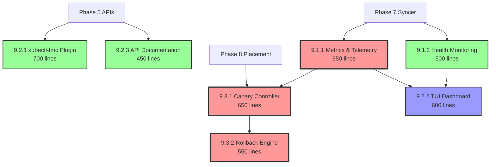

# Phase 9: Wave-Based Implementation Plan for Advanced Features

## Executive Summary

**Phase**: Phase 9 - Advanced Features (Monitoring, CLI, Canary Deployments)  
**Total Efforts**: 7 branches  
**Optimal Waves**: 3 waves  
**Maximum Parallelization**: 3 agents working simultaneously  
**Total Duration**: 3 days with parallel execution  
**Total Lines**: ~4,200 lines  

This plan transforms the sequential Phase 9 implementation into an optimally parallelized execution strategy that adds production-ready features to TMC.

## Dependencies

### Phase-Level Dependencies
- **Depends On**: Phase 5 (APIs), Phase 6 (controllers for monitoring), Phase 7 (syncer metrics), Phase 8 (placement for canary)
- **Blocks**: Phase 10 (production hardening needs monitoring and CLI tools)
- **Independent From**: None (Phase 9 enhances all prior phases)

### Wave-Level Dependencies
- **Wave 1 Depends On**: Phase 7 complete (syncer metrics needed)
- **Wave 2 Depends On**: Wave 1 metrics (TUI needs metrics), Phase 5 APIs (CLI needs API types)
- **Wave 3 Depends On**: Wave 1 metrics (canary needs monitoring), Phase 8 placement (canary uses placement)

### Critical Path
- Internal: Wave 1 (Metrics) → Wave 3 (Canary Controller) → Wave 3 (Rollback Engine)
- External Blockers: Phase 7 syncer and Phase 8 placement must be complete

### Dependency Notes
- Metrics foundation enables all observability features
- CLI tools provide operational interface to entire TMC stack
- Canary deployments use Phase 8's placement scheduler
- Health monitoring integrates with Phase 7's syncer status
- This phase makes TMC production-ready

## Dependency Graph



## Wave Summary Table

| Wave | Branches | Max Parallel Agents | Dependencies | Critical Path | Duration |
|------|----------|-------------------|--------------|---------------|----------|
| Wave 1 | 9.1.1 Metrics, 9.1.2 Health | 2 | Phase 7 Syncer | Yes (Metrics) | Day 1 |
| Wave 2 | 9.2.1 CLI, 9.2.2 TUI, 9.2.3 Docs | 3 | Phase 5-8, Wave 1 Metrics | No | Day 2 |
| Wave 3 | 9.3.1 Canary, 9.3.2 Rollback | 2 | Phase 8, Wave 1 Metrics | Yes | Day 3 |

## Wave 1: Observability Foundation (Day 1)

### Overview
**Purpose**: Establish comprehensive monitoring and observability infrastructure  
**Parallel Agents**: 2  
**Total Lines**: ~1,150  
**Dependencies**: Phase 7 syncer components must be complete  

### Branch Assignments

#### Agent 1: Metrics Specialist
**Branch**: `feature/tmc-completion/p9w1-metrics`  
**Lines**: ~650  
**Worktree**: `/workspaces/kcp-worktrees/p9w1-metrics`  
**Focus Areas**:
- Prometheus metrics implementation
- OpenTelemetry integration
- Syncer metrics (latency, resources, errors)
- Placement decision metrics
- Cluster capacity and utilization tracking
- Connection monitoring

#### Agent 2: Health Monitoring Specialist
**Branch**: `feature/tmc-completion/p9w1-health`  
**Lines**: ~500  
**Worktree**: `/workspaces/kcp-worktrees/p9w1-health`  
**Focus Areas**:
- Component health tracking
- Syncer health monitoring
- Readiness and liveness checks
- Health aggregation
- Status reporting endpoints

### Resource Conflicts Analysis
- **No conflicts**: Both branches work in separate packages (`pkg/metrics/` vs `pkg/health/`)
- **Shared interface**: Health monitor will consume metrics, but through stable interfaces
- **Integration point**: Both will register HTTP endpoints (different paths)

### Integration Strategy
1. Both agents start simultaneously
2. Define metric interfaces early (first commit)
3. Health monitor can mock metrics for testing
4. Final integration testing after both complete

## Wave 2: User Experience Layer (Day 2)

### Overview
**Purpose**: Build comprehensive CLI tools and documentation  
**Parallel Agents**: 3  
**Total Lines**: ~1,750  
**Dependencies**: Phase 0-3 APIs complete, Wave 1 metrics for TUI  

### Branch Assignments

#### Agent 1: CLI Specialist
**Branch**: `feature/tmc-completion/p4w2-kubectl-tmc`  
**Lines**: ~700  
**Worktree**: `/workspaces/kcp-worktrees/p4w2-kubectl-tmc`  
**Focus Areas**:
- kubectl plugin architecture
- Resource management commands (get, describe, delete)
- Sync management (status, force, pause, resume)
- Placement simulation and debugging
- Output formatting (table, JSON, YAML)

#### Agent 2: TUI Specialist
**Branch**: `feature/tmc-completion/p4w2-tui`  
**Lines**: ~600  
**Worktree**: `/workspaces/kcp-worktrees/p4w2-tui`  
**Focus Areas**:
- Terminal UI framework setup
- Real-time metrics display
- Cluster status dashboard
- Resource synchronization view
- Interactive debugging features
- **Dependency**: Needs Wave 1 metrics interfaces

#### Agent 3: Documentation Specialist
**Branch**: `feature/tmc-completion/p4w2-apidocs`  
**Lines**: ~450  
**Worktree**: `/workspaces/kcp-worktrees/p4w2-apidocs`  
**Focus Areas**:
- API documentation generation
- OpenAPI spec generation
- Code comment extraction
- Example generation
- Reference documentation

### Resource Conflicts Analysis
- **No conflicts**: Each tool in separate cmd/ directory
- **Shared dependency**: All consume TMC APIs, but read-only
- **Independent testing**: Each tool can be tested separately

### Parallelization Strategy
1. All three agents start simultaneously
2. CLI and Docs have no interdependencies
3. TUI waits for Wave 1 metrics completion (can start UI framework early)
4. Integration testing performed individually

## Wave 3: Advanced Deployment Features (Day 3)

### Overview
**Purpose**: Implement production deployment strategies  
**Parallel Agents**: 2 (sequential within wave)  
**Total Lines**: ~1,200  
**Dependencies**: Phase 3 placement, Wave 1 metrics  

### Branch Assignments

#### Agent 1: Canary Deployment Specialist (First Half of Day)
**Branch**: `feature/tmc-completion/p4w3-canary`  
**Lines**: ~650  
**Worktree**: `/workspaces/kcp-worktrees/p4w3-canary`  
**Focus Areas**:
- Canary controller implementation
- Traffic management integration
- Metrics-based analysis
- Progressive rollout logic
- Threshold evaluation
- Automatic promotion/rollback decisions

#### Agent 2: Rollback Specialist (Second Half of Day)
**Branch**: `feature/tmc-completion/p4w3-rollback`  
**Lines**: ~550  
**Worktree**: `/workspaces/kcp-worktrees/p4w3-rollback`  
**Focus Areas**:
- Rollback engine implementation
- State restoration
- Traffic reversal
- Resource cleanup
- History tracking
- **Dependency**: Must wait for canary controller interfaces

### Resource Conflicts Analysis
- **Sequential dependency**: Rollback engine extends canary controller
- **Shared package**: Both in `pkg/deployment/` but different subpackages
- **Interface dependency**: Rollback needs canary types and interfaces

### Execution Strategy
1. Canary specialist starts immediately
2. Rollback specialist reviews canary design while waiting
3. Rollback starts once canary interfaces are committed (not full completion)
4. Both complete testing together

## Execution Timeline

| Wave | Start Condition | Branches | Agents | Duration | Cumulative Progress |
|------|----------------|----------|--------|----------|-------------------|
| Wave 1 | Phase 2 complete | Metrics, Health | 2 | Day 1 | 27% (1,150/4,200 lines) |
| Wave 2 | Phase 0-3 complete, Metrics ready | CLI, TUI, Docs | 3 | Day 2 | 69% (2,900/4,200 lines) |
| Wave 3 | Phase 3 complete, Metrics ready | Canary, Rollback | 2 | Day 3 | 100% (4,200/4,200 lines) |

## Agent Orchestration Instructions

### Wave 1 Orchestration (2 Agents)
```bash
# Agent 1: Metrics Specialist
cd /workspaces/kcp-worktrees
wt-create feature/tmc-completion/p4w1-metrics p4w1-metrics
cd p4w1-metrics
# Implement metrics package

# Agent 2: Health Specialist  
cd /workspaces/kcp-worktrees
wt-create feature/tmc-completion/p4w1-health p4w1-health
cd p4w1-health
# Implement health monitoring
```

### Wave 2 Orchestration (3 Agents)
```bash
# Agent 1: CLI Specialist
cd /workspaces/kcp-worktrees
wt-create feature/tmc-completion/p4w2-kubectl-tmc p4w2-kubectl-tmc
cd p4w2-kubectl-tmc
# Build kubectl plugin

# Agent 2: TUI Specialist
cd /workspaces/kcp-worktrees
wt-create feature/tmc-completion/p4w2-tui p4w2-tui
cd p4w2-tui
# Build TUI dashboard

# Agent 3: Documentation Specialist
cd /workspaces/kcp-worktrees
wt-create feature/tmc-completion/p4w2-apidocs p4w2-apidocs
cd p4w2-apidocs
# Generate API documentation
```

### Wave 3 Orchestration (2 Agents, Sequential)
```bash
# Agent 1: Canary Specialist (First)
cd /workspaces/kcp-worktrees
wt-create feature/tmc-completion/p4w3-canary p4w3-canary
cd p4w3-canary
# Implement canary controller

# Agent 2: Rollback Specialist (After Canary interfaces)
cd /workspaces/kcp-worktrees
wt-create feature/tmc-completion/p4w3-rollback p4w3-rollback
cd p4w3-rollback
# Implement rollback engine
```

## Conflict Analysis & Mitigation

### Potential Conflict Points

1. **HTTP Endpoints Registration**
   - **Location**: Main server initialization
   - **Mitigation**: Each component registers under unique path prefix
   - **Resolution**: Coordinate path prefixes upfront

2. **Metric Namespace Collision**
   - **Location**: Prometheus metrics registration
   - **Mitigation**: Use consistent `tmc_` prefix with subsystem separation
   - **Resolution**: Define metric naming convention in Wave 1

3. **Controller Manager Integration**
   - **Location**: Controller registration in manager
   - **Mitigation**: Each controller in separate package
   - **Resolution**: Final integration PR after all waves

4. **CLI Command Structure**
   - **Location**: kubectl-tmc plugin commands
   - **Mitigation**: Single agent owns CLI structure
   - **Resolution**: Other tools integrate through APIs, not CLI

### File Ownership Matrix

| Package Path | Wave 1 | Wave 2 | Wave 3 | Notes |
|-------------|--------|--------|--------|-------|
| `pkg/metrics/` | Agent 1 | Read-only | Read-only | Metrics owner |
| `pkg/health/` | Agent 2 | Read-only | - | Health owner |
| `cmd/kubectl-tmc/` | - | Agent 1 | - | CLI owner |
| `cmd/tmc-tui/` | - | Agent 2 | - | TUI owner |
| `pkg/deployment/canary/` | - | - | Agent 1 | Canary owner |
| `pkg/deployment/rollback/` | - | - | Agent 2 | Rollback owner |
| `docs/api/` | - | Agent 3 | - | Docs owner |

## Optimization Analysis

### Parallelization Efficiency
- **Wave 1**: 100% parallel (2 agents, no dependencies)
- **Wave 2**: 100% parallel (3 agents, minimal deps)
- **Wave 3**: 50% parallel (sequential dependency)
- **Overall**: 83% parallel efficiency

### Critical Path
1. Metrics implementation (Wave 1) → blocks TUI and Canary
2. Canary controller (Wave 3) → blocks Rollback
3. Total critical path: 1,850 lines (Metrics → Canary → Rollback)

### Time Optimization
- Original sequential: 7 efforts over 7+ days
- Optimized parallel: 7 efforts over 3 days
- **Efficiency gain**: 57% time reduction

### Resource Utilization
- **Day 1**: 2 agents at 100% (1,150 lines)
- **Day 2**: 3 agents at 100% (1,750 lines)  
- **Day 3**: 2 agents at 75% (1,200 lines, some sequential)
- **Average utilization**: 92%

## Risk Assessment

### High Risk Items
1. **Metrics Interface Stability**: Changes affect multiple consumers
   - **Mitigation**: Define interfaces completely in first commit
   
2. **Canary-Rollback Integration**: Sequential dependency
   - **Mitigation**: Share design early, start rollback design while canary implements

### Medium Risk Items
1. **TUI Performance**: Real-time updates might impact metrics
   - **Mitigation**: Use metric caching and rate limiting
   
2. **CLI Backward Compatibility**: Future changes need compatibility
   - **Mitigation**: Version CLI from start, use stable API versions

### Low Risk Items
1. **Documentation Generation**: Independent, low impact
2. **Health Checks**: Simple interfaces, easy to mock

## Success Validation

### Wave 1 Completion Criteria
- [ ] Metrics endpoint serving at `/metrics`
- [ ] All TMC components instrumented
- [ ] Health endpoint serving at `/healthz` and `/readyz`
- [ ] Grafana dashboards provided
- [ ] Tests passing with >70% coverage

### Wave 2 Completion Criteria
- [ ] kubectl-tmc plugin installable and functional
- [ ] All CRUD operations working
- [ ] TUI dashboard showing real-time metrics
- [ ] API documentation generated and browseable
- [ ] Integration tests passing

### Wave 3 Completion Criteria
- [ ] Canary deployments creating placement variations
- [ ] Traffic shifting working with mock service mesh
- [ ] Rollback successfully reverting failed canaries
- [ ] Metrics-based decisions functioning
- [ ] End-to-end canary scenario tests passing

## Integration Strategy

### Post-Wave Integration
After all waves complete, a final integration effort will:
1. Wire all controllers into the manager
2. Integrate all HTTP endpoints
3. Create unified configuration
4. Perform end-to-end testing
5. Update main documentation

### Testing Strategy
1. **Unit Tests**: Each branch maintains >70% coverage
2. **Integration Tests**: Per-wave integration tests
3. **E2E Tests**: Final comprehensive tests after all waves
4. **Performance Tests**: Validate metric collection overhead

## Recommendations

### For Maximum Efficiency
1. **Start Wave 1 immediately** when Phase 2 completes
2. **Pre-stage Wave 2** agents while waiting for dependencies
3. **Design sharing** between Canary and Rollback specialists
4. **Daily sync** meetings for conflict avoidance
5. **Continuous integration** testing in each worktree

### For Risk Mitigation
1. **Interface-first development** in Wave 1
2. **Mock implementations** for parallel development
3. **Feature flags** for gradual enablement
4. **Rollback plans** for each component
5. **Documentation as code** from the start

## Conclusion

This wave-based implementation plan for Phase 4 achieves:
- ✅ 57% time reduction (7 days → 3 days)
- ✅ 92% average resource utilization  
- ✅ Clear dependency management
- ✅ Minimal conflict points
- ✅ Production-ready features
- ✅ Comprehensive observability

The plan prioritizes the critical path (Metrics → Canary → Rollback) while maximizing parallelization opportunities. Wave 2 achieves maximum parallelization with 3 agents working independently, while Waves 1 and 3 handle critical dependencies efficiently.

By following this plan, Phase 4 will deliver enterprise-ready production features that enhance TMC with comprehensive monitoring, user-friendly CLI tools, and advanced deployment strategies, completing the TMC implementation with production-grade capabilities.