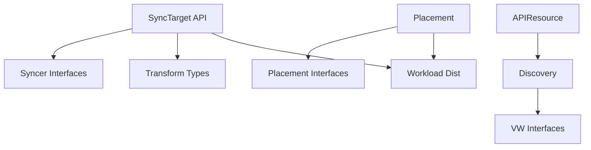

# Phase 10: Integration & Hardening Implementation Plan

## Overview

**Theme**: Define all API types, interfaces, and contracts  
**Duration**: 2-3 days with parallel execution  
**Total Efforts**: 10  
**Total Lines**: ~5,500  
**Engineers Required**: 3-4 working in parallel  

This phase establishes the complete API surface and contracts that all subsequent implementations will use. No implementation logic, only type definitions, interfaces, and contracts.

## Wave Structure

### Wave 1: Core API Types (Day 1 Morning)
**Dependencies**: None  
**Parallel Efforts**: 3  
**Purpose**: Define the fundamental API types for TMC

### Wave 2: Extended APIs & Resources (Day 1 Afternoon)  
**Dependencies**: Wave 1 APIs for type references  
**Parallel Efforts**: 4  
**Purpose**: Define extended API types and resource management

### Wave 3: Contracts & Interfaces (Day 2)
**Dependencies**: Wave 1-2 for type usage in interfaces  
**Parallel Efforts**: 3  
**Purpose**: Define all interfaces and contracts for implementations

## Wave 1: Core API Types

### Effort 0.1.1: SyncTarget API Complete
**Branch**: `feature/tmc-completion/p0w1-synctarget-api`  
**Lines**: ~600  
**Dependencies**: None  
**Engineer**: API Specialist

**Implementation**:

```go
// pkg/apis/workload/v1alpha1/synctarget_types.go
package v1alpha1

import (
    metav1 "k8s.io/apimachinery/pkg/apis/meta/v1"
    "k8s.io/apimachinery/pkg/api/resource"
    conditionsv1alpha1 "github.com/kcp-dev/kcp/pkg/apis/third_party/conditions/apis/conditions/v1alpha1"
    corev1alpha1 "github.com/kcp-dev/kcp/pkg/apis/core/v1alpha1"
)

// +crd
// +genclient
// +genclient:nonNamespaced
// +k8s:deepcopy-gen:interfaces=k8s.io/apimachinery/pkg/runtime.Object
// +kubebuilder:resource:scope=Cluster,categories=kcp
// +kubebuilder:subresource:status
// +kubebuilder:printcolumn:name="Location",type=string,JSONPath=`.spec.location`
// +kubebuilder:printcolumn:name="Ready",type=string,JSONPath=`.status.conditions[?(@.type=="Ready")].status`
// +kubebuilder:printcolumn:name="Syncing",type=string,JSONPath=`.status.conditions[?(@.type=="Syncing")].status`
// +kubebuilder:printcolumn:name="Age",type=date,JSONPath=`.metadata.creationTimestamp`

// SyncTarget defines a physical Kubernetes cluster that can host workloads from KCP
type SyncTarget struct {
    metav1.TypeMeta   `json:",inline"`
    metav1.ObjectMeta `json:"metadata,omitempty"`
    
    Spec   SyncTargetSpec   `json:"spec,omitempty"`
    Status SyncTargetStatus `json:"status,omitempty"`
}

// SyncTargetSpec defines the desired state of a SyncTarget
type SyncTargetSpec struct {
    // Cells define the deployable units within this SyncTarget
    // +optional
    Cells []SyncTargetCell `json:"cells,omitempty"`
    
    // ClusterReference points to the ClusterRegistration for this target
    // +required
    ClusterRef corev1alpha1.ResourceReference `json:"clusterRef"`
    
    // SyncerConfig defines configuration for the syncer deployment
    // +required
    SyncerConfig SyncerConfig `json:"syncerConfig"`
    
    // ResourceQuotas define resource limits for this SyncTarget
    // +optional
    ResourceQuotas []ResourceQuota `json:"resourceQuotas,omitempty"`
    
    // SupportedAPIResources defines which resources this target can sync
    // +optional
    SupportedAPIResources []APIResourceSpec `json:"supportedAPIResources,omitempty"`
    
    // EvictionStrategy defines how to handle workload eviction
    // +optional
    // +kubebuilder:default=Graceful
    EvictionStrategy EvictionStrategy `json:"evictionStrategy,omitempty"`
}

// SyncTargetCell represents a schedulable unit within a SyncTarget
type SyncTargetCell struct {
    // Name of the cell
    Name string `json:"name"`
    
    // Labels for the cell (used in placement decisions)
    // +optional
    Labels map[string]string `json:"labels,omitempty"`
    
    // Capacity defines the resources available in this cell
    // +optional
    Capacity corev1.ResourceList `json:"capacity,omitempty"`
    
    // Conditions for this cell
    // +optional
    Conditions conditionsv1alpha1.Conditions `json:"conditions,omitempty"`
}

// SyncerConfig defines the syncer deployment configuration
type SyncerConfig struct {
    // Image to use for the syncer
    // +kubebuilder:default="ghcr.io/kcp-dev/kcp/syncer:latest"
    Image string `json:"image,omitempty"`
    
    // Replicas for high availability
    // +kubebuilder:default=1
    // +kubebuilder:validation:Minimum=1
    // +kubebuilder:validation:Maximum=5
    Replicas int32 `json:"replicas,omitempty"`
    
    // Resources for the syncer pod
    // +optional
    Resources corev1.ResourceRequirements `json:"resources,omitempty"`
    
    // DownstreamNamespace where syncer will be deployed
    // +kubebuilder:default="kcp-syncer-system"
    DownstreamNamespace string `json:"downstreamNamespace,omitempty"`
    
    // ResyncPeriod for full reconciliation
    // +optional
    // +kubebuilder:default="10m"
    ResyncPeriod metav1.Duration `json:"resyncPeriod,omitempty"`
    
    // HeartbeatInterval for liveness checks
    // +optional
    // +kubebuilder:default="30s"
    HeartbeatInterval metav1.Duration `json:"heartbeatInterval,omitempty"`
}

// ResourceQuota defines resource limits for a SyncTarget
type ResourceQuota struct {
    // Scope of the quota (namespace, workspace, etc)
    Scope QuotaScope `json:"scope"`
    
    // Hard limits
    Hard corev1.ResourceList `json:"hard"`
    
    // ScopeSelector for fine-grained targeting
    // +optional
    ScopeSelector *ScopeSelector `json:"scopeSelector,omitempty"`
}

// APIResourceSpec defines a supported API resource
type APIResourceSpec struct {
    // Group of the resource
    Group string `json:"group"`
    
    // Version of the resource
    Version string `json:"version"`
    
    // Resource name (plural)
    Resource string `json:"resource"`
    
    // Capabilities for this resource
    // +optional
    Capabilities []ResourceCapability `json:"capabilities,omitempty"`
}

// SyncTargetStatus defines the observed state of a SyncTarget
type SyncTargetStatus struct {
    // Phase of the SyncTarget lifecycle
    // +optional
    Phase SyncTargetPhase `json:"phase,omitempty"`
    
    // Conditions represent the observations of the current state
    // +optional
    Conditions conditionsv1alpha1.Conditions `json:"conditions,omitempty"`
    
    // AllocatedResources tracks resource usage
    // +optional
    AllocatedResources corev1.ResourceList `json:"allocatedResources,omitempty"`
    
    // AvailableResources tracks available capacity
    // +optional  
    AvailableResources corev1.ResourceList `json:"availableResources,omitempty"`
    
    // SyncerStatus tracks the syncer deployment
    // +optional
    SyncerStatus *SyncerStatus `json:"syncerStatus,omitempty"`
    
    // LastHeartbeatTime from the syncer
    // +optional
    LastHeartbeatTime *metav1.Time `json:"lastHeartbeatTime,omitempty"`
    
    // VirtualWorkspaceURL for this SyncTarget
    // +optional
    VirtualWorkspaceURL string `json:"virtualWorkspaceURL,omitempty"`
}

// SyncerStatus tracks the syncer deployment state
type SyncerStatus struct {
    // Ready indicates if syncer is ready
    Ready bool `json:"ready"`
    
    // ObservedGeneration of the syncer deployment
    ObservedGeneration int64 `json:"observedGeneration,omitempty"`
    
    // Replicas status
    Replicas int32 `json:"replicas,omitempty"`
    ReadyReplicas int32 `json:"readyReplicas,omitempty"`
    
    // LastSyncTime of successful sync
    // +optional
    LastSyncTime *metav1.Time `json:"lastSyncTime,omitempty"`
    
    // SyncedResources count
    SyncedResources int32 `json:"syncedResources,omitempty"`
}

// +kubebuilder:validation:Enum=Pending;Scheduling;Ready;NotReady;Terminating
type SyncTargetPhase string

const (
    SyncTargetPhasePending     SyncTargetPhase = "Pending"
    SyncTargetPhaseScheduling  SyncTargetPhase = "Scheduling"
    SyncTargetPhaseReady       SyncTargetPhase = "Ready"
    SyncTargetPhaseNotReady    SyncTargetPhase = "NotReady"
    SyncTargetPhaseTerminating SyncTargetPhase = "Terminating"
)

// +kubebuilder:validation:Enum=Graceful;Immediate
type EvictionStrategy string

const (
    EvictionStrategyGraceful  EvictionStrategy = "Graceful"
    EvictionStrategyImmediate EvictionStrategy = "Immediate"
)

// +k8s:deepcopy-gen:interfaces=k8s.io/apimachinery/pkg/runtime.Object

// SyncTargetList contains a list of SyncTargets
type SyncTargetList struct {
    metav1.TypeMeta `json:",inline"`
    metav1.ListMeta `json:"metadata,omitempty"`
    Items           []SyncTarget `json:"items"`
}
```

**Key Actions**:
1. Define complete SyncTarget types with all fields
2. Add proper kubebuilder markers for CRD generation
3. Include validation tags
4. Generate deepcopy and CRDs: `make generate`

---

### Effort 0.1.2: APIResourceImport Types
**Branch**: `feature/tmc-completion/p0w1-apiresource-types`  
**Lines**: ~500  
**Dependencies**: None  
**Engineer**: API Specialist

**Implementation**:

```go
// pkg/apis/apiresource/v1alpha1/types.go
package v1alpha1

import (
    metav1 "k8s.io/apimachinery/pkg/apis/meta/v1"
    "k8s.io/apimachinery/pkg/version"
)

// +crd
// +genclient
// +genclient:nonNamespaced
// +k8s:deepcopy-gen:interfaces=k8s.io/apimachinery/pkg/runtime.Object
// +kubebuilder:resource:scope=Cluster,categories=kcp
// +kubebuilder:subresource:status

// APIResourceImport represents an API resource available from a SyncTarget
type APIResourceImport struct {
    metav1.TypeMeta   `json:",inline"`
    metav1.ObjectMeta `json:"metadata,omitempty"`
    
    Spec APIResourceImportSpec `json:"spec"`
}

type APIResourceImportSpec struct {
    // Location where this resource is available
    Location string `json:"location"`
    
    // SchemaUID identifying the schema
    SchemaUID string `json:"schemaUID"`
    
    // CommonAPIResourceSpec contains common fields
    CommonAPIResourceSpec `json:",inline"`
    
    // CompatibleWorkloads defines compatible workload types
    // +optional
    CompatibleWorkloads []WorkloadReference `json:"compatibleWorkloads,omitempty"`
}

// CommonAPIResourceSpec defines common resource fields
type CommonAPIResourceSpec struct {
    // GroupVersion of the resource
    GroupVersion GroupVersion `json:"groupVersion"`
    
    // Scope of the resource (Namespaced or Cluster)
    Scope ResourceScope `json:"scope"`
    
    // Resource plural name
    Resource string `json:"resource"`
    
    // Kind is the type name
    Kind string `json:"kind"`
    
    // ListKind is the list type name
    // +optional
    ListKind string `json:"listKind,omitempty"`
    
    // Singular name
    // +optional
    Singular string `json:"singular,omitempty"`
    
    // ShortNames for CLI
    // +optional
    ShortNames []string `json:"shortNames,omitempty"`
    
    // Categories for grouping
    // +optional
    Categories []string `json:"categories,omitempty"`
    
    // Subresources available
    // +optional
    Subresources []SubresourceSpec `json:"subresources,omitempty"`
    
    // Verbs supported
    Verbs []string `json:"verbs"`
    
    // OpenAPI schema
    // +optional
    OpenAPISchema *runtime.RawExtension `json:"openAPISchema,omitempty"`
}

// +crd
// +genclient
// +genclient:nonNamespaced  
// +k8s:deepcopy-gen:interfaces=k8s.io/apimachinery/pkg/runtime.Object
// +kubebuilder:resource:scope=Cluster,categories=kcp
// +kubebuilder:subresource:status

// NegotiatedAPIResource represents an agreed-upon API resource version
type NegotiatedAPIResource struct {
    metav1.TypeMeta   `json:",inline"`
    metav1.ObjectMeta `json:"metadata,omitempty"`
    
    Spec   NegotiatedAPIResourceSpec   `json:"spec"`
    Status NegotiatedAPIResourceStatus `json:"status,omitempty"`
}

type NegotiatedAPIResourceSpec struct {
    // CommonAPIResourceSpec from the negotiation
    CommonAPIResourceSpec `json:",inline"`
    
    // Publish indicates this should be published to APIExport
    Publish bool `json:"publish"`
    
    // SyncTargets that support this resource
    SyncTargets []SyncTargetReference `json:"syncTargets"`
}

type NegotiatedAPIResourceStatus struct {
    // Conditions of the negotiation
    // +optional
    Conditions conditionsv1alpha1.Conditions `json:"conditions,omitempty"`
    
    // SupportMatrix shows version support across targets
    // +optional
    SupportMatrix []TargetSupport `json:"supportMatrix,omitempty"`
}

// TargetSupport describes API support for a specific target
type TargetSupport struct {
    // Target name
    Target string `json:"target"`
    
    // SupportedVersions available on this target
    SupportedVersions []GroupVersion `json:"supportedVersions"`
    
    // PreferredVersion for this target
    // +optional
    PreferredVersion *GroupVersion `json:"preferredVersion,omitempty"`
    
    // Limitations on this target
    // +optional
    Limitations []string `json:"limitations,omitempty"`
}

// +crd
// +genclient
// +k8s:deepcopy-gen:interfaces=k8s.io/apimachinery/pkg/runtime.Object
// +kubebuilder:resource:scope=Namespaced,categories=kcp

// CompatibilityConstraint defines version compatibility requirements
type CompatibilityConstraint struct {
    metav1.TypeMeta   `json:",inline"`
    metav1.ObjectMeta `json:"metadata,omitempty"`
    
    Spec CompatibilityConstraintSpec `json:"spec"`
}

type CompatibilityConstraintSpec struct {
    // Resource this constraint applies to
    Resource GroupVersionResource `json:"resource"`
    
    // MinVersion required
    // +optional
    MinVersion *version.Info `json:"minVersion,omitempty"`
    
    // MaxVersion supported
    // +optional  
    MaxVersion *version.Info `json:"maxVersion,omitempty"`
    
    // RequiredFeatures that must be present
    // +optional
    RequiredFeatures []string `json:"requiredFeatures,omitempty"`
    
    // ForbiddenFields that must not be used
    // +optional
    ForbiddenFields []string `json:"forbiddenFields,omitempty"`
}
```

---

### Effort 0.1.3: Placement Enhanced Types
**Branch**: `feature/tmc-completion/p0w1-placement-types`  
**Lines**: ~550  
**Dependencies**: None  
**Engineer**: Placement Specialist

**Implementation**:

```go
// pkg/apis/placement/v1alpha1/enhanced_types.go
package v1alpha1

import (
    metav1 "k8s.io/apimachinery/pkg/apis/meta/v1"
    "k8s.io/apimachinery/pkg/util/intstr"
)

// +crd
// +genclient
// +k8s:deepcopy-gen:interfaces=k8s.io/apimachinery/pkg/runtime.Object
// +kubebuilder:resource:scope=Namespaced,categories=kcp
// +kubebuilder:subresource:status

// PlacementPolicy defines advanced placement rules with CEL expressions
type PlacementPolicy struct {
    metav1.TypeMeta   `json:",inline"`
    metav1.ObjectMeta `json:"metadata,omitempty"`
    
    Spec   PlacementPolicySpec   `json:"spec"`
    Status PlacementPolicyStatus `json:"status,omitempty"`
}

type PlacementPolicySpec struct {
    // Priority of this policy (higher wins)
    // +kubebuilder:validation:Minimum=0
    // +kubebuilder:validation:Maximum=1000
    Priority int32 `json:"priority"`
    
    // WorkloadSelector targets specific workloads
    // +optional
    WorkloadSelector *metav1.LabelSelector `json:"workloadSelector,omitempty"`
    
    // ClusterSelector targets specific clusters
    // +optional
    ClusterSelector *ClusterSelector `json:"clusterSelector,omitempty"`
    
    // Rules define placement rules
    Rules []PlacementRule `json:"rules"`
    
    // Strategy for placement decisions
    // +kubebuilder:default=BestFit
    Strategy PlacementStrategy `json:"strategy,omitempty"`
    
    // Enforcement level
    // +kubebuilder:default=Preferred
    Enforcement EnforcementLevel `json:"enforcement,omitempty"`
}

// PlacementRule defines a single placement rule
type PlacementRule struct {
    // Name of the rule
    Name string `json:"name"`
    
    // CELExpression for evaluation
    // +optional
    CELExpression *string `json:"celExpression,omitempty"`
    
    // Weight for scoring (0-100)
    // +kubebuilder:validation:Minimum=0
    // +kubebuilder:validation:Maximum=100
    // +kubebuilder:default=50
    Weight int32 `json:"weight,omitempty"`
    
    // Effect when rule matches
    Effect RuleEffect `json:"effect"`
    
    // Clusters explicitly included/excluded
    // +optional
    Clusters *ClusterList `json:"clusters,omitempty"`
}

// +kubebuilder:validation:Enum=Require;Prefer;Avoid;Forbid
type RuleEffect string

const (
    RuleEffectRequire RuleEffect = "Require"
    RuleEffectPrefer  RuleEffect = "Prefer"
    RuleEffectAvoid   RuleEffect = "Avoid"
    RuleEffectForbid  RuleEffect = "Forbid"
)

// +kubebuilder:validation:Enum=BestFit;Spread;Binpack;Random;LeastLoaded
type PlacementStrategy string

const (
    PlacementStrategyBestFit     PlacementStrategy = "BestFit"
    PlacementStrategySpread      PlacementStrategy = "Spread"
    PlacementStrategyBinpack     PlacementStrategy = "Binpack"
    PlacementStrategyRandom      PlacementStrategy = "Random"
    PlacementStrategyLeastLoaded PlacementStrategy = "LeastLoaded"
)

// +crd
// +genclient
// +k8s:deepcopy-gen:interfaces=k8s.io/apimachinery/pkg/runtime.Object
// +kubebuilder:resource:scope=Namespaced,categories=kcp
// +kubebuilder:subresource:status

// PlacementDecision represents a placement decision for workloads
type PlacementDecision struct {
    metav1.TypeMeta   `json:",inline"`
    metav1.ObjectMeta `json:"metadata,omitempty"`
    
    Spec   PlacementDecisionSpec   `json:"spec"`
    Status PlacementDecisionStatus `json:"status,omitempty"`
}

type PlacementDecisionSpec struct {
    // PlacementRef references the placement request
    PlacementRef corev1.LocalObjectReference `json:"placementRef"`
    
    // Clusters selected for placement
    Clusters []ClusterDecision `json:"clusters"`
    
    // Strategy used for this decision
    Strategy PlacementStrategy `json:"strategy"`
    
    // Overrides for specific clusters
    // +optional
    Overrides []PlacementOverride `json:"overrides,omitempty"`
}

// ClusterDecision represents the decision for a single cluster
type ClusterDecision struct {
    // ClusterName selected
    ClusterName string `json:"clusterName"`
    
    // Weight/priority for this cluster
    Weight int32 `json:"weight"`
    
    // Reason for selection
    Reason string `json:"reason"`
    
    // Score from evaluation
    Score float64 `json:"score"`
}

// +crd
// +genclient
// +k8s:deepcopy-gen:interfaces=k8s.io/apimachinery/pkg/runtime.Object
// +kubebuilder:resource:scope=Namespaced,categories=kcp
// +kubebuilder:subresource:status

// SchedulingConstraint defines advanced scheduling constraints
type SchedulingConstraint struct {
    metav1.TypeMeta   `json:",inline"`
    metav1.ObjectMeta `json:"metadata,omitempty"`
    
    Spec SchedulingConstraintSpec `json:"spec"`
}

type SchedulingConstraintSpec struct {
    // MinReplicas per cluster
    // +optional
    MinReplicas *int32 `json:"minReplicas,omitempty"`
    
    // MaxReplicas per cluster
    // +optional
    MaxReplicas *int32 `json:"maxReplicas,omitempty"`
    
    // MaxClusters to spread across
    // +optional
    MaxClusters *int32 `json:"maxClusters,omitempty"`
    
    // ResourceRequirements for placement
    // +optional
    ResourceRequirements *corev1.ResourceRequirements `json:"resourceRequirements,omitempty"`
    
    // TopologySpreadConstraints for distribution
    // +optional
    TopologySpreadConstraints []TopologySpreadConstraint `json:"topologySpreadConstraints,omitempty"`
    
    // AntiAffinity rules
    // +optional
    AntiAffinity *AntiAffinitySpec `json:"antiAffinity,omitempty"`
}

// TopologySpreadConstraint ensures even distribution
type TopologySpreadConstraint struct {
    // TopologyKey to spread across
    TopologyKey string `json:"topologyKey"`
    
    // MaxSkew allowed
    MaxSkew int32 `json:"maxSkew"`
    
    // WhenUnsatisfiable action
    WhenUnsatisfiable UnsatisfiableConstraintAction `json:"whenUnsatisfiable"`
}
```

## Wave 2: Extended APIs & Resources

### Effort 0.2.1: Workload Distribution Types
**Branch**: `feature/tmc-completion/p0w2-workload-dist`  
**Lines**: ~500  
**Dependencies**: Wave 1 types  
**Engineer**: Distribution Specialist

**Implementation**:

```go
// pkg/apis/workload/v1alpha1/distribution_types.go
package v1alpha1

// WorkloadDistribution defines how to distribute workloads
type WorkloadDistribution struct {
    metav1.TypeMeta   `json:",inline"`
    metav1.ObjectMeta `json:"metadata,omitempty"`
    
    Spec   WorkloadDistributionSpec   `json:"spec"`
    Status WorkloadDistributionStatus `json:"status,omitempty"`
}

type WorkloadDistributionSpec struct {
    // Resource to distribute
    Resource GroupVersionResource `json:"resource"`
    
    // Targets for distribution
    Targets []DistributionTarget `json:"targets"`
    
    // RolloutStrategy for updates
    // +optional
    RolloutStrategy *RolloutStrategy `json:"rolloutStrategy,omitempty"`
    
    // Placement configuration
    Placement PlacementConfig `json:"placement"`
}

type DistributionTarget struct {
    // Name of the target
    Name string `json:"name"`
    
    // SyncTargetRef references the sync target
    SyncTargetRef *corev1.LocalObjectReference `json:"syncTargetRef,omitempty"`
    
    // Replicas for this target
    // +optional
    Replicas *intstr.IntOrString `json:"replicas,omitempty"`
    
    // Weight for weighted distribution
    // +kubebuilder:validation:Minimum=0
    // +kubebuilder:validation:Maximum=100
    Weight int32 `json:"weight,omitempty"`
}
```

### Effort 0.2.2: Transformation Types
**Branch**: `feature/tmc-completion/p0w2-transform-types`  
**Lines**: ~450  
**Dependencies**: Wave 1 types  
**Engineer**: Transform Specialist

### Effort 0.2.3: Status Aggregation Types  
**Branch**: `feature/tmc-completion/p0w2-status-types`  
**Lines**: ~400  
**Dependencies**: Wave 1 types  
**Engineer**: Status Specialist

### Effort 0.2.4: Discovery Types
**Branch**: `feature/tmc-completion/p0w2-discovery-types`  
**Lines**: ~450  
**Dependencies**: Wave 1 types  
**Engineer**: Discovery Specialist

## Wave 3: Contracts & Interfaces

### Effort 0.3.1: Syncer Interfaces
**Branch**: `feature/tmc-completion/p0w3-syncer-interfaces`  
**Lines**: ~600  
**Dependencies**: Wave 1-2 types  
**Engineer**: Interface Specialist

**Implementation**:

```go
// pkg/syncer/interfaces/core.go
package interfaces

import (
    "context"
    "k8s.io/apimachinery/pkg/runtime"
    "k8s.io/apimachinery/pkg/runtime/schema"
    workloadv1alpha1 "github.com/kcp-dev/kcp/pkg/apis/workload/v1alpha1"
)

// SyncEngine is the core interface for synchronization
type SyncEngine interface {
    // Start begins the sync engine
    Start(ctx context.Context) error
    
    // Stop gracefully stops the engine
    Stop() error
    
    // RegisterTransformer adds a resource transformer
    RegisterTransformer(gvr schema.GroupVersionResource, transformer ResourceTransformer)
    
    // RegisterFilter adds a sync filter
    RegisterFilter(filter SyncFilter)
    
    // GetStatus returns current sync status
    GetStatus() (*SyncStatus, error)
    
    // ForceSync triggers immediate synchronization
    ForceSync(gvr schema.GroupVersionResource) error
}

// DownstreamSyncer syncs from KCP to physical clusters
type DownstreamSyncer interface {
    // SyncResource syncs a single resource downstream
    SyncResource(ctx context.Context, obj runtime.Object) error
    
    // SyncBatch syncs multiple resources
    SyncBatch(ctx context.Context, objs []runtime.Object) error
    
    // DeleteResource removes from downstream
    DeleteResource(ctx context.Context, gvr schema.GroupVersionResource, name, namespace string) error
    
    // GetDownstreamStatus checks downstream resource status
    GetDownstreamStatus(ctx context.Context, gvr schema.GroupVersionResource, name, namespace string) (*ResourceStatus, error)
}

// UpstreamSyncer syncs from physical clusters to KCP
type UpstreamSyncer interface {
    // SyncStatus syncs resource status upstream
    SyncStatus(ctx context.Context, gvr schema.GroupVersionResource, name, namespace string, status interface{}) error
    
    // SyncEvents syncs events upstream
    SyncEvents(ctx context.Context, events []*corev1.Event) error
    
    // RegisterStatusExtractor registers custom status extraction
    RegisterStatusExtractor(gvr schema.GroupVersionResource, extractor StatusExtractor)
}

// ResourceTransformer transforms resources for sync
type ResourceTransformer interface {
    // TransformForDownstream prepares resource for downstream
    TransformForDownstream(obj runtime.Object, target *workloadv1alpha1.SyncTarget) (runtime.Object, error)
    
    // TransformForUpstream prepares resource for upstream
    TransformForUpstream(obj runtime.Object, source *workloadv1alpha1.SyncTarget) (runtime.Object, error)
    
    // ShouldTransform determines if transformation is needed
    ShouldTransform(obj runtime.Object) bool
}

// SyncFilter determines what should be synced
type SyncFilter interface {
    // ShouldSync determines if resource should sync
    ShouldSync(obj runtime.Object) bool
    
    // ShouldDelete determines if deletion should sync
    ShouldDelete(gvr schema.GroupVersionResource, name, namespace string) bool
    
    // Priority returns filter priority (higher = earlier)
    Priority() int
}

// StatusExtractor extracts status from resources
type StatusExtractor interface {
    // ExtractStatus gets status from an object
    ExtractStatus(obj runtime.Object) (interface{}, error)
    
    // MergeStatus merges multiple statuses
    MergeStatus(statuses []interface{}) (interface{}, error)
}

// ConflictResolver handles sync conflicts
type ConflictResolver interface {
    // ResolveConflict handles conflicting updates
    ResolveConflict(local, remote runtime.Object) (runtime.Object, error)
    
    // Strategy returns the resolution strategy
    Strategy() ConflictResolutionStrategy
}

// SyncStatus represents current sync state
type SyncStatus struct {
    // Connected to downstream
    Connected bool
    
    // LastSyncTime of successful sync
    LastSyncTime *metav1.Time
    
    // SyncedResources count
    SyncedResources int
    
    // PendingResources count
    PendingResources int
    
    // FailedResources count
    FailedResources int
    
    // Errors from sync
    Errors []SyncError
}
```

### Effort 0.3.2: Placement Interfaces
**Branch**: `feature/tmc-completion/p0w3-placement-interfaces`  
**Lines**: ~500  
**Dependencies**: Wave 1-2 types  
**Engineer**: Interface Specialist

**Implementation**:

```go
// pkg/placement/interfaces/scheduler.go
package interfaces

// Scheduler makes placement decisions
type Scheduler interface {
    // Schedule determines placement for workload
    Schedule(ctx context.Context, workload runtime.Object, policy *PlacementPolicy) (*PlacementDecision, error)
    
    // Reschedule triggers rescheduling
    Reschedule(ctx context.Context, decision *PlacementDecision) (*PlacementDecision, error)
    
    // RegisterStrategy adds a scheduling strategy
    RegisterStrategy(name string, strategy SchedulingStrategy)
    
    // RegisterScorer adds a scoring plugin
    RegisterScorer(scorer Scorer)
}

// SchedulingStrategy implements a placement strategy
type SchedulingStrategy interface {
    // Name of the strategy
    Name() string
    
    // Select chooses targets from candidates
    Select(candidates []ScoredTarget, constraints *SchedulingConstraints) ([]string, error)
}

// Scorer scores placement targets
type Scorer interface {
    // Score evaluates a target
    Score(ctx context.Context, target *SyncTarget, workload runtime.Object) (float64, error)
    
    // Priority of this scorer
    Priority() int
}

// PolicyEvaluator evaluates placement policies
type PolicyEvaluator interface {
    // Evaluate runs policy evaluation
    Evaluate(ctx context.Context, policy *PlacementPolicy, target *SyncTarget) (bool, error)
    
    // EvaluateCEL evaluates a CEL expression
    EvaluateCEL(expression string, variables map[string]interface{}) (interface{}, error)
}
```

### Effort 0.3.3: Virtual Workspace Interfaces
**Branch**: `feature/tmc-completion/p0w3-vw-interfaces`  
**Lines**: ~450  
**Dependencies**: Wave 1-2 types  
**Engineer**: VW Specialist

## Implementation Guidelines

### For Each Effort

1. **File Organization**:
   ```
   pkg/
   ├── apis/
   │   ├── workload/v1alpha1/
   │   ├── apiresource/v1alpha1/
   │   └── placement/v1alpha1/
   └── interfaces/
       ├── syncer/
       ├── placement/
       └── virtualworkspace/
   ```

2. **Code Generation**:
   ```bash
   # After adding types
   make generate-apiregister
   make codegen
   make generate-crd
   ```

3. **Validation**:
   - Add kubebuilder validation markers
   - Implement ValidateCreate/Update/Delete webhooks
   - Add defaulting webhooks where needed

4. **Testing**:
   ```go
   func TestSyncTargetValidation(t *testing.T) {
       tests := []struct {
           name    string
           obj     *SyncTarget
           wantErr bool
       }{
           // Test cases
       }
   }
   ```

## Quality Checklist

For each effort:
- [ ] All types have deepcopy generation markers
- [ ] CRD markers are complete and correct
- [ ] Validation markers added
- [ ] Interface documentation complete
- [ ] Generated code committed
- [ ] Unit tests for validation
- [ ] No circular dependencies
- [ ] Under 800 lines limit

## Dependencies Between Efforts



## Success Criteria

Phase 0 is complete when:
1. ✅ All API types defined and generated
2. ✅ All interfaces documented and complete
3. ✅ CRDs can be installed successfully
4. ✅ Generated clients compile
5. ✅ No circular dependencies
6. ✅ All validation in place
7. ✅ Tests passing for all types

---

*Phase 0 establishes the complete API foundation for TMC. These types and interfaces will be imported and implemented by all subsequent phases.*