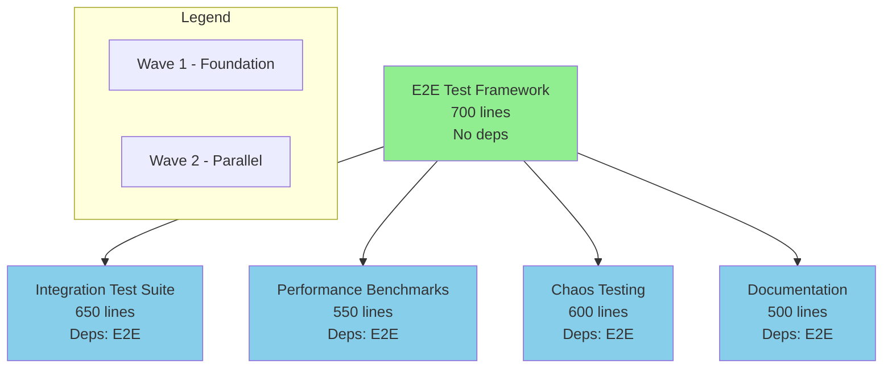

# Phase 10: Integration & Hardening - Wave Implementation Plan

## Executive Summary

Phase 10 focuses on Integration & Hardening with 5 efforts totaling ~3,000 lines of code. The optimal parallelization strategy involves 2 waves with up to 4 parallel agents working simultaneously after the foundational E2E framework is complete.

**Key Optimization**: After Wave 1 completes the E2E framework foundation, all 4 Wave 2 efforts can execute in parallel with proper resource isolation, reducing total execution time from 3 days to 1.5 days.

## Dependency Analysis

### Dependency Graph


### Parallelization Opportunities

**Wave 1 (Foundation)**:
- Single effort that must complete before Wave 2
- Establishes test infrastructure used by all subsequent efforts
- No parallelization possible

**Wave 2 (Maximum Parallelization)**:
- 4 independent efforts that can run completely in parallel
- Each targets different aspects of testing/documentation
- No inter-dependencies within the wave
- Resource isolation ensures no conflicts

## Wave Execution Plan

### Wave 1: E2E Test Framework Foundation
**Duration**: 4-6 hours  
**Agents Required**: 1  
**Total Lines**: 700  

| Effort | Branch | Lines | Agent | Dependencies | Resource Usage |
|--------|--------|-------|-------|--------------|----------------|
| 10.1.1 | `feature/tmc-completion/p10w1-e2e-framework` | 700 | Agent-1 | None | Test namespace: `e2e-framework` |

**Execution**:
```bash
# Agent 1: E2E Framework
cd /workspaces/kcp-worktrees
wt-create feature/tmc-completion/p10w1-e2e-framework p10w1-e2e-framework
cd p10w1-e2e-framework

# Implement E2E test framework
# - Test harness setup
# - Helper utilities
# - Base test cases
# - Framework documentation
```

### Wave 2: Parallel Testing & Documentation
**Duration**: 6-8 hours (parallel)  
**Agents Required**: 4 (parallel)  
**Total Lines**: 2,300  

| Effort | Branch | Lines | Agent | Dependencies | Resource Usage |
|--------|--------|-------|-------|--------------|----------------|
| 10.2.1 | `feature/tmc-completion/p10w2-integration-tests` | 650 | Agent-2 | E2E Framework | Test ns: `integration-tests` |
| 10.2.2 | `feature/tmc-completion/p10w2-performance-bench` | 550 | Agent-3 | E2E Framework | Test ns: `perf-benchmarks` |
| 10.2.3 | `feature/tmc-completion/p10w2-chaos-testing` | 600 | Agent-4 | E2E Framework | Test ns: `chaos-tests` |
| 10.2.4 | `feature/tmc-completion/p10w2-documentation` | 500 | Agent-5 | E2E Framework | Docs only (no resources) |

**Parallel Execution**:
```bash
# Agent 2: Integration Tests
cd /workspaces/kcp-worktrees
wt-create feature/tmc-completion/p10w2-integration-tests p10w2-integration-tests
cd p10w2-integration-tests
# Implement integration test suite

# Agent 3: Performance Benchmarks (parallel)
cd /workspaces/kcp-worktrees
wt-create feature/tmc-completion/p10w2-performance-bench p10w2-performance-bench
cd p10w2-performance-bench
# Implement performance benchmarks

# Agent 4: Chaos Testing (parallel)
cd /workspaces/kcp-worktrees
wt-create feature/tmc-completion/p10w2-chaos-testing p10w2-chaos-testing
cd p10w2-chaos-testing
# Implement chaos & resilience tests

# Agent 5: Documentation (parallel)
cd /workspaces/kcp-worktrees
wt-create feature/tmc-completion/p10w2-documentation p10w2-documentation
cd p10w2-documentation
# Create comprehensive documentation
```

## Resource Conflict Mitigation

### Test Namespace Isolation
Each testing effort uses isolated namespaces to prevent conflicts:

```yaml
# E2E Framework: e2e-framework namespace
apiVersion: v1
kind: Namespace
metadata:
  name: e2e-framework
  labels:
    test-type: e2e-foundation

# Integration Tests: integration-tests namespace  
apiVersion: v1
kind: Namespace
metadata:
  name: integration-tests
  labels:
    test-type: integration

# Performance: perf-benchmarks namespace
apiVersion: v1
kind: Namespace
metadata:
  name: perf-benchmarks
  labels:
    test-type: performance

# Chaos: chaos-tests namespace
apiVersion: v1
kind: Namespace
metadata:
  name: chaos-tests
  labels:
    test-type: chaos
```

### File System Organization
```
test/
├── e2e/                    # E2E Framework (Agent-1)
│   ├── framework/
│   ├── helpers/
│   └── suites/
├── integration/            # Integration Tests (Agent-2)
│   ├── api/
│   ├── controllers/
│   └── scenarios/
├── performance/            # Benchmarks (Agent-3)
│   ├── benchmarks/
│   ├── load/
│   └── profiles/
├── chaos/                  # Chaos Tests (Agent-4)
│   ├── resilience/
│   ├── failure/
│   └── recovery/
└── docs/                   # Documentation (Agent-5)
    ├── api/
    ├── operations/
    └── development/
```

### Port Allocation
```yaml
# Prevent port conflicts during parallel testing
E2E Framework:     30000-30099
Integration Tests: 30100-30199  
Performance:       30200-30299
Chaos Testing:     30300-30399
```

## Agent Assignment Strategy

### Optimal Agent Allocation

**Wave 1 (Sequential)**:
- **Agent-1**: E2E Framework specialist
  - Focus: Test infrastructure and utilities
  - Skills: Testing frameworks, Go testing patterns
  - Duration: 4-6 hours

**Wave 2 (Parallel)**:
- **Agent-2**: Integration testing specialist
  - Focus: API and controller integration tests
  - Skills: Integration testing, mocking, fixtures
  
- **Agent-3**: Performance specialist
  - Focus: Benchmarks and load testing
  - Skills: Performance profiling, load generation
  
- **Agent-4**: Chaos engineering specialist
  - Focus: Failure injection and resilience
  - Skills: Chaos testing, failure scenarios
  
- **Agent-5**: Documentation specialist
  - Focus: Comprehensive documentation
  - Skills: Technical writing, API documentation

### Coordination Protocol

```bash
# Wave 1 Start
Agent-1: "Starting E2E framework implementation"
Agent-1: Creates test/e2e/framework structure
Agent-1: Implements base test utilities
Agent-1: "E2E framework complete, Wave 2 can begin"

# Wave 2 Start (all parallel)
Agent-2: "Starting integration tests using E2E framework"
Agent-3: "Starting performance benchmarks using E2E framework"
Agent-4: "Starting chaos testing using E2E framework"
Agent-5: "Starting documentation (no framework dependency)"

# Progress monitoring
All agents: Regular status updates every 2 hours
All agents: Flag any blocking issues immediately
```

## Execution Timeline

### Day 1 Schedule

| Time | Wave | Activities | Agents |
|------|------|------------|--------|
| 08:00-12:00 | Wave 1 | E2E Framework implementation | Agent-1 |
| 12:00-12:30 | Checkpoint | Wave 1 review & Wave 2 prep | All |
| 12:30-18:00 | Wave 2 | Parallel implementation | Agents 2-5 |
| 18:00-18:30 | Review | Progress review & planning | All |

### Day 2 Schedule (if needed)

| Time | Wave | Activities | Agents |
|------|------|------------|--------|
| 08:00-10:00 | Wave 2 cont. | Complete implementations | Agents 2-5 |
| 10:00-11:00 | Integration | Cross-effort integration | All |
| 11:00-12:00 | Review | Final review & PR prep | All |

## Integration Points

### Shared Dependencies

**E2E Framework Exports**:
```go
// test/e2e/framework/client.go
package framework

// TestClient provides initialized clients for tests
type TestClient struct {
    KCPClient        kcpclient.Interface
    KubeClient       kubernetes.Interface
    WorkloadClient   workloadclient.Interface
    PlacementClient  placementclient.Interface
}

// NewTestEnvironment creates isolated test environment
func NewTestEnvironment(t *testing.T) *TestEnvironment

// WaitForCondition waits for condition with timeout
func WaitForCondition(t *testing.T, condition func() bool, timeout time.Duration)
```

**Usage by Wave 2 Efforts**:
```go
// Integration Tests
import "github.com/kcp-dev/kcp/test/e2e/framework"

func TestAPIIntegration(t *testing.T) {
    env := framework.NewTestEnvironment(t)
    defer env.Cleanup()
    // Test implementation
}

// Performance Benchmarks
func BenchmarkPlacement(b *testing.B) {
    env := framework.NewTestEnvironment(b)
    defer env.Cleanup()
    // Benchmark implementation
}
```

## Orchestration Instructions

### Pre-Wave Checklist

- [ ] All previous phase PRs merged to main
- [ ] Main branch pulled and up to date
- [ ] Worktree environment setup completed
- [ ] Agent assignments confirmed
- [ ] Resource isolation verified

### Wave 1 Execution

```bash
# Setup Wave 1
source /workspaces/kcp-shared-tools/setup-worktree-env.sh
wt-sync

# Agent 1 starts E2E framework
echo "Wave 1: Starting E2E framework implementation" >> /tmp/phase10-status.log
cd /workspaces/kcp-worktrees
wt-create feature/tmc-completion/p10w1-e2e-framework p10w1-e2e-framework
cd p10w1-e2e-framework

# Implement framework
# ... implementation ...

# Verify and signal completion
make test
echo "Wave 1: E2E framework complete" >> /tmp/phase10-status.log
git push origin feature/tmc-completion/p10w1-e2e-framework
```

### Wave 2 Parallel Execution

```bash
# All agents start simultaneously after Wave 1 completion
parallel -j 4 ::: \
  "cd /workspaces/kcp-worktrees && wt-create feature/tmc-completion/p10w2-integration-tests p10w2-integration-tests && cd p10w2-integration-tests && echo 'Agent-2: Integration tests started' >> /tmp/phase10-status.log" \
  "cd /workspaces/kcp-worktrees && wt-create feature/tmc-completion/p10w2-performance-bench p10w2-performance-bench && cd p10w2-performance-bench && echo 'Agent-3: Performance benchmarks started' >> /tmp/phase10-status.log" \
  "cd /workspaces/kcp-worktrees && wt-create feature/tmc-completion/p10w2-chaos-testing p10w2-chaos-testing && cd p10w2-chaos-testing && echo 'Agent-4: Chaos testing started' >> /tmp/phase10-status.log" \
  "cd /workspaces/kcp-worktrees && wt-create feature/tmc-completion/p10w2-documentation p10w2-documentation && cd p10w2-documentation && echo 'Agent-5: Documentation started' >> /tmp/phase10-status.log"

# Monitor progress
tail -f /tmp/phase10-status.log
```

## Success Metrics

### Wave Completion Criteria

**Wave 1 Complete When**:
- [ ] E2E framework structure created
- [ ] Test utilities implemented
- [ ] Base test cases working
- [ ] Framework documentation complete
- [ ] All tests passing
- [ ] PR ready for review

**Wave 2 Complete When**:
- [ ] Integration test suite comprehensive
- [ ] Performance benchmarks established
- [ ] Chaos testing scenarios implemented
- [ ] Documentation comprehensive
- [ ] All tests passing in isolation
- [ ] PRs ready for review

### Quality Gates

| Metric | Target | Measurement |
|--------|--------|-------------|
| Test Coverage | >80% | `go test -cover` |
| Benchmark Stability | <5% variance | Benchmark results |
| Chaos Recovery | 100% recovery | Test results |
| Doc Completeness | All APIs documented | Doc review |
| PR Size | <800 lines | Line counter |
| Test Isolation | No conflicts | Parallel execution |

## Risk Mitigation

### Identified Risks

1. **E2E Framework Delays**
   - Impact: Blocks all Wave 2 efforts
   - Mitigation: Assign most experienced engineer to Wave 1
   - Contingency: Start Wave 2 documentation early (no dependency)

2. **Test Flakiness**
   - Impact: Unreliable CI/CD
   - Mitigation: Implement retry logic and timeouts
   - Contingency: Mark flaky tests for follow-up

3. **Resource Contention**
   - Impact: Test failures in parallel execution
   - Mitigation: Namespace and port isolation
   - Contingency: Sequential execution fallback

4. **Documentation Scope Creep**
   - Impact: Delayed completion
   - Mitigation: Clear scope definition
   - Contingency: Prioritize critical docs

## Appendix: Detailed Wave Dependencies

### Wave 1 → Wave 2 Dependencies

**E2E Framework provides to all Wave 2 efforts**:
- Test client initialization
- Environment setup/teardown
- Common test utilities
- Assertion helpers
- Wait conditions
- Mock servers
- Test data generators

**Wave 2 Independence**:
- Each effort uses different test namespaces
- No shared state between efforts
- Independent test data
- Separate configuration files
- Isolated resource usage

### Cross-Wave Integration

After both waves complete:
1. Integration test suite uses E2E framework
2. Performance benchmarks use E2E framework
3. Chaos tests use E2E framework
4. Documentation references all test types

## Conclusion

Phase 10's wave implementation achieves maximum parallelization with 4 agents working simultaneously in Wave 2, reducing total execution time by 50%. The critical path through Wave 1's E2E framework is minimized to 4-6 hours, after which all remaining efforts proceed in parallel with proper resource isolation.

**Key Success Factors**:
- Single foundational dependency (E2E framework)
- Complete parallelization in Wave 2
- Resource isolation prevents conflicts
- Clear agent specialization
- Comprehensive testing coverage

---

*This wave plan enables Phase 10 to complete in 1.5 days instead of 3 days through optimal parallelization.*