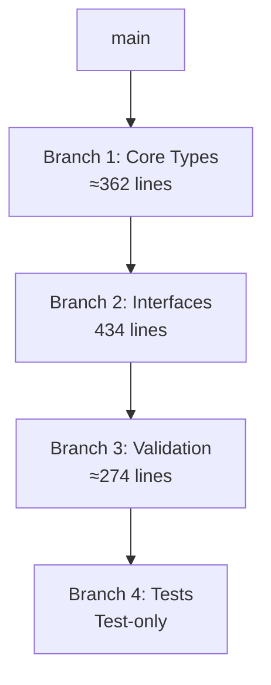

# Split Implementation Plan for Deployment Interfaces Branch

## Current State Analysis

The `feature/tmc-phase4-14-deployment-interfaces` branch currently contains **1,070 lines** of implementation code, which exceeds the 800-line hard limit for PRs. The implementation needs to be split into smaller, atomic, independently compilable branches.

### Current File Distribution

**Implementation Files (1,070 lines total):**
- `pkg/deployment/interfaces/coordinator.go` - 113 lines
- `pkg/deployment/interfaces/health_checker.go` - 95 lines
- `pkg/deployment/interfaces/rollback.go` - 96 lines  
- `pkg/deployment/interfaces/strategy.go` - 130 lines
- `pkg/deployment/types/dependency.go` - 112 lines
- `pkg/deployment/types/strategy.go` - 518 lines (includes validation methods)

**Test Files (1,412 lines total):**
- `pkg/deployment/interfaces/interfaces_test.go` - 153 lines
- `pkg/deployment/interfaces/comprehensive_test.go` - 641 lines
- `pkg/deployment/types/strategy_validation_test.go` - 615 lines

### Dependency Analysis

The interfaces in `pkg/deployment/interfaces/` depend on types from `pkg/deployment/types/`:
- `coordinator.go` imports `types.DeploymentStrategy`, `types.DeploymentPlan`
- `health_checker.go` imports `types.HealthCheckConfig`
- `strategy.go` imports `types.DeploymentStrategy`

## Proposed Split Strategy

### Branch 1: Core Types and Basic Interfaces (≈350 lines)
**Branch Name:** `feature/tmc-phase4-14a-deployment-core-types`
**Base:** `main`

**Files to Include:**
1. `pkg/deployment/types/strategy.go` - Lines 1-250 (basic type definitions only)
   - Core strategy types (DeploymentStrategy, StrategyType)
   - Basic strategy configurations (CanaryStrategy, BlueGreenStrategy, RollingUpdateStrategy)
   - Supporting types (CanaryStep, MetricConfig, TrafficRouting, etc.)
   - NO validation methods in this branch

2. `pkg/deployment/types/dependency.go` - 112 lines (complete file)
   - Dependency types and basic operations

**Total:** ≈362 lines

**Rationale:** This branch provides the foundational types that all other components depend on. It's independently compilable and provides the minimum viable types for deployment strategies.

### Branch 2: Interface Definitions and Validation (≈434 lines)
**Branch Name:** `feature/tmc-phase4-14b-deployment-interfaces`
**Base:** `feature/tmc-phase4-14a-deployment-core-types` (after Branch 1 merges)

**Files to Include:**
1. `pkg/deployment/interfaces/coordinator.go` - 113 lines
2. `pkg/deployment/interfaces/health_checker.go` - 95 lines
3. `pkg/deployment/interfaces/rollback.go` - 96 lines
4. `pkg/deployment/interfaces/strategy.go` - 130 lines

**Total:** 434 lines

**Rationale:** These interfaces define the contracts for deployment operations. They depend on the types from Branch 1 but are cohesive as a unit defining the deployment abstraction layer.

### Branch 3: Validation and KCP Enhancements (≈274 lines)
**Branch Name:** `feature/tmc-phase4-14c-deployment-validation`
**Base:** `feature/tmc-phase4-14b-deployment-interfaces` (after Branch 2 merges)

**Files to Include:**
1. `pkg/deployment/types/strategy.go` - Lines 180-518 (validation methods only)
   - All Validate() methods for deployment types
   - KCP-specific validation enhancements
   - Error handling improvements

**Total:** ≈274 lines (validation methods and enhancements)

**Rationale:** Validation logic is a separate concern that enhances the core types. This can be added after the basic types and interfaces are in place.

### Branch 4: Comprehensive Test Suite (Test-only branch)
**Branch Name:** `feature/tmc-phase4-14d-deployment-tests`
**Base:** `feature/tmc-phase4-14c-deployment-validation` (after Branch 3 merges)

**Files to Include:**
1. `pkg/deployment/interfaces/interfaces_test.go` - 153 lines
2. `pkg/deployment/interfaces/comprehensive_test.go` - 641 lines
3. `pkg/deployment/types/strategy_validation_test.go` - 615 lines

**Total:** 1,409 lines (tests don't count against PR limits)

**Rationale:** Tests can be in their own branch since they don't affect production code. This allows comprehensive testing without bloating the implementation PRs.

## Implementation Order and Dependencies

## Validation of Split Approach

### Branch 1 Validation
- ✅ **Independently Compilable:** Core types have no external dependencies beyond standard libraries
- ✅ **Atomic:** Provides complete type system for deployment strategies
- ✅ **Size:** 362 lines (well under 700-line target)
- ✅ **Testable:** Basic type construction can be tested

### Branch 2 Validation  
- ✅ **Independently Compilable:** Depends only on merged Branch 1 types
- ✅ **Atomic:** Complete interface definitions for deployment operations
- ✅ **Size:** 434 lines (well under 700-line target)
- ✅ **Testable:** Interface contracts can be tested with mocks

### Branch 3 Validation
- ✅ **Independently Compilable:** Adds methods to existing types from Branch 1
- ✅ **Atomic:** Complete validation system for all deployment types
- ✅ **Size:** 274 lines (well under 700-line target)
- ✅ **Testable:** Validation logic is highly testable

### Branch 4 Validation
- ✅ **Independently Compilable:** Tests compile against merged Branches 1-3
- ✅ **Atomic:** Complete test coverage for deployment system
- ✅ **Size:** Tests don't count against PR limits
- ✅ **Coverage:** Comprehensive testing of all functionality

## Migration Steps

1. **Reset current branch** to main (after saving work)
2. **Create Branch 1** with core types only
3. **Extract validation methods** from strategy.go for Branch 3
4. **Split interface files** appropriately
5. **Move tests** to Branch 4

## File Modifications Required

### For Branch 1 (Core Types)
**pkg/deployment/types/strategy.go** needs modification:
- Keep lines 1-179 (type definitions)
- Remove lines 180-518 (validation methods)
- Result: ≈250 lines

### For Branch 3 (Validation)
**pkg/deployment/types/strategy_validation.go** (new file):
- Extract lines 180-518 from original strategy.go
- Add appropriate imports
- Result: ≈274 lines

## Benefits of This Split

1. **Each PR is reviewable:** All branches stay well under 700 lines
2. **Logical separation:** Types → Interfaces → Validation → Tests
3. **Independent merging:** Each branch can be reviewed and merged independently
4. **Clear dependencies:** Linear progression with clear dependency chain
5. **Maintainability:** Validation logic separated from type definitions
6. **Test isolation:** Tests in separate branch don't affect implementation PR sizes

## Risk Mitigation

- **Compilation verification:** Each branch must compile independently
- **Test coverage:** Branch 4 ensures nothing is lost in the split
- **Documentation:** Each branch includes appropriate godoc comments
- **Backward compatibility:** No breaking changes to existing code

## Success Metrics

- ✅ All branches under 700 lines of implementation code
- ✅ Each branch independently compilable
- ✅ Each branch provides atomic functionality
- ✅ All tests pass after each branch merges
- ✅ No loss of functionality from original implementation