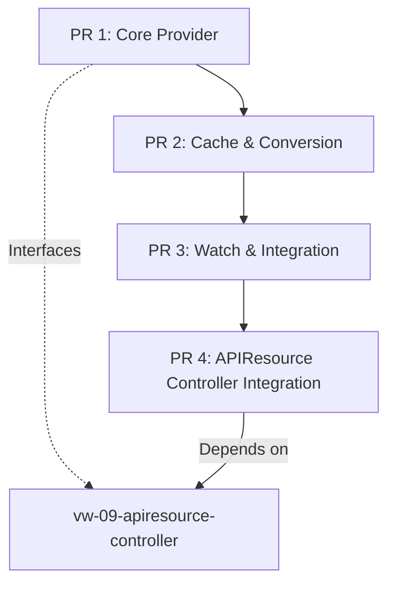

# Split Implementation Plan: vw-07-discovery-impl

## Overview
The current implementation exceeds the 800-line limit by 580 lines (1,380 total). This plan splits the work into 3 manageable PRs that maintain atomic functionality while staying within size limits.

## PR Split Strategy

### PR 1: Discovery Interfaces & Core Provider (≈600 lines)
**Branch**: `feature/tmc-phase4-vw-07a-discovery-core`
**Base**: `main`

#### Files to Include:
1. `pkg/virtual/interfaces/discovery.go` (107 lines)
   - Core interfaces for resource discovery
   - Event types and structures
   
2. `pkg/virtual/contracts/discovery.go` (32 lines)
   - Constants and configuration contracts
   
3. `pkg/virtual/discovery/provider.go` (247 lines - needs cleanup)
   - Core KCPDiscoveryProvider implementation
   - Remove watcher integration (stub it)
   
4. `pkg/virtual/discovery/metrics.go` (100 lines)
   - Prometheus metrics for monitoring
   
5. Basic unit tests (≈150 lines)
   - Provider initialization tests
   - Basic discovery tests

**Key Changes Required**:
- Stub out watcher and converter dependencies
- Add proper error handling
- Fix workspace isolation issues
- Add comprehensive godoc comments

---

### PR 2: Cache & Resource Conversion (≈650 lines)
**Branch**: `feature/tmc-phase4-vw-07b-discovery-cache`
**Base**: `feature/tmc-phase4-vw-07a-discovery-core` (after PR 1 merges)

#### Files to Include:
1. `pkg/virtual/discovery/cache.go` (216 lines - needs fixes)
   - Fix race condition in GetResources
   - Add proper workspace isolation
   
2. `pkg/virtual/discovery/converter.go` (211 lines - needs rewrite)
   - MUST implement actual APIResourceSchema resolution
   - Remove placeholder implementations
   - Add proper group/version/resource parsing
   
3. Cache tests (≈150 lines)
   - Concurrent access tests
   - TTL expiration tests
   - Workspace isolation tests
   
4. Converter tests (≈100 lines)
   - Schema conversion tests
   - Error handling tests

**Key Changes Required**:
- Implement actual APIResourceSchema resolution
- Fix cache race conditions
- Add proper workspace boundary enforcement
- Remove all placeholder code

---

### PR 3: Watch & Integration Layer (≈700 lines)
**Branch**: `feature/tmc-phase4-vw-07c-discovery-watch`
**Base**: `feature/tmc-phase4-vw-07b-discovery-cache` (after PR 2 merges)

#### Files to Include:
1. `pkg/virtual/discovery/watcher.go` (273 lines)
   - Event processing and broadcasting
   - Informer event handlers
   
2. `pkg/virtual/discovery/integration.go` (194 lines - needs security fixes)
   - Fix insecure workspace hierarchy checks
   - Add proper RBAC validation
   - Implement real workspace access controls
   
3. Integration with provider (≈50 lines)
   - Wire watcher into provider
   - Complete the integration
   
4. Integration tests (≈200 lines)
   - Multi-workspace scenarios
   - Event propagation tests
   - Security boundary tests

**Key Changes Required**:
- Implement proper workspace access validation
- Add RBAC checks
- Fix security vulnerabilities
- Add comprehensive integration tests

---

## Implementation Order & Dependencies

## Critical Fixes Required Across All PRs

### 1. Security & Isolation
- [ ] Replace string workspace parameters with `logicalcluster.Name`
- [ ] Add proper RBAC checks for all discovery operations
- [ ] Implement secure workspace hierarchy validation
- [ ] Add workspace boundary enforcement in cache

### 2. Race Conditions
- [ ] Fix cache mutex handling (no unlock/relock patterns)
- [ ] Add proper synchronization for concurrent access
- [ ] Implement thread-safe event broadcasting

### 3. Placeholder Removal
- [ ] Implement actual APIResourceSchema resolution
- [ ] Remove all hardcoded/dummy values
- [ ] Add real OpenAPI schema extraction

### 4. Error Handling
- [ ] Add comprehensive error handling
- [ ] Implement retry logic with backoff
- [ ] Add circuit breaker for failing discoveries

### 5. Testing
- [ ] Achieve minimum 60% test coverage per PR
- [ ] Add integration tests for each component
- [ ] Include negative test cases
- [ ] Add benchmark tests for performance-critical paths

## Success Criteria Per PR

### PR 1 Success Criteria
- [ ] Core interfaces fully documented
- [ ] Provider can be initialized and started
- [ ] Metrics properly registered and working
- [ ] 60% test coverage
- [ ] No race conditions
- [ ] Under 700 lines

### PR 2 Success Criteria
- [ ] Cache operations thread-safe
- [ ] Real APIResourceSchema conversion working
- [ ] Workspace isolation enforced
- [ ] TTL and cleanup working correctly
- [ ] 60% test coverage
- [ ] Under 700 lines

### PR 3 Success Criteria
- [ ] Event watching fully functional
- [ ] Secure workspace access validation
- [ ] RBAC properly enforced
- [ ] Integration tests passing
- [ ] Full end-to-end functionality
- [ ] 60% test coverage
- [ ] Under 700 lines

## Risk Mitigation

1. **Dependency Risk**: Each PR depends on the previous one
   - Mitigation: Create feature branches that build on each other
   - Test integration points thoroughly

2. **Integration Risk**: Split implementation may have integration issues
   - Mitigation: Design clear interfaces between components
   - Add integration tests in PR 3

3. **Security Risk**: Current implementation has vulnerabilities
   - Mitigation: Security fixes in PR 1, validated in PR 3
   - Get security review before final merge

## Timeline Estimate

- **PR 1**: 2-3 days (includes security fixes)
- **PR 2**: 2-3 days (includes rewriting converter)
- **PR 3**: 3-4 days (includes comprehensive testing)
- **Total**: 7-10 days for complete implementation

## Next Steps

1. Create new branch `feature/tmc-phase4-vw-07a-discovery-core`
2. Cherry-pick relevant changes from current branch
3. Implement fixes for critical issues
4. Add comprehensive tests
5. Submit PR 1 for review

## Notes

- Each PR must pass all tests independently
- Each PR must be functionally complete (even if stubbed)
- Security and isolation fixes are highest priority
- No placeholder implementations in final code